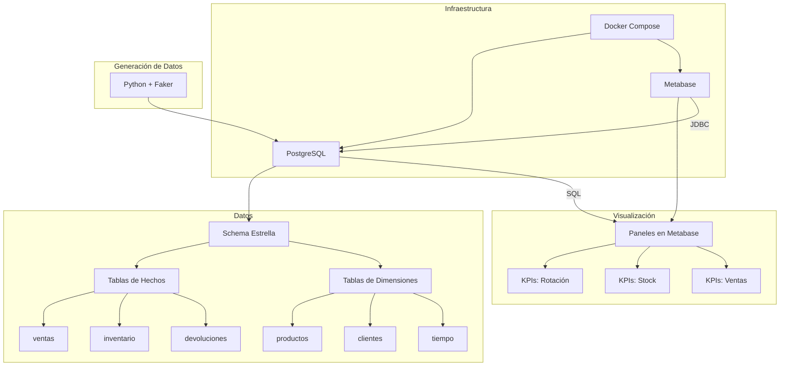

# AGENTS.MD – Dashboard Metabase + Colección Analítica para E-commerce v1.0

**Fecha:** 2026-07-02 | **Autor:** Fisherk2 | **Referencia:** [WORKFLOW.md](docs/WORKFLOW.md)

---

## 🎯 Contexto del Proyecto

### Descripción MVP y Propósito

El proyecto consiste en un **Dashboard analítico** conectado a **PostgreSQL** para visualizar **KPIs de inventario, rotación y alertas de stock mínimo** en un entorno de e-commerce simulado. El objetivo es demostrar la capacidad de:

- Diseñar un **schema estrella para OLAP** en PostgreSQL.
- Optimizar **queries SQL** para carga en <2 segundos.
- Configurar **Metabase** como herramienta de visualización.
- Generar **datos sintéticos realistas** para pruebas.
- Documentar el proceso de manera **reproducible y profesional** para portafolio.

### Requisitos Funcionales vs. No Funcionales


| **Tipo**         | **Requisito**                                                  | **Prioridad** | **Estado** |
| ---------------- | -------------------------------------------------------------- | ------------- | ---------- |
| **Funcional**    | 3+ paneles configurados en Metabase (rotación, stock, ventas). | Alta          | Pendiente  |
| **Funcional**    | Exportación de paneles a PNG/CSV.                              | Alta          | Pendiente  |
| **Funcional**    | Queries SQL optimizadas para KPIs.                             | Alta          | Pendiente  |
| **Funcional**    | Schema estrella en PostgreSQL (8+ tablas).                     | Alta          | Pendiente  |
| **Funcional**    | Generación de datos sintéticos con Python + Faker.             | Alta          | Pendiente  |
| **No Funcional** | Conexión segura entre Metabase y PostgreSQL.                   | Alta          | Pendiente  |
| **No Funcional** | Tiempo de carga <2s por vista.                                 | Alta          | Pendiente  |
| **No Funcional** | Sin lógica de negocio duplicada (todo en SQL).                 | Alta          | Pendiente  |
| **No Funcional** | Entorno reproducible con Docker Compose.                       | Alta          | Pendiente  |


### Dominio y Límites del Sistema

- **Dominio:** Análisis de datos de e-commerce (inventario, ventas, rotación, logística).
- **Límites:**
  - No incluye lógica de negocio fuera de PostgreSQL (ej: triggers complejos).
  - No incluye autenticación avanzada (ej: OAuth).
  - No incluye integración con sistemas externos (ej: ERP).
  - Solo para uso local (no producción).

### Orden de Implementación Propuesto

1. **F0: Preparación** (Estructura, entorno, documentación inicial).
2. **F1: Infraestructura** (Docker Compose, PostgreSQL, Metabase).
3. **F2: Núcleo** (Schema estrella, generación de datos, vistas materializadas).
4. **F3: Interfaces** (Paneles en Metabase, queries optimizadas).
5. **F4: Pruebas** (Validación de rendimiento, exportación de datos).
6. **F5: Despliegue** (Documentación final, README con badges).

---

## 🏗️ Arquitectura y Diseño

### Patrones Arquitectónicos Aplicados


| **Patrón**                 | **Aplicación**                                                                                                     | **Justificación**                                                                                 |
| -------------------------- | ------------------------------------------------------------------------------------------------------------------ | ------------------------------------------------------------------------------------------------- |
| **Schema Estrella**        | Tablas de hechos (`ventas`, `inventario`, `devoluciones`) + tablas de dimensiones (`productos`, `clientes`, etc.). | Optimizado para consultas analíticas complejas (OLAP).                                            |
| **Adapter Pattern**        | Conexión entre Metabase y PostgreSQL mediante JDBC.                                                                | Permite que Metabase (herramienta genérica) se conecte a PostgreSQL (fuente de datos específica). |
| **Read-Optimized View**    | Vistas materializadas para KPIs críticos (ej: `mv_rotacion_mensual`).                                              | Pre-calcula resultados para queries frecuentes, mejorando rendimiento.                            |
| **Separation of Concerns** | Separación clara entre:                                                                                            | &nbsp;                                                                                            |


- **Presentación** (Metabase),
- **Lógica** (PostgreSQL),
- **Datos** (Schema estrella),
- **Infraestructura** (Docker). | Facilita mantenimiento, testing y escalabilidad.                                               |

### Diagrama de Componentes y Flujo de Datos



### Estrategia de Comunicación entre Módulos

- **Metabase → PostgreSQL:** Conexión directa mediante **JDBC** (configurada en Metabase).
- **PostgreSQL → Metabase:** Resultados de queries en formato tabular.
- **Script Python → PostgreSQL:** Inserción de datos sintéticos mediante `psycopg2` o `SQLAlchemy`.
- **Docker Compose → Servicios:** Orquestación de contenedores mediante red interna de Docker.

### Justificación Técnica de Elecciones Críticas


| **Decisión**        | **Alternativas Consideradas**                   | **Razón para Elegir**                                                                            |
| ------------------- | ----------------------------------------------- | ------------------------------------------------------------------------------------------------ |
| **PostgreSQL 15+**  | MySQL, SQLite, MongoDB                          | Soporte nativo para schema estrella, vistas materializadas, particionamiento, y JSON.            |
| **Metabase**        | Tableau, Power BI, Grafana                      | Open-source, fácil de configurar, soporta conexión directa a PostgreSQL y exportación a PNG/CSV. |
| **Schema Estrella** | Schema normalizado (3FN), Schema desnormalizado | Optimizado para queries analíticas (OLAP) con agregaciones frecuentes.                           |
| **Docker Compose**  | Instalación nativa, Kubernetes                  | Reproducibilidad, aislamiento de servicios, y portabilidad.                                      |
| **Python + Faker**  | Datos reales, Mockaroo                          | Flexibilidad para generar datos sintéticos con reglas de negocio (ej: distribución de ventas).   |


---

## 🔧 Guías de Desarrollo

### Principios SOLID Aplicados


| **Principio**                   | **Aplicación en el Proyecto**                                                                                               |
| ------------------------------- | --------------------------------------------------------------------------------------------------------------------------- |
| **Single Responsibility (SRP)** | Cada componente tiene una sola responsabilidad (ver detalle abajo).                                                         |
| **Open/Closed (OCP)**           | El schema estrella permite agregar nuevas dimensiones o hechos **sin modificar** las tablas existentes.                     |
| **Liskov Substitution (LSP)**   | No aplica (no hay herencia en el diseño actual).                                                                            |
| **Interface Segregation (ISP)** | No aplica (no hay interfaces explícitas en SQL).                                                                            |
| **Dependency Inversion (DIP)**  | Docker Compose **abstrae** la dependencia entre servicios (PostgreSQL y Metabase no dependen directamente el uno del otro). |

**Detalle SRP — Cada componente tiene una sola responsabilidad:**
- **Metabase:** Visualización.
- **PostgreSQL:** Almacenamiento y procesamiento de datos.
- **Script Python:** Generación de datos.

### Patrones de Diseño


| **Patrón**             | **Aplicación**                                                                                             |
| ---------------------- | ---------------------------------------------------------------------------------------------------------- |
| **Adapter Pattern**    | Metabase actúa como **adaptador** entre el usuario y PostgreSQL, tradciendo queries SQL a visualizaciones. |
| **Factory Method**     | No aplica (no hay creación de objetos en tiempo de ejecución).                                             |
| **Observer Pattern**   | No aplica (no hay eventos en tiempo real).                                                                 |
| **Repository Pattern** | PostgreSQL actúa como **repositorio** centralizado de datos.                                               |


### Convenciones de Nomenclatura


| **Tipo**                  | **Convención**                                        | **Ejemplo**                              |
| ------------------------- | ----------------------------------------------------- | ---------------------------------------- |
| **Tablas**                | Minúsculas, singular, separadas por guión bajo (`_`). | `ventas`, `productos`                    |
| **Columnas**              | Minúsculas, separadas por guión bajo (`_`).           | `producto_id`, `fecha_venta`             |
| **Índices**               | `idx_<tabla>_<columna>`                               | `idx_ventas_producto_id`                 |
| **Vistas Materializadas** | `mv_<descripción>`                                    | `mv_rotacion_mensual`                    |
| **Scripts Python**        | `snake_case.py`                                       | `generate_data.py`                       |
| **Archivos SQL**          | `YYYYMMDD_HHMMSS_descripcion.sql`                     | `20260702_140000_crear_tabla_ventas.sql` |
| **Variables de Entorno**  | `MAYUSCULAS_CON_GUIONES_BAJOS`                        | `POSTGRES_PASSWORD`                      |


### Estructura de Carpetas

```
/
├── docs/                          # Documentación
│   ├── PRD.md                    # Product Requirements Document
│   ├── TRD.md                    # Technical Requirements Document
│   ├── APPFLOW.md                # Flujo de Navegación
│   ├── SCHEMA.md                 # Database Schema
│   └── AGENTS.md                 # Este documento
│
├── scripts/                      # Scripts de generación y utilidades
│   ├── generate_data.py          # Generación de datos sintéticos
│   ├── init.sql                  # Script de inicialización de la BD
│   └── refresh_materialized_views.sql # Actualización de vistas materializadas
│
├── docker/                       # Configuración de Docker
│   ├── docker-compose.yml        # Orquestación de servicios
│   └── Dockerfile                # (Opcional) Para imágenes personalizadas
│
├── sql/                          # Queries y migraciones
│   ├── views/                    # Vistas SQL
│   │   └── mv_rotacion_mensual.sql
│   ├── indexes/                  # Índices
│   │   └── create_indexes.sql
│   └── partitions/               # Particionamiento
│       └── partition_ventas.sql
│
├── metabase/                     # Configuración de Metabase (opcional)
│   └── collections/              # Colecciones de paneles (exportadas)
│
├── README.md                     # Documentación principal
└── .gitignore                    # Archivos ignorados por Git
```

### Estilo de Código

#### SQL

- **Identación:** 4 espacios (no tabs).
- **Mayúsculas:** Palabras clave SQL en mayúsculas (`SELECT`, `FROM`, `WHERE`).
- **Comentarios:** Usar `--` para comentarios en línea, `/* */` para bloques.
- **Nombres:** Descriptivos y en inglés (ej: `customer_id`, no `cli_id`).
- **Ejemplo:**
  ```sql
  -- Consulta de rotación por categoría
  SELECT 
      c.name AS category,
      t.month,
      SUM(v.quantity) AS total_sales
  FROM sales v
  JOIN products p ON v.product_id = p.id
  JOIN categories c ON p.category_id = c.id
  JOIN time t ON v.time_id = t.id
  GROUP BY c.name, t.month
  ORDER BY total_sales DESC;
  ```

#### Python

- **Identación:** 4 espacios (PEP 8).
- **Nombres:** `snake_case` para variables y funciones, `PascalCase` para clases.
- **Docstrings:** Usar formato Google para funciones y clases.
- **Ejemplo:**
  ```python
  from faker import Faker
  import psycopg2

  def generate_products(n: int, conn: psycopg2.extensions.connection) -> None:
      """Generates n fake products and inserts them into the database.
      
      Args:
          n: Number of products to generate.
          conn: PostgreSQL connection object.
      """
      fake = Faker()
      cursor = conn.cursor()
      for _ in range(n):
          name = fake.word()
          price = fake.random_int(10, 1000)
          cursor.execute(
              "INSERT INTO products (name, price) VALUES (%s, %s)",
              (name, price)
          )
      conn.commit()
  ```

### Checklists de Pre-Commit

- **SQL:**
  - Todas las tablas tienen `PRIMARY KEY`.
  - Todas las columnas `FOREIGN KEY` tienen índices.
  - Las queries usan `JOIN` explícitos (no `JOIN` implícitos).
  - Las vistas materializadas están actualizadas (`REFRESH MATERIALIZED VIEW`).
- **Python:**
  - El código sigue PEP 8.
  - Todas las funciones tienen docstrings.
  - No hay credenciales hardcodeadas (usar variables de entorno).
  - El script maneja excepciones (ej: `try/except` para conexiones a la BD).
- **Docker:**
  - El `docker-compose.yml` usa variables de entorno para credenciales.
  - Los volúmenes están configurados para persistencia.
  - Los servicios dependen unos de otros (`depends_on`).

### Estrategia de Manejo de Errores y Fallbacks


| **Escenario**                     | **Manejo de Error**                                                                | **Fallback**                                                        |
| --------------------------------- | ---------------------------------------------------------------------------------- | ------------------------------------------------------------------- |
| **Conexión fallida a PostgreSQL** | Metabase muestra error: "No se pudo conectar a la BD".                             | Revisar credenciales en `docker-compose.yml` y reiniciar servicios. |
| **Query lenta (>2s)**             | PostgreSQL loguea la query lenta (configurar `log_min_duration_statement = 2000`). | Usar vistas materializadas o índices.                               |
| **Datos inconsistentes**          | Validar con `CHECK` constraints en PostgreSQL (ej: `stock_actual >= 0`).           | Corregir datos manualmente o regenerar con el script de Python.     |
| **Script de Python falla**        | Loguear error y continuar con el siguiente registro (si aplica).                   | Ejecutar el script en modo debug (`--debug`).                       |
| **Docker Compose falla**          | Mostrar error de Docker (ej: puerto en uso, imagen no encontrada).                 | Liberar puertos, verificar imágenes, reiniciar Docker.              |


---

## 🧪 Testing y Calidad

### Estrategia de Pruebas en 3 Fases


| **Fase**        | **Tipo de Prueba**               | **Herramienta**                   | **Criterio de Éxito**                                                          |
| --------------- | -------------------------------- | --------------------------------- | ------------------------------------------------------------------------------ |
| **Unitarias**   | Pruebas de queries SQL.          | PostgreSQL (`EXPLAIN ANALYZE`)    | Todas las queries cargan en <2s.                                               |
| **Integración** | Conexión Metabase-PostgreSQL.    | Metabase + PostgreSQL             | Metabase muestra datos correctamente y sin errores de conexión.                |
| **Integración** | Generación de datos.             | Python (`pytest`)                 | El script genera datos válidos (ej: `producto_id` existe en `productos`).      |
| **E2E**         | Flujo completo de visualización. | Metabase                          | Los paneles en Metabase muestran los KPIs esperados (rotación, stock, ventas). |
| **Rendimiento** | Carga bajo volumen alto.         | PostgreSQL (`pg_stat_statements`) | Queries mantienen <2s con 200K registros por tabla.                            |
| **Seguridad**   | Acceso a datos.                  | PostgreSQL + Docker               | Credenciales no están expuestas en logs o archivos.                            |


### Frameworks y Fixtures


| **Tipo**                   | **Herramienta**   | **Uso**                                                     |
| -------------------------- | ----------------- | ----------------------------------------------------------- |
| **Pruebas SQL**            | `EXPLAIN ANALYZE` | Validar planes de ejecución de queries.                     |
| **Pruebas Python**         | `pytest`          | Validar lógica de generación de datos.                      |
| **Pruebas de Integración** | `docker-compose`  | Validar que los servicios se levantan correctamente.        |
| **Fixtures**               | Datos sintéticos  | Usar el mismo script de generación para pruebas repetibles. |


### Métricas de Calidad


| **Métrica**                 | **Valor Objetivo**            | **Herramienta de Medición**                  |
| --------------------------- | ----------------------------- | -------------------------------------------- |
| **Cobertura de Queries**    | 100% de queries críticas.     | `EXPLAIN ANALYZE` + revisión manual.         |
| **Tiempo de Carga**         | <2s por query.                | Cronómetro manual en Metabase.               |
| **Volumen de Datos**        | 50K–200K registros por tabla. | `SELECT COUNT(*) FROM tabla;` en PostgreSQL. |
| **Complejidad Ciclomática** | <10 por query.                | Análisis manual de queries.                  |
| **Deuda Técnica**           | 0 (para MVP).                 | Revisión de código y schema.                 |


### Estrategia de Mockeo y Aislamiento

- **PostgreSQL:** Usar **vistas** para aislar datos de pruebas (ej: `v_test_ventas`).
- **Metabase:** Usar **colecciones separadas** para pruebas (no afectar paneles de producción).
- **Python:** Usar **fixtures** con datos de prueba pequeños (ej: 100 registros) para pruebas unitarias.

---

## 🔒 Seguridad y Prohibiciones

### Validación de Inputs y Sanitización


| **Componente**    | **Riesgo**             | **Mitigación**                                                      |
| ----------------- | ---------------------- | ------------------------------------------------------------------- |
| **PostgreSQL**    | Inyección SQL.         | Usar **prepared statements** en Python (`psycopg2`).                |
| **Metabase**      | Acceso no autorizado.  | Configurar **permisos de usuario** en Metabase.                     |
| **Script Python** | Inyección de código.   | Validar inputs (ej: `n` debe ser entero en `generate_products(n)`). |
| **Docker**        | Exposición de puertos. | Usar **red interna de Docker** (no exponer PostgreSQL a `0.0.0.0`). |


### Control de Excepciones, Timeouts y Rate Limiting


| **Componente**    | **Riesgo**                 | **Mitigación**                                                             |
| ----------------- | -------------------------- | -------------------------------------------------------------------------- |
| **PostgreSQL**    | Queries infinitas.         | Configurar `statement_timeout = 5000` (5s) en PostgreSQL.                  |
| **Metabase**      | Sobrecarga de consultas.   | Limitar el número de paneles simultáneos (configuración de Metabase).      |
| **Script Python** | Conexión colgada.          | Usar `timeout` en conexiones a la BD (ej: `psycopg2.connect(timeout=10)`). |
| **Docker**        | Contenedores sin recursos. | Limitar recursos en `docker-compose.yml` (ej: `mem_limit: 2g`).            |


### Gestión de Secretos

- **Nunca** hardcodear credenciales en:
  - Archivos SQL.
  - Scripts Python.
  - `docker-compose.yml` (usar variables de entorno o `.env`).
- **Ejemplo seguro:**
  ```yaml
  # docker-compose.yml
  services:
    postgres:
      image: postgres:15
      environment:
        POSTGRES_PASSWORD: ${POSTGRES_PASSWORD}  # Definido en .env
  ```
  ```bash
  # .env
  POSTGRES_PASSWORD=mi_contraseña_segura
  ```

### Lista Explicita de Prácticas Prohibidas


| **Práctica Prohibida**                    | **Razón**                                             | **Alternativa**                                                              |
| ----------------------------------------- | ----------------------------------------------------- | ---------------------------------------------------------------------------- |
| Hardcodear credenciales.                  | Riesgo de exposición en repositorios públicos.        | Usar variables de entorno o secretos de Docker.                              |
| Usar `SELECT *`.                          | Ineficiente y propenso a errores si el schema cambia. | Listar columnas explícitamente.                                              |
| Queries sin índices en columnas críticas. | Rendimiento pobre con volumen alto.                   | Crear índices en columnas usadas en `WHERE`, `JOIN`, `GROUP BY`.             |
| No validar inputs en scripts Python.      | Riesgo de inyección SQL o errores de tipo.            | Validar tipos y sanitizar inputs.                                            |
| Usar `root` o `superuser` en PostgreSQL.  | Riesgo de seguridad (acceso ilimitado).               | Crear usuarios con permisos mínimos (ej: `SELECT` solo).                     |
| No documentar cambios en el schema.       | Dificulta el mantenimiento y la trazabilidad.         | Usar migraciones con convención de nombres (ej: `YYYYMMDD_descripcion.sql`). |
| Ejecutar queries sin `EXPLAIN ANALYZE`.   | No se puede validar el rendimiento.                   | Siempre validar con `EXPLAIN ANALYZE` antes de implementar.                  |
| Usar `JOIN` implícitos.                   | Menos legible y propenso a errores.                   | Usar `JOIN` explícitos (ej: `INNER JOIN`, `LEFT JOIN`).                      |
| No usar transacciones en scripts Python.  | Riesgo de datos inconsistentes si el script falla.    | Usar `BEGIN` y `COMMIT`/`ROLLBACK` en bloques de inserción.                  |
| Exponer PostgreSQL a internet.            | Riesgo de ataques externos.                           | Usar red interna de Docker o firewall.                                       |


---

## 📌 Notas Adicionales

- **Badges en README:** Incluir badges para:
  - Estado del proyecto (ej: `MVP`, `En Desarrollo`).
  - Tecnologías usadas (PostgreSQL, Metabase, Docker, Python).
  - Licencias (ej: MIT).
  - Ejemplo:
    ```markdown
    
    
    
    
    ```
- **Revisión de Pares:** Antes de merguear cambios, validar:
  - Queries SQL con `EXPLAIN ANALYZE`.
  - Scripts Python con `pytest`.
  - Configuración de Docker con `docker-compose config`.
- **Documentación:** Mantener actualizados:
  - `README.md` (pasos para levantar el proyecto).
  - `AGENTS.md` (este documento).
  - Diagramas en Mermaid (si hay cambios en la arquitectura).

___