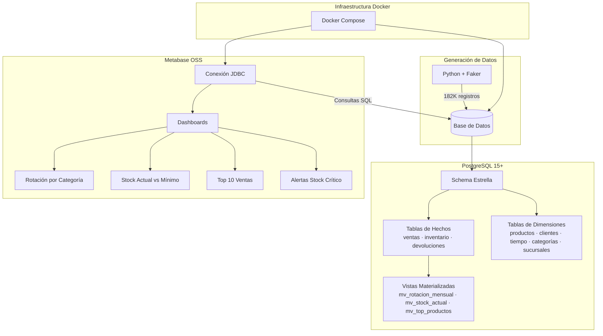

# Dashboard Metabase + Colección Analítica para E-commerce

[](https://www.postgresql.org/)
[](https://www.metabase.com/)
[](https://www.docker.com/)
[](https://www.python.org/)
[](https://www.gnu.org/software/make/)
[](SPEC.md)
[](LICENSE)

Panel visual conectado a **PostgreSQL** que muestra KPIs de inventario, rotación y alertas de stock mínimo para un e-commerce simulado. Proyecto que demuestra diseño de **schema estrella para OLAP**, optimización de **queries SQL**, integración con **Metabase** como herramienta BI, y generación de **datos sintéticos** con Python + Faker.

## Features

| Feature | Descripción |
|---------|-------------|
| **Schema Estrella** | 4 tablas de hechos + 5 dimensiones diseñadas para OLAP |
| **Vistas Materializadas** | 3 vistas pre-agregadas para queries sub-2s (rotación, stock, top productos) |
| **Particionamiento** | Tabla `ventas` particionada por mes (12 particiones, pruning activo) |
| **Alertas de Stock** | 2 Metabase Pulses: stock crítico (09:00) + resumen ventas (18:00) |
| **Datos Sintéticos** | ~182K registros con distribución Pareto para simular comportamiento real |
| **Exportación** | Dashboards exportables a CSV, XLSX, PNG y JSON |
| **Reproducible** | `make setup` → todo funcionando desde cero |

## Demo

Los dashboards están disponibles en `http://localhost:3000` después de ejecutar `make setup`.

| Dashboard | Descripción |
|-----------|-------------|
| **Rotación por Categoría** | Productos más vendidos y rotación mensual (bar chart, <2s) |
| **Stock Actual vs. Mínimo** | Alertas de stock bajo y niveles actuales con filtros estado/categoría |
| **Top 10 Ventas** | Productos con mayores ingresos (row chart, <20ms) |
| **Alertas** | Notificaciones programadas vía Metabase Pulses |

## Arquitectura



*Diagrama completo y detallado en [docs/ARCHITECTURE.md](docs/ARCHITECTURE.md)*

## Tech Stack

| Categoría | Tecnología | Propósito |
|-----------|-----------|-----------|
| **Base de datos** | PostgreSQL 15+ | Schema estrella, vistas materializadas, particionamiento |
| **BI / Visualización** | Metabase OSS | Dashboards, queries ad-hoc, exportación PNG/CSV/JSON |
| **Orquestación** | Docker Compose | Servicios reproducibles PostgreSQL + Metabase |
| **Generación de datos** | Python + Faker | Datos sintéticos realistas (182K registros, Pareto) |
| **Automatización** | GNU Make | Interfaz unificada (`make up`, `make db-init`, `make data-generate`) |

## Quick Start

```bash
# 1. Clonar y configurar entorno
cp .env.example .env

# 2. Setup completo (deps + servicios + BD + datos)
make setup
```

Esto levanta PostgreSQL 15+ y Metabase, crea el schema estrella, genera ~182K registros sintéticos, crea y refresca vistas materializadas, y deja los servicios listos para explorar en `http://localhost:3000`.

## Instalación Detallada

### Prerrequisitos

- **Docker** 20+ y **Docker Compose** 2+
- **Python** 3.8+
- **GNU Make** 4.0+
- **Git**

### Pasos

```bash
# 1. Clonar el repositorio
git clone <repo-url> dashboard-metabase
cd dashboard-metabase

# 2. Crear archivo de credenciales
cp .env.example .env
# Editar .env si es necesario (los defaults funcionan para desarrollo local)

# 3. Setup completo (recomendado)
make setup

# 4. Verificar que todo funciona
make status          # Services health
make data-count      # Record counts per table
make test            # Run static tests (no Docker required)
```

### Comandos Individuales

```bash
make deps            # Install Python dependencies
make up              # Start PostgreSQL + Metabase
make db-init         # Create schema (tables + indexes)
make data-generate   # Generate synthetic data
make create-views    # Create materialized views
make mv-refresh      # Refresh materialized views
```

## Uso Diario

```bash
# Iniciar servicios
make up

# Acceder a Metabase
# Abrir http://localhost:3000 en el navegador

# Conectar a PostgreSQL (CLI)
make db-shell

# Ver logs
make logs            # Todos los servicios
make logs-pg         # Solo PostgreSQL

# Detener servicios
make down

# Reconstruir desde cero (⚠️ pierde datos)
make destroy && make setup
```

### Explorar los Dashboards

1. Abrir `http://localhost:3000` en el navegador
2. Completar el setup inicial de Metabase (nombre, email, contraseña)
3. Conectar a la base de datos `ecommerce` (JDBC, credenciales en `.env`)
4. Navegar a los dashboards pre-configurados:
   - Rotación por Categoría
   - Stock Actual vs. Mínimo
   - Top 10 Ventas
   - Alertas

## Project Structure

```
├── docker/                   # Docker Compose para PostgreSQL + Metabase
├── sql/                      # SQL: vistas materializadas, índices, particiones
│   ├── views/
│   ├── indexes/
│   └── partitions/
├── scripts/                  # Generación de datos e init SQL
├── metabase/                 # Exportaciones de dashboards
├── specs/                    # Especificaciones por feature
│   ├── adr/                  # Architecture Decision Records
│   ├── spec-star-schema.md
│   ├── spec-data-generation.md
│   └── ...
├── docs/                     # Documentación completa
│   ├── ARCHITECTURE.md       # Diagramas y patrones
│   ├── SCHEMA.md             # Diseño del schema estrella
│   ├── TESTING.md            # Estrategia de pruebas
│   ├── METABASE_EXPORTS.md   # Exportación de dashboards
│   ├── METABASE_SETUP.md     # Configuración de Metabase
│   └── ...
├── tasks/                    # Planes de ejecución y TODO
├── tests/                    # Suites de pruebas (F0-F4)
├── Makefile                  # Automatización de tareas
└── SPEC.md                   # Especificación central
```

## Development

### Workflow

Este proyecto sigue **TDD + slicing vertical**: cada feature se implementa en commits pequeños y atómicos, con tests que pasan antes de avanzar.

```bash
# 1. Seleccionar tarea del plan en tasks/todo.md
# 2. Escribir test que falla (RED)
# 3. Implementar mínimo necesario (GREEN)
# 4. Refactorizar si es necesario
# 5. Correr suite completa
make test
# 6. Commit
```

### Estándares

- **SQL:** Keywords en UPPERCASE, JOINs explícitos, `EXPLAIN ANALYZE` antes de implementar
- **Python:** PEP 8, type hints, Google-style docstrings, transacciones BEGIN/COMMIT
- **Makefile:** Targets kebab-case con comentarios `##` para `make help`
- **Credenciales:** Siempre vía `.env`, nunca hardcodeadas

Ver [docs/CODE_STYLE.md](docs/CODE_STYLE.md) para convenciones completas.

## Testing

| Tipo | Herramienta | Comando | Cobertura |
|------|------------|---------|-----------|
| **Estáticos** | pytest | `make test` | 313+ tests (estructura, seguridad, schema) |
| **Rendimiento** | EXPLAIN ANALYZE | `make test-queries` | Todas las queries <2s (p95 validado) |
| **Integridad** | PostgreSQL | `make test-integrity` | Referencias FK, CHECK constraints |
| **Exportación** | Python + Metabase API | — | CSV/XLSX válidos (parsable, non-empty) |
| **Persistencia** | Shell + Docker | `test_persistence.sh` | Roundtrip destroy → setup → test |
| **Error** | Python + Docker | `test_error_handling.py` | Conexión fallida, restart, recovery |

Ver [docs/TESTING.md](docs/TESTING.md) para estrategia completa.

## Performance

| Query | Fuente | Tiempo | Validación |
|-------|--------|--------|------------|
| Rotación por Categoría | `mv_rotacion_mensual` | <2s | EXPLAIN ANALYZE + 10 ejecuciones |
| Stock Actual vs Mínimo | `mv_stock_actual` | <2s | EXPLAIN ANALYZE + 10 ejecuciones |
| Top 10 Ventas | `mv_top_productos` | <20ms | EXPLAIN ANALYZE + 10 ejecuciones |
| Alertas Stock Crítico | Tablas base | <100ms | EXPLAIN ANALYZE + 10 ejecuciones |

**Técnicas de optimización aplicadas:**
- **Vistas materializadas** para pre-agregar KPIs frecuentes
- **Particionamiento por rango** en tabla `ventas` (12 particiones mensuales)
- **Índices B-tree** en todas las columnas de JOIN, WHERE y GROUP BY (9+ índices)
- **Queries con columnas explícitas** — nunca `SELECT *`

## Security

- Credenciales exclusivamente vía `.env` — nunca hardcodeadas
- PostgreSQL no expuesto a `0.0.0.0` (solo red interna de Docker)
- Conexiones Metabase → PostgreSQL vía JDBC con usuario dedicado
- `.env` en `.gitignore` — protegido contra commits accidentales
- Sin datos reales — solo datos sintéticos generados con Faker
- Stack traces no expuestos al usuario en errores de API

## Documentation

| Recurso | Descripción |
|---------|-------------|
| [SPEC.md](SPEC.md) | Especificación central — objetivos, comandos, criterios de éxito |
| [docs/ARCHITECTURE.md](docs/ARCHITECTURE.md) | Arquitectura, patrones, diagramas Mermaid, ADR index |
| [docs/SCHEMA.md](docs/SCHEMA.md) | Schema estrella — tablas, relaciones, queries de ejemplo |
| [docs/TESTING.md](docs/TESTING.md) | Estrategia de testing (unidad, integración, rendimiento) |
| [docs/WORKFLOW.md](docs/WORKFLOW.md) | Plan de implementación por fases (F0–F6) |
| [docs/CODE_STYLE.md](docs/CODE_STYLE.md) | Convenciones de estilo SQL + Python |
| [docs/METABASE_SETUP.md](docs/METABASE_SETUP.md) | Configuración programática de Metabase |
| [docs/METABASE_EXPORTS.md](docs/METABASE_EXPORTS.md) | Endpoints de exportación CSV/XLSX/PNG/JSON |
| [docs/PRD.md](docs/PRD.md) | Requisitos de producto |
| [docs/TRD.md](docs/TRD.md) | Requisitos técnicos |
| [docs/TECH_DEBT.md](docs/TECH_DEBT.md) | Registro de deuda técnica |
| [docs/SECURITY.md](docs/SECURITY.md) | Guía de seguridad |
| [docs/APPFLOW.md](docs/APPFLOW.md) | Flujos de navegación |
| [specs/adr/](specs/adr/) | Architecture Decision Records (4 ADRs) |

## Contributing

Este es un proyecto de portafolio personal. Sugerencias y feedback son bienvenidos vía Issues o Pull Requests.

## Licencia

MIT — ver [LICENSE](LICENSE) para detalles.
