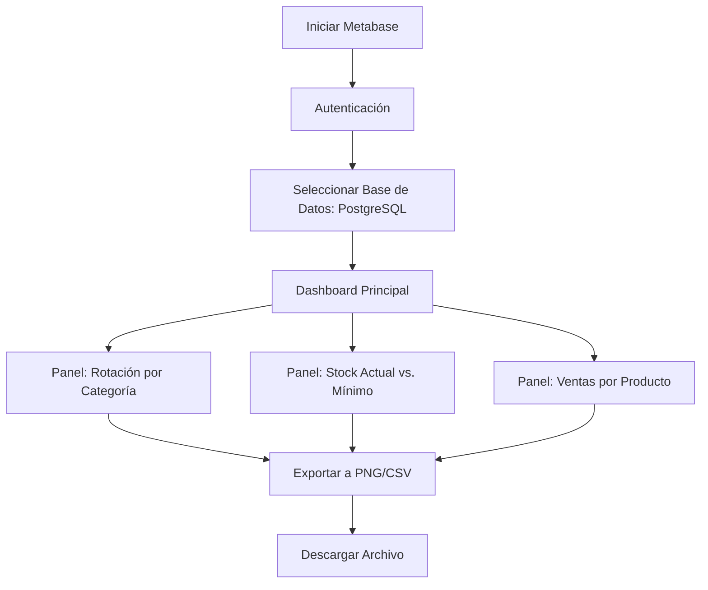
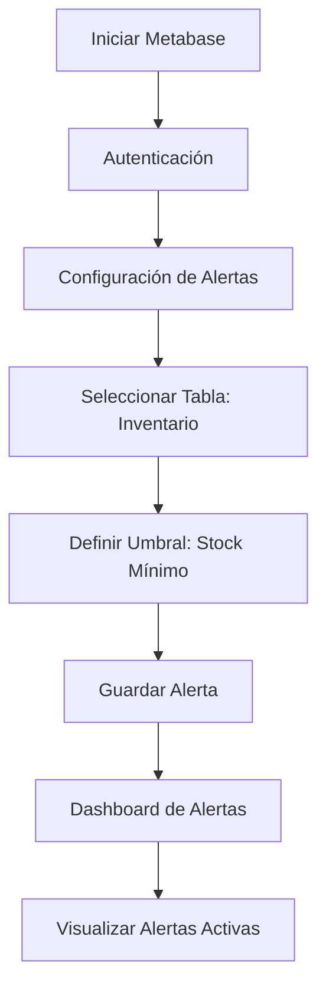
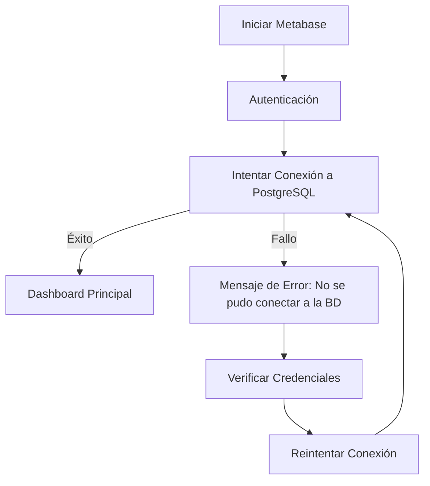

# Flujo de Navegación – Dashboard Metabase para E-commerce v1.0

**Fecha:** 2026-07-02 | **Autor:** Fisherk2

---

## 1. Actores y Roles

| **Rol**                    | **Permisos**                                                                | **Pantallas Iniciales**               |
| -------------------------- | --------------------------------------------------------------------------- | ------------------------------------- |
| **Gerente de Operaciones** | Acceso a todos los paneles, exportación de datos, configuración de alertas. | Dashboard principal (KPIs).           |
| **Analista de Datos**      | Acceso a paneles y queries personalizadas, exportación de datos.            | Lista de paneles + editor de queries. |
| **Desarrollador**          | Acceso a la configuración de la conexión a PostgreSQL, logs de queries.     | Configuración de BD + logs.           |
| **Dueño del E-commerce**   | Acceso a paneles de alertas y KPIs de alto nivel.                           | Dashboard de alertas.                 |

---

## 2. Diagramas de Flujo por Caso de Uso

### Flujo Principal: Visualización de KPIs

### Flujo Alternativo: Configuración de Alertas

### Flujo de Error: Conexión Fallida a PostgreSQL

---

## 3. Matriz de Navegación

| **Origen**               | **Destino**              | **Trigger**                       | **Condición**                   | **Estado Global Requerido**  | **Rollback/Cancel**           |
| ------------------------ | ------------------------ | --------------------------------- | ------------------------------- | ---------------------------- | ----------------------------- |
| Dashboard Principal      | Panel de Rotación        | Clic en "Rotación por Categoría"  | Usuario autenticado             | Conexión a PostgreSQL activa | Volver al Dashboard Principal |
| Dashboard Principal      | Panel de Stock           | Clic en "Stock Actual vs. Mínimo" | Usuario autenticado             | Conexión a PostgreSQL activa | Volver al Dashboard Principal |
| Panel de Rotación        | Exportar a PNG/CSV       | Clic en "Exportar"                | Panel cargado                   | Datos disponibles            | Cancelar exportación          |
| Dashboard Principal      | Configuración de Alertas | Clic en "Configurar Alertas"      | Usuario con permisos de edición | Conexión a PostgreSQL activa | Volver al Dashboard Principal |
| Configuración de Alertas | Dashboard de Alertas     | Guardar configuración             | Umbrales definidos              | Alertas configuradas         | Volver a Configuración        |
| Cualquier Panel          | Editor de Queries        | Clic en "Nueva Query"             | Usuario autenticado             | Conexión a PostgreSQL activa | Cerrar editor sin guardar     |

---

## 4. Flujos Alternativos y Errores

| **Escenario**                 | **Causa**                                     | **Acción del Sistema**                                                                     | **Acción del Usuario**                                   |
| ----------------------------- | --------------------------------------------- | ------------------------------------------------------------------------------------------ | -------------------------------------------------------- |
| Conexión fallida a PostgreSQL | Credenciales incorrectas o BD no disponible.  | Mostrar mensaje: "Error de conexión. Verificar credenciales o estado de la BD."            | Revisar credenciales o reiniciar servicios.              |
| Query demasiado lenta (>2s)   | Falta de índices o vistas materializadas.     | Mostrar mensaje: "La consulta está tardando. Optimice la query o use vistas predefinidas." | Usar vistas materializadas o contactar al desarrollador. |
| Permisos insuficientes        | Usuario sin permisos para ver/editar paneles. | Mostrar mensaje: "No tiene permisos para esta acción."                                     | Solicitar permisos al administrador.                     |
| Datos no disponibles          | Tablas vacías o sin conexión.                 | Mostrar mensaje: "No hay datos para mostrar."                                              | Verificar generación de datos o conexión.                |
| Exportación fallida           | Problema de permisos o espacio en disco.      | Mostrar mensaje: "No se pudo exportar. Verificar permisos o espacio."                      | Liberar espacio o contactar al administrador.            |

---

## 5. Gestión de Estado de Navegación

| **Aspecto**          | **Detalle**                                                                                   |
| -------------------- | --------------------------------------------------------------------------------------------- |
| **Estado Local**     | Filtros aplicados en paneles (ej: fecha, categoría).                                          |
| **Estado Global**    | Conexión a PostgreSQL, usuario autenticado, permisos.                                         |
| **Persistencia**     | Metabase guarda preferencias de usuario (ej: paneles favoritos) en su propia BD interna.      |
| **Deep Linking**     | No aplica (Metabase no soporta deep linking a paneles específicos en su versión open-source). |
| **Rutas Protegidas** | Todas las rutas requieren autenticación básica (usuario/contraseña).                          |

---

## 6. Trazabilidad

| **Flow-ID** | **PRD REQ-ID** | **Pantalla UI**           | **Componente Técnico**           |
| ----------- | -------------- | ------------------------- | -------------------------------- |
| FLOW-01     | US-01, RF-02   | Panel de Rotación         | PostgreSQL (Vista `mv_rotacion`) |
| FLOW-02     | US-01, RF-02   | Panel de Stock            | PostgreSQL (Vista `mv_stock`)    |
| FLOW-03     | US-02, RF-03   | Exportar a PNG/CSV        | Metabase (UI)                    |
| FLOW-04     | US-04, RF-07   | Dashboard de Alertas      | PostgreSQL (Vista `mv_alertas`)  |
| FLOW-05     | US-03, RF-04   | Editor de Queries         | PostgreSQL (SQL)                 |
| FLOW-06     | RF-01          | Configuración de Conexión | Metabase (JDBC)                  |
___