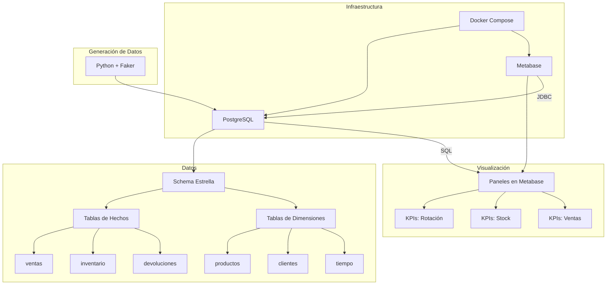
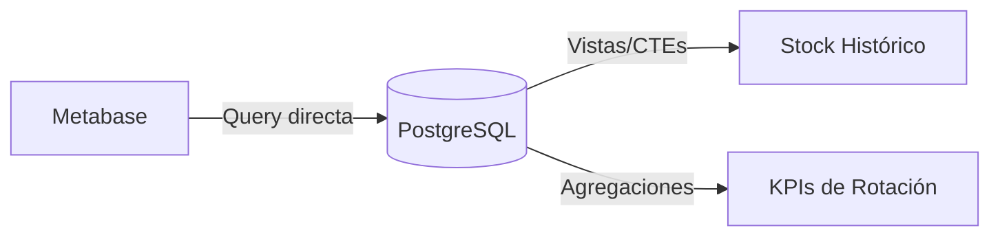

# ARCHITECTURE – Dashboard Metabase + Colección Analítica

**Fecha:** 2026-07-02 | **Autor:** Fisherk2

---

## 1. Patrones Arquitectónicos Aplicados

| **Patrón**                 | **Aplicación**                                                                                                     | **Justificación**                                                                                 |
| -------------------------- | ------------------------------------------------------------------------------------------------------------------ | ------------------------------------------------------------------------------------------------- |
| **Schema Estrella**        | Tablas de hechos (`ventas`, `inventario`, `devoluciones`) + tablas de dimensiones (`productos`, `clientes`, etc.). | Optimizado para consultas analíticas complejas (OLAP).                                            |
| **Adapter Pattern**        | Conexión entre Metabase y PostgreSQL mediante JDBC.                                                                | Permite que Metabase (herramienta genérica) se conecte a PostgreSQL (fuente de datos específica). |
| **Read-Optimized View**    | Vistas materializadas para KPIs críticos (ej: `mv_rotacion_mensual`).                                              | Pre-calcula resultados para queries frecuentes, mejorando rendimiento.                            |
| **Separation of Concerns** | Separación clara entre: Presentación (Metabase), Lógica (PostgreSQL), Datos (Schema estrella), Infraestructura (Docker). | Facilita mantenimiento, testing y escalabilidad.                                          |

---

## 2. Diagrama de Componentes y Flujo de Datos

### Diagrama Simplificado (Componentes)

---

## 3. Estrategia de Comunicación entre Módulos

- **Metabase → PostgreSQL:** Conexión directa mediante **JDBC** (configurada en Metabase).
- **PostgreSQL → Metabase:** Resultados de queries en formato tabular.
- **Script Python → PostgreSQL:** Inserción de datos sintéticos mediante `psycopg2` o `SQLAlchemy`.
- **Docker Compose → Servicios:** Orquestación de contenedores mediante red interna de Docker.

---

## 4. Justificación Técnica de Elecciones Críticas

| **Decisión**        | **Alternativas Consideradas**                   | **Razón para Elegir**                                                                            |
| ------------------- | ----------------------------------------------- | ------------------------------------------------------------------------------------------------ |
| **PostgreSQL 15+**  | MySQL, SQLite, MongoDB                          | Soporte nativo para schema estrella, vistas materializadas, particionamiento, y JSON.            |
| **Metabase**        | Tableau, Power BI, Grafana                      | Open-source, fácil de configurar, soporta conexión directa a PostgreSQL y exportación a PNG/CSV. |
| **Schema Estrella** | Schema normalizado (3FN), Schema desnormalizado | Optimizado para queries analíticas (OLAP) con agregaciones frecuentes.                           |
| **Docker Compose**  | Instalación nativa, Kubernetes                  | Reproducibilidad, aislamiento de servicios, y portabilidad.                                      |
| **Python + Faker**  | Datos reales, Mockaroo                          | Flexibilidad para generar datos sintéticos con reglas de negocio (ej: distribución de ventas).   |

---

## 5. Principios SOLID Aplicados

| **Principio**                   | **Aplicación en el Proyecto**                                                                                               |
| ------------------------------- | --------------------------------------------------------------------------------------------------------------------------- |
| **Single Responsibility (SRP)** | Cada componente tiene una sola responsabilidad: Metabase (visualización), PostgreSQL (almacenamiento/lógica), Python (generación). |
| **Open/Closed (OCP)**           | El schema estrella permite agregar nuevas dimensiones o hechos **sin modificar** las tablas existentes.                     |
| **Liskov Substitution (LSP)**   | No aplica (no hay herencia en el diseño actual).                                                                            |
| **Interface Segregation (ISP)** | No aplica (no hay interfaces explícitas en SQL).                                                                            |
| **Dependency Inversion (DIP)**  | Docker Compose **abstrae** la dependencia entre servicios (PostgreSQL y Metabase no dependen directamente el uno del otro). |

---

## 6. Architecture Decision Records (ADR) Index

| ADR | Título | Estado |
|-----|--------|--------|
| [ADR-001](../specs/adr/adr-001-postgresql.md) | PostgreSQL 15+ como base de datos analítica | Aceptado |
| [ADR-002](../specs/adr/adr-002-metabase.md) | Metabase OSS como herramienta BI | Aceptado |
| [ADR-003](../specs/adr/adr-003-star-schema.md) | Star schema para cargas OLAP | Aceptado |
| [ADR-004](../specs/adr/adr-004-docker-compose.md) | Docker Compose para orquestación de servicios | Aceptado |

---

## 7. Patrones de Diseño Aplicados

| **Patrón**             | **Aplicación**                                                                                             |
| ---------------------- | ---------------------------------------------------------------------------------------------------------- |
| **Adapter Pattern**    | Metabase actúa como **adaptador** entre el usuario y PostgreSQL, traduciendo queries SQL a visualizaciones. |
| **Repository Pattern** | PostgreSQL actúa como **repositorio** centralizado de datos.                                               |
