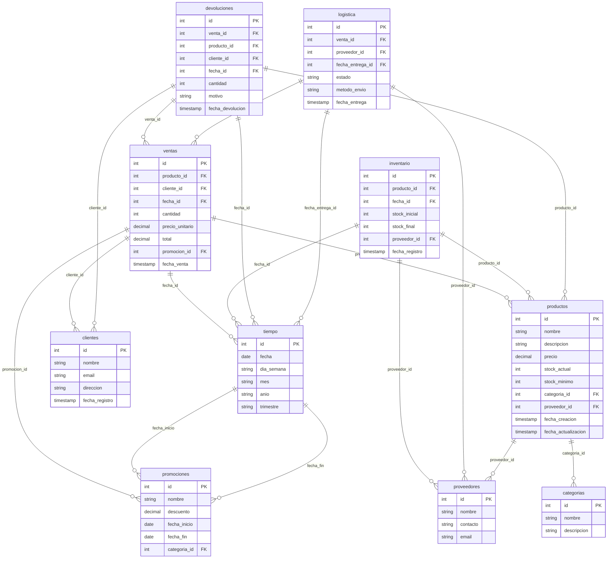

# Database Schema – Dashboard Metabase para E-commerce v1.0

**Fecha:** 2026-07-02 | **Autor:** Fisherk2

---

## 1. Estrategia de Almacenamiento


| **Aspecto**         | **Detalle**                                                                                                                                                                             |
| ------------------- | --------------------------------------------------------------------------------------------------------------------------------------------------------------------------------------- |
| **Tipo**            | **Schema Estrella para OLAP** (Tablas de hechos + Tablas de dimensiones).                                                                                                               |
| **Justificación**   | Optimizado para consultas analíticas complejas (ej: agregaciones por categoría, tiempo, proveedor). Permite separar datos transaccionales (hechos) de datos descriptivos (dimensiones). |
| **Motor y Versión** | **PostgreSQL 15+** (soporte nativo para particionamiento, vistas materializadas, CTEs, y JSON).                                                                                         |


---

## 2. Modelo Entidad-Relación (Schema Estrella)



---

## 3. Esquema de Tablas/Colecciones

### Tablas de Dimensiones


| **Entidad** | **Campo**      | **Tipo**     | **Constraints**             | **Índice**  | **Nullable** | **Descripción**                  |
| ----------- | -------------- | ------------ | --------------------------- | ----------- | ------------ | -------------------------------- |
| categorias  | id             | SERIAL       | PRIMARY KEY                 | Sí (B-tree) | NO           | Identificador único.             |
| categorias  | nombre         | VARCHAR(100) | UNIQUE                      | Sí (B-tree) | NO           | Nombre de la categoría.          |
| categorias  | descripcion    | TEXT         | -                           | No          | SÍ           | Descripción de la categoría.     |
| proveedores | id             | SERIAL       | PRIMARY KEY                 | Sí (B-tree) | NO           | Identificador único.             |
| proveedores | nombre         | VARCHAR(100) | -                           | Sí (B-tree) | NO           | Nombre del proveedor.            |
| proveedores | contacto       | VARCHAR(100) | -                           | No          | SÍ           | Nombre del contacto.             |
| proveedores | email          | VARCHAR(100) | UNIQUE                      | Sí (B-tree) | SÍ           | Email del proveedor.             |
| clientes    | id             | SERIAL       | PRIMARY KEY                 | Sí (B-tree) | NO           | Identificador único.             |
| clientes    | nombre         | VARCHAR(100) | -                           | Sí (B-tree) | NO           | Nombre del cliente.              |
| clientes    | email          | VARCHAR(100) | UNIQUE                      | Sí (B-tree) | SÍ           | Email del cliente.               |
| clientes    | direccion      | TEXT         | -                           | No          | SÍ           | Dirección del cliente.           |
| clientes    | fecha_registro | TIMESTAMP    | -                           | No          | NO           | Fecha de registro del cliente.   |
| tiempo      | id             | SERIAL       | PRIMARY KEY                 | Sí (B-tree) | NO           | Identificador único.             |
| tiempo      | fecha          | DATE         | UNIQUE                      | Sí (B-tree) | NO           | Fecha del registro.              |
| tiempo      | dia_semana     | VARCHAR(10)  | -                           | No          | NO           | Día de la semana (ej: "Lunes").  |
| tiempo      | mes            | VARCHAR(10)  | -                           | No          | NO           | Mes (ej: "Enero").               |
| tiempo      | anio           | VARCHAR(4)   | -                           | No          | NO           | Año (ej: "2026").                |
| tiempo      | trimestre      | VARCHAR(10)  | -                           | No          | NO           | Trimestre (ej: "Q1").            |
| promociones | id             | SERIAL       | PRIMARY KEY                 | Sí (B-tree) | NO           | Identificador único.             |
| promociones | nombre         | VARCHAR(100) | -                           | Sí (B-tree) | NO           | Nombre de la promoción.          |
| promociones | descuento      | DECIMAL(5,2) | CHECK (descuento >= 0)      | No          | NO           | Porcentaje de descuento.         |
| promociones | fecha_inicio   | DATE         | -                           | Sí (B-tree) | NO           | Fecha de inicio de la promoción. |
| promociones | fecha_fin      | DATE         | -                           | Sí (B-tree) | NO           | Fecha de fin de la promoción.    |
| promociones | categoria_id   | INT          | FOREIGN KEY (categorias.id) | Sí (B-tree) | SÍ           | Categoría aplicable.             |


---

### Tablas de Hechos


| **Entidad**  | **Campo**           | **Tipo**      | **Constraints**              | **Índice**  | **Nullable** | **Descripción**                                |
| ------------ | ------------------- | ------------- | ---------------------------- | ----------- | ------------ | ---------------------------------------------- |
| productos    | id                  | SERIAL        | PRIMARY KEY                  | Sí (B-tree) | NO           | Identificador único.                           |
| productos    | nombre              | VARCHAR(100)  | -                            | Sí (B-tree) | NO           | Nombre del producto.                           |
| productos    | descripcion         | TEXT          | -                            | No          | SÍ           | Descripción del producto.                      |
| productos    | precio              | DECIMAL(10,2) | CHECK (precio > 0)           | No          | NO           | Precio del producto.                           |
| productos    | stock_actual        | INT           | CHECK (stock_actual >= 0)    | No          | NO           | Stock actual en inventario.                    |
| productos    | stock_minimo        | INT           | CHECK (stock_minimo >= 0)    | No          | NO           | Stock mínimo para alertas.                     |
| productos    | categoria_id        | INT           | FOREIGN KEY (categorias.id)  | Sí (B-tree) | NO           | Categoría del producto.                        |
| productos    | proveedor_id        | INT           | FOREIGN KEY (proveedores.id) | Sí (B-tree) | NO           | Proveedor del producto.                        |
| productos    | fecha_creacion      | TIMESTAMP     | -                            | No          | NO           | Fecha de creación del producto.                |
| productos    | fecha_actualizacion | TIMESTAMP     | -                            | No          | SÍ           | Fecha de última actualización.                 |
| ventas       | id                  | SERIAL        | PRIMARY KEY                  | Sí (B-tree) | NO           | Identificador único.                           |
| ventas       | producto_id         | INT           | FOREIGN KEY (productos.id)   | Sí (B-tree) | NO           | Producto vendido.                              |
| ventas       | cliente_id          | INT           | FOREIGN KEY (clientes.id)    | Sí (B-tree) | NO           | Cliente que realizó la compra.                 |
| ventas       | fecha_id            | INT           | FOREIGN KEY (tiempo.id)      | Sí (B-tree) | NO           | Fecha de la venta.                             |
| ventas       | cantidad            | INT           | CHECK (cantidad > 0)         | No          | NO           | Cantidad vendida.                              |
| ventas       | precio_unitario     | DECIMAL(10,2) | CHECK (precio_unitario > 0)  | No          | NO           | Precio unitario en el momento de la venta.     |
| ventas       | total               | DECIMAL(10,2) | -                            | No          | NO           | Total de la venta (cantidad * precio).         |
| ventas       | promocion_id        | INT           | FOREIGN KEY (promociones.id) | Sí (B-tree) | SÍ           | Promoción aplicada (NULL si no aplica).        |
| ventas       | fecha_venta         | TIMESTAMP     | -                            | Sí (B-tree) | NO           | Fecha y hora exacta de la venta.               |
| inventario   | id                  | SERIAL        | PRIMARY KEY                  | Sí (B-tree) | NO           | Identificador único.                           |
| inventario   | producto_id         | INT           | FOREIGN KEY (productos.id)   | Sí (B-tree) | NO           | Producto en inventario.                        |
| inventario   | fecha_id            | INT           | FOREIGN KEY (tiempo.id)      | Sí (B-tree) | NO           | Fecha del registro de inventario.              |
| inventario   | stock_inicial       | INT           | CHECK (stock_inicial >= 0)   | No          | NO           | Stock inicial en el período.                   |
| inventario   | stock_final         | INT           | CHECK (stock_final >= 0)     | No          | NO           | Stock final en el período.                     |
| inventario   | proveedor_id        | INT           | FOREIGN KEY (proveedores.id) | Sí (B-tree) | SÍ           | Proveedor asociado al inventario.              |
| inventario   | fecha_registro      | TIMESTAMP     | -                            | No          | NO           | Fecha de registro del inventario.              |
| devoluciones | id                  | SERIAL        | PRIMARY KEY                  | Sí (B-tree) | NO           | Identificador único.                           |
| devoluciones | venta_id            | INT           | FOREIGN KEY (ventas.id)      | Sí (B-tree) | NO           | Venta asociada a la devolución.                |
| devoluciones | producto_id         | INT           | FOREIGN KEY (productos.id)   | Sí (B-tree) | NO           | Producto devuelto.                             |
| devoluciones | cliente_id          | INT           | FOREIGN KEY (clientes.id)    | Sí (B-tree) | NO           | Cliente que realizó la devolución.             |
| devoluciones | fecha_id            | INT           | FOREIGN KEY (tiempo.id)      | Sí (B-tree) | NO           | Fecha de la devolución.                        |
| devoluciones | cantidad            | INT           | CHECK (cantidad > 0)         | No          | NO           | Cantidad devuelta.                             |
| devoluciones | motivo              | TEXT          | -                            | No          | SÍ           | Motivo de la devolución.                       |
| devoluciones | fecha_devolucion    | TIMESTAMP     | -                            | Sí (B-tree) | NO           | Fecha y hora de la devolución.                 |
| logistica    | id                  | SERIAL        | PRIMARY KEY                  | Sí (B-tree) | NO           | Identificador único.                           |
| logistica    | venta_id            | INT           | FOREIGN KEY (ventas.id)      | Sí (B-tree) | NO           | Venta asociada al envío.                       |
| logistica    | proveedor_id        | INT           | FOREIGN KEY (proveedores.id) | Sí (B-tree) | SÍ           | Proveedor asociado a la logística.             |
| logistica    | fecha_entrega_id    | INT           | FOREIGN KEY (tiempo.id)      | Sí (B-tree) | NO           | Fecha de entrega estimada.                     |
| logistica    | estado              | VARCHAR(50)   | -                            | Sí (B-tree) | NO           | Estado del envío (ej: "Enviado", "Entregado"). |
| logistica    | metodo_envio        | VARCHAR(50)   | -                            | No          | SÍ           | Método de envío (ej: "DHL", "FedEx").          |
| logistica    | fecha_entrega       | TIMESTAMP     | -                            | Sí (B-tree) | SÍ           | Fecha real de entrega.                         |


---

## 4. Patrones de Acceso y Consultas Críticas

### Queries Frecuentes

1. **Rotación por Categoría (Mensual/Anual)**
  ```sql
   SELECT 
       c.nombre AS categoria,
       t.mes,
       t.anio,
       SUM(v.cantidad) AS ventas_totales,
       SUM(v.total) AS ingresos_totales
   FROM ventas v
   JOIN productos p ON v.producto_id = p.id
   JOIN categorias c ON p.categoria_id = c.id
   JOIN tiempo t ON v.fecha_id = t.id
   GROUP BY c.nombre, t.mes, t.anio
   ORDER BY t.anio, t.mes, ventas_totales DESC;
  ```
2. **Stock Actual vs. Mínimo (por Producto)**
  ```sql
   SELECT 
       p.id,
       p.nombre,
       p.stock_actual,
       p.stock_minimo,
       CASE 
           WHEN p.stock_actual <= p.stock_minimo THEN 'ALERTA'
           ELSE 'OK'
       END AS estado
   FROM productos p
   WHERE p.stock_actual <= p.stock_minimo OR p.stock_actual <= p.stock_minimo * 1.1;
  ```
3. **Ventas por Producto (Top 10)**
  ```sql
   SELECT 
       p.nombre,
       SUM(v.cantidad) AS unidades_vendidas,
       SUM(v.total) AS ingresos
   FROM ventas v
   JOIN productos p ON v.producto_id = p.id
   GROUP BY p.nombre
   ORDER BY ingresos DESC
   LIMIT 10;
  ```
4. **Alertas de Stock Mínimo (Configurable)**
  ```sql
   SELECT 
       p.id,
       p.nombre,
       p.stock_actual,
       p.stock_minimo,
       pr.nombre AS proveedor
   FROM productos p
   JOIN proveedores pr ON p.proveedor_id = pr.id
   WHERE p.stock_actual <= p.stock_minimo;
  ```

### Estrategia de Optimización

- **Índices**: Crear índices en columnas usadas en `JOIN`, `WHERE`, y `GROUP BY` (ej: `producto_id`, `fecha_id`, `categoria_id`).
- **Vistas Materializadas**: Pre-calcular KPIs críticos (ej: rotación mensual, stock por categoría).
  ```sql
  CREATE MATERIALIZED VIEW mv_rotacion_mensual AS
  SELECT 
      c.nombre AS categoria,
      t.mes,
      t.anio,
      SUM(v.cantidad) AS ventas_totales
  FROM ventas v
  JOIN productos p ON v.producto_id = p.id
  JOIN categorias c ON p.categoria_id = c.id
  JOIN tiempo t ON v.fecha_id = t.id
  GROUP BY c.nombre, t.mes, t.anio;

  REFRESH MATERIALIZED VIEW mv_rotacion_mensual;
  ```
- **Particionamiento**: Particionar la tabla `ventas` por rango de fechas (ej: mensual).
  ```sql
  CREATE TABLE ventas (
      id SERIAL,
      producto_id INT,
      cliente_id INT,
      fecha_venta TIMESTAMP,
      cantidad INT,
      precio_unitario DECIMAL(10,2),
      total DECIMAL(10,2)
  ) PARTITION BY RANGE (fecha_venta);

  CREATE TABLE ventas_2026_01 PARTITION OF ventas 
      FOR VALUES FROM ('2026-01-01') TO ('2026-02-01');
  ```

---

## 5. Ciclo de Vida y Retención


| **Entidad**  | **Creación**            | **Actualización**                | **Soft Delete** | **Hard Delete** | **Retención**                    |
| ------------ | ----------------------- | -------------------------------- | --------------- | --------------- | -------------------------------- |
| productos    | Manual (script Python)  | Manual (script Python)           | No              | No              | Indefinida                       |
| clientes     | Manual (script Python)  | Manual (script Python)           | No              | No              | Indefinida                       |
| ventas       | Automática (simulación) | No aplica                        | No              | No              | 5 años (para análisis histórico) |
| inventario   | Automática (simulación) | No aplica                        | No              | No              | 2 años                           |
| devoluciones | Automática (simulación) | No aplica                        | No              | No              | 2 años                           |
| logistica    | Automática (simulación) | Manual (actualización de estado) | No              | No              | 1 año                            |


---

## 6. Seguridad y Cumplimiento


| **Aspecto**              | **Detalle**                                                              |
| ------------------------ | ------------------------------------------------------------------------ |
| **Cifrado en Reposo**    | No aplica (datos sintéticos, no PII).                                    |
| **Cifrado en Tránsito**  | Opcional: Configurar SSL/TLS en PostgreSQL si se expone fuera de Docker. |
| **Máscara de Datos/PII** | No aplica (datos sintéticos).                                            |
| **Auditoría**            | Logs de PostgreSQL para consultas lentas o errores.                      |
| **Gestión de Secretos**  | Credenciales de PostgreSQL en variables de entorno (no hardcodeadas).    |


---

## 7. Migraciones y Versionado


| **Aspecto**           | **Detalle**                                                                       |
| --------------------- | --------------------------------------------------------------------------------- |
| **Estrategia**        | Forward-only (solo migraciones hacia adelante).                                   |
| **Herramienta**       | Scripts SQL manuales + Docker para reinicio rápido.                               |
| **Convención de Nombres** | `YYYYMMDD_HHMMSS_descripcion.sql` (ej: `20260702_140000_crear_tabla_ventas.sql`). |

**Ejemplo de Migración:**

```sql
-- 20260702_140000_crear_tabla_ventas.sql
CREATE TABLE IF NOT EXISTS ventas (
   id SERIAL PRIMARY KEY,
   producto_id INT NOT NULL,
   cliente_id INT NOT NULL,
   fecha_venta TIMESTAMP NOT NULL
);
```

___