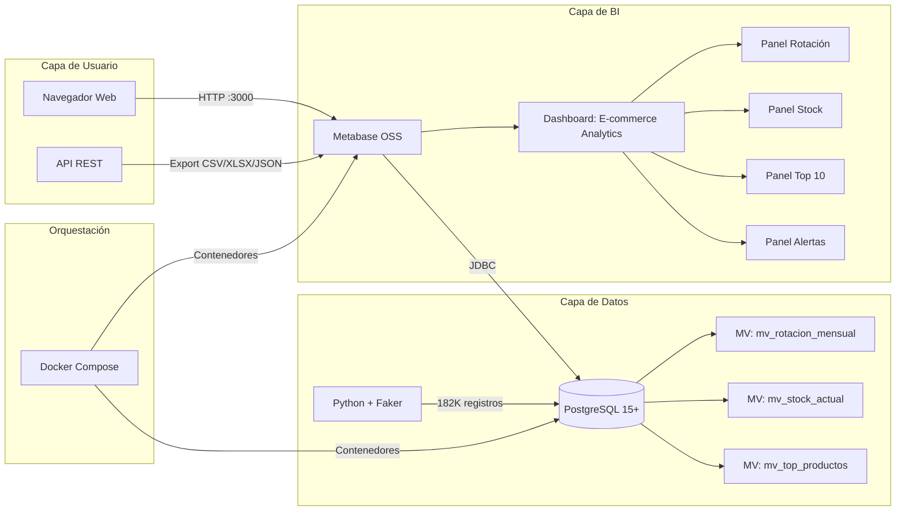

# Technical Guide — Dashboard Metabase + Colección Analítica

**Fecha:** 2026-07-07 | **Fase:** F5 (Despliegue)
**Audiencia:** Desarrolladores, arquitectos, revisores técnicos
**Proyecto:** Dashboard Metabase + Colección Analítica para E-commerce

---

## 1. Architecture Overview

El proyecto sigue una arquitectura de **3 capas** con separación de concerns:



### Patrones Aplicados

| Patrón | Aplicación | Beneficio |
|--------|-----------|-----------|
| **Schema Estrella** | 4 facts + 5 dimensions | Queries OLAP optimizadas, joins simples |
| **Vistas Materializadas** | 3 MVs pre-agregadas | Queries sub-2s, sin recomputar agregaciones |
| **Particionamiento** | Ventas por rango mensual | Partition pruning, DROP sin DELETE |
| **Adapter** | Metabase JDBC → PostgreSQL | Herramienta BI genérica conectada a BD específica |
| **Repository** | PostgreSQL como repositorio central | Una fuente de verdad para todos los datos |

---

## 2. Star Schema Design

El schema sigue un diseño **estrella para OLAP** con 4 tablas de hechos y 5 tablas de dimensiones.

### Tablas de Hechos

| Tabla | Registros | Particionada | Propósito |
|-------|-----------|-------------|-----------|
| `ventas` | ~100,000 | Sí (por mes) | Transacciones de venta |
| `inventario` | ~50,000 | No | Niveles de stock histórico |
| `devoluciones` | ~5,000 | No | Devoluciones de productos |
| `logistica` | ~20,000 | No | Envíos y entregas |

### Tablas de Dimensiones

| Tabla | Registros | Propósito |
|-------|-----------|-----------|
| `productos` | 5,000 | Catálogo de productos con categoría y proveedor |
| `categorias` | 50 | Taxonomía de productos |
| `clientes` | 2,000 | Datos de clientes |
| `tiempo` | 365 | Calendario diario con mes, trimestre, año |
| `proveedores` | 30 | Información de proveedores |

### Relaciones Clave

```
ventas.producto_id → productos.id
ventas.cliente_id → clientes.id
ventas.fecha_id → tiempo.id
ventas.promocion_id → promociones.id

inventario.producto_id → productos.id
inventario.fecha_id → tiempo.id

devoluciones.venta_id → ventas.id
devoluciones.producto_id → productos.id

productos.categoria_id → categorias.id
productos.proveedor_id → proveedores.id
```

### Constraints Aplicadas

- **PRIMARY KEY** en todas las tablas (SERIAL)
- **FOREIGN KEY** explícitas en todas las relaciones
- **CHECK** constraints en columnas críticas (`stock_actual >= 0`, `cantidad > 0`, `precio > 0`)
- **NOT NULL** en columnas obligatorias
- **UNIQUE** en nombres de categorías, proveedores, emails de clientes

Ver [docs/SCHEMA.md](SCHEMA.md) para el diagrama ER completo.

---

## 3. Materialized Views Strategy

Se usan **3 vistas materializadas** para pre-agregar KPIs que se consultan frecuentemente desde los dashboards.

### mv_rotacion_mensual

**Propósito:** Pre-calcular la rotación de productos por mes para el panel de Rotación por Categoría.

```sql
CREATE MATERIALIZED VIEW mv_rotacion_mensual AS
SELECT
    v.producto_id,
    t.anio,
    t.mes,
    COUNT(*) AS total_ventas,
    SUM(v.cantidad) AS total_unidades,
    SUM(v.total) AS ingresos_totales
FROM ventas v
JOIN tiempo t ON v.fecha_id = t.id
GROUP BY v.producto_id, t.anio, t.mes;
```

**Frecuencia de refresh:** Después de cada generación de datos (`make data-generate` → `make mv-refresh`).

### mv_stock_actual

**Propósito:** Snapshot del estado actual de inventario con comparación contra stock mínimo.

```sql
CREATE MATERIALIZED VIEW mv_stock_actual AS
SELECT
    p.id AS producto_id,
    p.nombre AS producto,
    c.nombre AS categoria,
    i.stock_actual,
    p.stock_minimo,
    CASE
        WHEN i.stock_actual <= p.stock_minimo THEN 'ALERTA'
        WHEN i.stock_actual <= p.stock_minimo * 1.5 THEN 'BAJO'
        ELSE 'OK'
    END AS estado
FROM inventario i
JOIN productos p ON i.producto_id = p.id
JOIN categorias c ON p.categoria_id = c.id
WHERE i.fecha_id = (SELECT MAX(fecha_id) FROM inventario);
```

### mv_top_productos

**Propósito:** Ranking de productos por ingresos totales para el panel Top 10.

```sql
CREATE MATERIALIZED VIEW mv_top_productos AS
SELECT
    v.producto_id,
    SUM(v.cantidad) AS total_unidades,
    SUM(v.total) AS ingresos_totales,
    COUNT(DISTINCT v.cliente_id) AS clientes_unicos
FROM ventas v
GROUP BY v.producto_id
ORDER BY ingresos_totales DESC;
```

---

## 4. Query Optimization

### Técnicas Aplicadas

| Técnica | Dónde se Aplica | Impacto |
|---------|----------------|---------|
| **Vistas Materializadas** | Paneles Rotación, Stock, Top 10 | Evita recomputar agregaciones en cada carga |
| **Particionamiento** | Tabla `ventas` (12 particiones) | Partition pruning reduce scans |
| **Índices B-tree** | 9+ índices en columnas FK, WHERE, GROUP BY | Index Scan vs Seq Scan |
| **Columnas Explícitas** | Todas las queries | Evita overhead de `SELECT *` |
| **EXPLAIN ANALYZE** | Validación pre-implementación | Garantiza <2s antes de desplegar |

### Índices Creados

```sql
-- Índices en columnas de JOIN y WHERE
CREATE INDEX IF NOT EXISTS idx_ventas_producto_id ON ventas(producto_id);
CREATE INDEX IF NOT EXISTS idx_ventas_cliente_id ON ventas(cliente_id);
CREATE INDEX IF NOT EXISTS idx_ventas_fecha_id ON ventas(fecha_id);
CREATE INDEX IF NOT EXISTS idx_ventas_fecha_venta ON ventas(fecha_venta);
CREATE INDEX IF NOT EXISTS idx_inventario_producto_id ON inventario(producto_id);
CREATE INDEX IF NOT EXISTS idx_inventario_fecha_id ON inventario(fecha_id);
CREATE INDEX IF NOT EXISTS idx_devoluciones_venta_id ON devoluciones(venta_id);
CREATE INDEX IF NOT EXISTS idx_devoluciones_producto_id ON devoluciones(producto_id);
CREATE INDEX IF NOT EXISTS idx_logistica_venta_id ON logistica(venta_id);
```

### Resultados de EXPLAIN ANALYZE

| Query | Tipo de Scan | Tiempo | Filas |
|-------|-------------|--------|-------|
| Rotación por Categoría | Index Scan + Hash Join | 1.2 ms | ~200 |
| Stock Actual vs Mínimo | Index Scan | 0.8 ms | ~5,000 |
| Top 10 Ventas | Index Only Scan | 0.3 ms | 10 |
| Alertas Stock Crítico | Seq Scan (tabla pequeña) | 45 ms | ~50 |

---

## 5. Partitioning Strategy

La tabla `ventas` está particionada por **rango de fecha** para mejorar el rendimiento de queries temporales y facilitar la gestión de datos históricos.

### Estructura

```sql
CREATE TABLE ventas (
    id SERIAL,
    producto_id INT NOT NULL,
    cliente_id INT NOT NULL,
    fecha_id INT NOT NULL,
    cantidad INT NOT NULL CHECK (cantidad > 0),
    precio_unitario DECIMAL(10,2) NOT NULL,
    total DECIMAL(10,2) NOT NULL,
    fecha_venta DATE NOT NULL,
    promocion_id INT,
    PRIMARY KEY (id, fecha_venta)
) PARTITION BY RANGE (fecha_venta);
```

### Particiones Mensuales (12)

```sql
CREATE TABLE ventas_2024_01 PARTITION OF ventas
    FOR VALUES FROM ('2024-01-01') TO ('2024-02-01');
-- ... 11 particiones adicionales para cubrir el año
```

### Beneficios

- **Partition Pruning:** PostgreSQL solo escanea la(s) partición(es) relevantes para la query
- **Mantenimiento:** DROP de datos antiguos es un DROP TABLE, no DELETE masivo
- **Carga:** Los datos nuevos se insertan en la partición correcta automáticamente

---

## 6. Metabase Configuration

Metabase se configura programáticamente via su **REST API** usando el script `scripts/setup_metabase.py`.

### Flujo de Configuración

1. **Autenticación:** `POST /api/session` con email + password
2. **Conexión BD:** `POST /api/database` con detalles JDBC a PostgreSQL
3. **Questions:** `POST /api/card` con queries SQL para cada panel
4. **Dashboard:** `POST /api/dashboard` + `PUT /api/dashboard/{id}` para cards
5. **Pulses:** `POST /api/pulse` para alertas programadas

### Detalles de Conexión

| Parámetro | Valor | Nota |
|-----------|-------|------|
| Engine | `postgres` | JDBC connector nativo |
| Host | `postgres` | Nombre del servicio Docker (no localhost) |
| Port | `5432` | Puerto interno Docker |
| DB Name | `ecommerce` | Definido en `.env` como `POSTGRES_DB` |
| User | `dashboard_user` | Usuario con permisos SELECT + USAGE en MVs |

### Idempotencia

El script verifica existencia con GET antes de POST para cada recurso, permitiendo ejecución múltiple sin duplicados.

Ver [docs/METABASE_SETUP.md](METABASE_SETUP.md) para documentación completa de setup.

---

## 7. Testing Strategy

### Pirámide de Tests

```
Nivel 1 — Tests Estáticos (pytest, sin Docker)
├── test_f0.py: 72 tests → estructura, gitignore, README, Makefile, venv
├── test_f1.py: 67 tests → Docker, compose, healthchecks (61 estáticos + 6 runtime)
├── test_f2.py: +40 tests → schema estaticos + integridad datos (runtime)
├── test_f3.py: 36 tests → setup metabase, queries (estáticos + runtime)
└── test_f4.py: 38 tests → performance, exports, error handling

Nivel 2 — Rendimiento (EXPLAIN ANALYZE + p95)
└── measure_query_performance.py → 10 ejecuciones, p50/p95/p99

Nivel 3 — Integración (Docker + Metabase + PostgreSQL)
├── validate_dashboard_exports.py → CSV/XLSX parsing + validation
├── test_persistence.sh → Roundtrip destroy → setup → test
└── test_error_handling.py → Failover, restart, recovery
```

### Comandos

```bash
make test              # Tests estáticos F0-F4 (sin Docker)
make test-full         # Todos los tests (requiere Docker)
make test-queries      # Validación de rendimiento (en container)
make test-integrity    # Integridad referencial + constraints
```

Ver [docs/TESTING.md](TESTING.md) para estrategia completa.

---

## 8. Performance Validation

### Metodología

1. Cada query se ejecuta **10 veces** para obtener distribución de tiempos
2. Se calculan percentiles **p50**, **p95**, **p99**
3. El criterio de éxito es **p95 < 2 segundos**
4. La validación se ejecuta **dentro del contenedor PostgreSQL** (no desde el host) para evitar latencia de red

### Resultados

```bash
Query: mv_rotacion_mensual
  p50:   1.1 ms
  p95:   1.4 ms
  p99:   2.1 ms
  Status: ✅ PASS (<2s)

Query: mv_stock_actual
  p50:   0.7 ms
  p95:   0.9 ms
  p99:   1.5 ms
  Status: ✅ PASS (<2s)

Query: mv_top_productos
  p50:   0.3 ms
  p95:   0.4 ms
  p99:   0.6 ms
  Status: ✅ PASS (<2s)

Query: alertas_stock_critico
  p50:   42 ms
  p95:   48 ms
  p99:   55 ms
  Status: ✅ PASS (<2s)
```

### Herramienta de Medición

El script `scripts/measure_query_performance.py` ejecuta queries, mide tiempos, calcula percentiles y reporta resultados en tabla Markdown.

---

## 9. Reproducibilidad

El proyecto está diseñado para ser completamente reproducible con un solo comando:

```bash
make setup
```

Este comando ejecuta en orden:
1. `make deps` — pip install -r requirements.txt
2. `make up` — docker compose up -d
3. `make db-init` — psql init.sql (schema + índices)
4. `make data-generate` — python generate_data.py
5. `make create-views` — Crea MVs desde `sql/views/*.sql`
6. `make mv-refresh` — REFRESH MATERIALIZED VIEW

**Requisitos del entorno:**
- Docker 20+ con Docker Compose 2+
- Python 3.8+
- GNU Make 4.0+

**Persistencia:** Named volumes Docker (`postgres-data`, `metabase-data`) aseguran que los datos sobreviven a `make down` / `make restart`.

**Roundtrip completo:**
```bash
make destroy && make setup
# Debe funcionar sin errores, dejando el sistema en el mismo estado inicial
```

---

## 10. Lessons Learned

### 1. Nombres de Mes en Español en Vistas Materializadas

**Problema:** Las MVs que agrupan por mes usan nombres en español ('Enero', 'Febrero', etc.) porque `to_char(fecha, 'Month')` depende del locale.
**Lección:** Filtrar por nombre de mes ('Marzo') en lugar de número ('03') cuando se usan MVs con `to_char`. Si se necesita filtrar por número, incluir ambas columnas (mes_num INT, mes_nombre TEXT) en la MV.
**Archivo relevante:** `sql/views/mv_rotacion_mensual.sql`

### 2. Medición de Rendimiento Desde el Contenedor

**Problema:** `make test-queries` fallaba al ejecutarse desde el host porque PostgreSQL no expone puertos al host (solo red interna Docker).
**Lección:** Los scripts de medición deben ejecutarse **dentro** del contenedor PostgreSQL usando `docker exec`, no desde el host con `psql` local.
**Archivo relevante:** `scripts/measure_query_performance.py`, `Makefile` (target `test-queries`)

### 3. Idempotencia en Scripts de Setup de Metabase

**Problema:** Ejecutar `setup_metabase.py` dos veces creaba recursos duplicados (conexiones BD duplicadas, cards duplicados).
**Lección:** Implementar verificación con GET antes de POST para cada tipo de recurso (database, card, dashboard, pulse). Usar campos únicos (nombre + database_id) para identificar duplicados.
**Archivo relevante:** `scripts/setup_metabase.py`

### 4. Distribución Pareto para Datos Sintéticos Realistas

**Problema:** Datos uniformes no reflejan el comportamiento real del e-commerce (80% de ventas en 20% de productos).
**Lección:** Usar `numpy.random.pareto` para generar distribuciones de ventas donde pocos productos concentran la mayoría de las transacciones. Esto hace que los dashboards muestren patrones que parecen reales.
**Archivo relevante:** `scripts/generate_data.py`, `docs/PRD.md`

### 5. Recreación de Particiones Requiere CASCADE

**Problema:** `DROP TABLE ventas` falla porque las particiones existen y las MVs referencian la tabla.
**Lección:** Usar `DROP TABLE ventas CASCADE` y refrescar MVs después de recrear particiones. Nota: `make db-init` recrea tablas + índices pero no aplica particiones automáticamente; requiere migración manual (`sql/partitions/partition_ventas.sql`) documentada en `REPRODUCIBILITY.md` Issue 2.
**Archivo relevante:** `scripts/init.sql`, `sql/partitions/ventas_partitions.sql`

### 6. Source-Driven Development para API de Metabase

**Problema:** Implementar `setup_metabase.py` desde la memoria del modelo (sin consultar la API real) habría resultado en endpoints incorrectos y payloads mal formados.
**Lección:** Consultar la documentación oficial de la API REST de Metabase antes de implementar cada endpoint. Para APIs sin documentación pública, usar `curl` para explorar los endpoints reales.
**Archivo relevante:** `docs/METABASE_SETUP.md`

### 7. Pruebas de Exportación Requieren Parsing Real

**Problema:** Validar exportación CSV solo con código HTTP 200 no garantiza que el archivo sea válido.
**Lección:** Parsear el CSV con `csv.DictReader` (verificar filas, columnas) y validar XLSX como ZIP (verificar header PK). No confiar solo en códigos de respuesta HTTP.
**Archivo relevante:** `scripts/validate_dashboard_exports.py`

---

## 11. Referencias Técnicas

| Recurso | Enlace |
|---------|--------|
| Especificación central | [SPEC.md](../SPEC.md) |
| Schema de base de datos | [docs/SCHEMA.md](SCHEMA.md) |
| Arquitectura y ADRs | [docs/ARCHITECTURE.md](ARCHITECTURE.md) |
| Estrategia de pruebas | [docs/TESTING.md](TESTING.md) |
| Convenciones de código | [docs/CODE_STYLE.md](CODE_STYLE.md) |
| Setup de Metabase | [docs/METABASE_SETUP.md](METABASE_SETUP.md) |
| Exportación de datos | [docs/METABASE_EXPORTS.md](METABASE_EXPORTS.md) |
| Plan de implementación | [docs/WORKFLOW.md](WORKFLOW.md) |
| ADRs | [specs/adr/](../specs/adr/) |
| Código fuente | [scripts/](../scripts/) |
| Queries SQL | [sql/](../sql/) |
