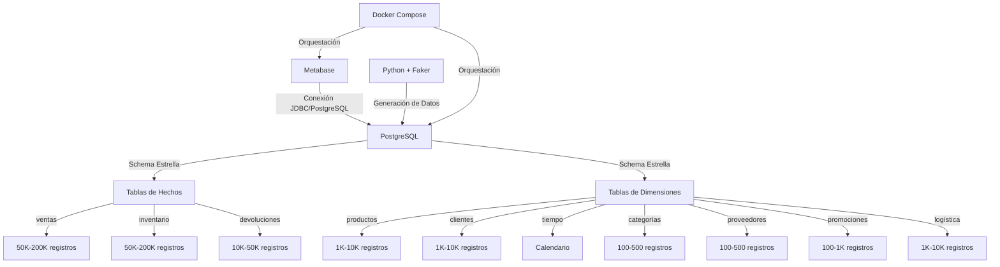

# Technical Requirements Document – Dashboard Metabase + Colección Analítica para E-commerce v1.0

**Fecha:** 2026-07-02 | **Autor:** Fisherk2 | **Estado:** Borrador

---

## 1. Arquitectura de Referencia

### Diagrama de Alto Nivel

### Capas y Responsabilidades

| **Capa**                | **Responsabilidad**                                                                        | **Tecnología**               |
| ----------------------- | ------------------------------------------------------------------------------------------ | ---------------------------- |
| **Presentación**        | Visualización de datos y paneles interactivos.                                             | Metabase                     |
| **Aplicación**          | Ejecución de queries y conexión a la BD.                                                   | Metabase (backend)           |
| **Datos**               | Almacenamiento y procesamiento de datos (schema estrella, índices, vistas materializadas). | PostgreSQL 15+               |
| **Infraestructura**     | Contenerización y orquestación de servicios.                                               | Docker + Docker Compose      |
| **Generación de Datos** | Scripts para poblar la BD con datos sintéticos.                                            | Python 3.8+ + Faker + Pandas |

---

## 2. Stack Tecnológico & Justificación

| **Capa**             | **Tecnología** | **Versión** | **Justificación Arquitectónica**                                                                             |
| -------------------- | -------------- | ----------- | ------------------------------------------------------------------------------------------------------------ |
| **Visualización**    | Metabase       | Latest      | Herramienta open-source, fácil de configurar, soporta conexión directa a PostgreSQL y exportación a PNG/CSV. |
| **Base de Datos**    | PostgreSQL     | 15+         | Soporte nativo para schema estrella, índices, vistas materializadas, particionamiento y CTEs.                |
| **Contenerización**  | Docker         | 20+         | Aislamiento de servicios, portabilidad, y reproducción consistente del entorno.                              |
| **Orquestación**     | Docker Compose | 2+          | Gestión simplificada de múltiples contenedores (PostgreSQL + Metabase).                                      |
| **Generación Datos** | Python + Faker | 3.8+        | Flexibilidad para generar datos sintéticos con reglas de negocio (ej: distribución de ventas por categoría). |
| **Lenguaje SQL**     | PostgreSQL SQL | 15+         | Soporte para queries analíticas complejas, CTEs, y optimización de rendimiento.                              |

---

## 3. Componentes del Sistema

| **Componente**            | **Responsabilidad**                                           | **Interfaces Expuestas**               | **Dependencias**                   | **Principio SOLID Aplicado** |
| ------------------------- | ------------------------------------------------------------- | -------------------------------------- | ---------------------------------- | ---------------------------- |
| **Metabase**              | Visualización de datos y ejecución de queries.                | UI Web (puerto 3000)                   | PostgreSQL                         | Single Responsibility (SRP)  |
| **PostgreSQL**            | Almacenamiento de datos en schema estrella.                   | Puerto 5432 (PostgreSQL)               | Docker (volumen para persistencia) | Open/Closed Principle (OCP)  |
| **Script de Generación**  | Generar datos sintéticos para tablas de hechos y dimensiones. | Script Python (`generate_data.py`)     | Faker, Pandas                      | Single Responsibility (SRP)  |
| **Docker Compose**        | Orquestar servicios de PostgreSQL y Metabase.                 | Archivo `docker-compose.yml`           | Docker                             | Dependency Inversion (DIP)   |
| **Vistas Materializadas** | Almacenar KPIs pre-calculados (ej: rotación mensual).         | Consultas SQL (`SELECT * FROM mv_...`) | PostgreSQL                         | Single Responsibility (SRP)  |
| **Índices**               | Optimizar el rendimiento de queries en columnas críticas.     | Índices en PostgreSQL                  | PostgreSQL                         | Open/Closed Principle (OCP)  |

---

## 4. Contratos de API / Integraciones

| **Componente**    | **Tipo**            | **Detalle**                                                                                  | **Autenticación**                    | **Rate Limit** |
| ----------------- | ------------------- | -------------------------------------------------------------------------------------------- | ------------------------------------ | -------------- |
| **PostgreSQL**    | Base de Datos       | Schema estrella con tablas de hechos (`ventas`, `inventario`, `devoluciones`) y dimensiones. | Credenciales en variables de entorno | N/A            |
| **Metabase**      | Herramienta de BI   | Conexión JDBC a PostgreSQL para ejecutar queries y mostrar paneles.                          | Credenciales en variables de entorno | N/A            |
| **Script Python** | Generación de Datos | Script `generate_data.py` que genera datos sintéticos y los inserta en PostgreSQL.           | N/A                                  | N/A            |

---

## 5. Requisitos Técnicos No Funcionales

| **Categoría**      | **Requisito**                                | **Detalle**                                                                              |
| ------------------ | -------------------------------------------- | ---------------------------------------------------------------------------------------- |
| **Escalabilidad**  | Manejo de 50K–200K registros por tabla.      | PostgreSQL con índices, vistas materializadas y particionamiento.                        |
| **Rendimiento**    | Queries con tiempo de respuesta <2s.         | Usar `EXPLAIN ANALYZE`, índices en columnas críticas, y vistas materializadas para KPIs. |
| **Seguridad**      | Conexión segura entre Metabase y PostgreSQL. | Credenciales en variables de entorno (no hardcodeadas), red interna de Docker.           |
| **Disponibilidad** | Entorno reproducible localmente.             | Docker Compose con servicios de PostgreSQL y Metabase.                                   |
| **Observabilidad** | Validación de rendimiento de queries.        | `EXPLAIN ANALYZE` en PostgreSQL, logs de Docker.                                         |
| **Mantenibilidad** | Scripts y documentación versionados.         | Git + Markdown para documentación, scripts en `/scripts`.                                |

---

## 6. Estrategia de Despliegue & CI/CD

### Entornos

| **Entorno**    | **Propósito**          | **Configuración**                                                |
| -------------- | ---------------------- | ---------------------------------------------------------------- |
| **Local**      | Desarrollo y pruebas.  | Docker Compose con PostgreSQL y Metabase en puertos 5432 y 3000. |
| **Staging**    | Validación final.      | Opcional: Despliegue en servidor remoto con Docker.              |
| **Producción** | No aplica (MVP local). | N/A                                                              |

### Pipeline (Manual para MVP)

1. **Generación de Datos**: Ejecutar `python generate_data.py` para poblar PostgreSQL.
2. **Inicialización**: Ejecutar `docker-compose up -d` para levantar PostgreSQL y Metabase.
3. **Configuración**: Conectar Metabase a PostgreSQL usando credenciales definidas en `docker-compose.yml`.
4. **Validación**: Verificar que los paneles en Metabase carguen en <2s.

### Rollback

- **Base de Datos**: Usar volúmenes de Docker para persistencia. En caso de error, eliminar volúmenes y regenerar datos.
- **Metabase**: Reiniciar contenedor si hay problemas de conexión.

---

## 7. Matriz de Trazabilidad

| **PRD REQ-ID** | **TRD Componente**            | **API/DB**                  | **Estado** |
| -------------- | ----------------------------- | --------------------------- | ---------- |
| RF-01          | Conexión Metabase-PostgreSQL  | PostgreSQL (JDBC)           | Pendiente  |
| RF-02          | Paneles en Metabase           | Metabase (UI)               | Pendiente  |
| RF-03          | Exportación PNG/CSV           | Metabase (UI)               | Pendiente  |
| RF-04          | Queries optimizadas           | PostgreSQL (SQL)            | Pendiente  |
| RF-05          | Schema estrella               | PostgreSQL (SQL)            | Pendiente  |
| RF-06          | Script de generación de datos | Python (`generate_data.py`) | Pendiente  |
| RF-07          | Alertas de stock mínimo       | PostgreSQL (Vistas)         | Pendiente  |

---

## 8. ADRs (Architecture Decision Records)

| **ADR-ID** | **Contexto**                                                          | **Decisión**                                                              | **Consecuencias**                                                                                | **Alternativas Descartadas** |
| ---------- | --------------------------------------------------------------------- | ------------------------------------------------------------------------- | ------------------------------------------------------------------------------------------------ | ---------------------------- |
| ADR-01     | Necesidad de visualizar KPIs de inventario y rotación en tiempo real. | Usar **Metabase** como herramienta de BI.                                 | Fácil de configurar, open-source, pero limitado a dashboards estáticos sin lógica personalizada. | Tableau, Power BI            |
| ADR-02     | Requisito de rendimiento (<2s por query) con volumen alto de datos.   | Usar **schema estrella para OLAP** en PostgreSQL.                         | Optimizado para queries analíticas, pero requiere mantenimiento de vistas materializadas.        | Schema normalizado (3FN)     |
| ADR-03     | Necesidad de generar datos realistas para pruebas.                    | Usar **Python + Faker + Pandas** para generar datos sintéticos.           | Flexible y personalizable, pero requiere desarrollo inicial de scripts.                          | Datos reales anonimizados    |
| ADR-04     | Requisito de entorno reproducible y aislado.                          | Usar **Docker + Docker Compose** para contenerizar PostgreSQL y Metabase. | Portabilidad y consistencia, pero mayor uso de recursos locales.                                 | Instalación nativa           |
| ADR-05     | Optimización de queries para KPIs críticos.                           | Usar **índices + vistas materializadas + particionamiento + CTEs**.       | Máximo rendimiento, pero mayor complejidad de mantenimiento.                                     | Solo índices o solo vistas   |
| ADR-06     | Necesidad de documentar el proyecto para portafolio.                  | Usar **Markdown + badges en README** para documentación.                  | Fácil de mantener y visualmente atractivo, pero requiere esfuerzo inicial.                       | Documentación en Word/PDF    |

___