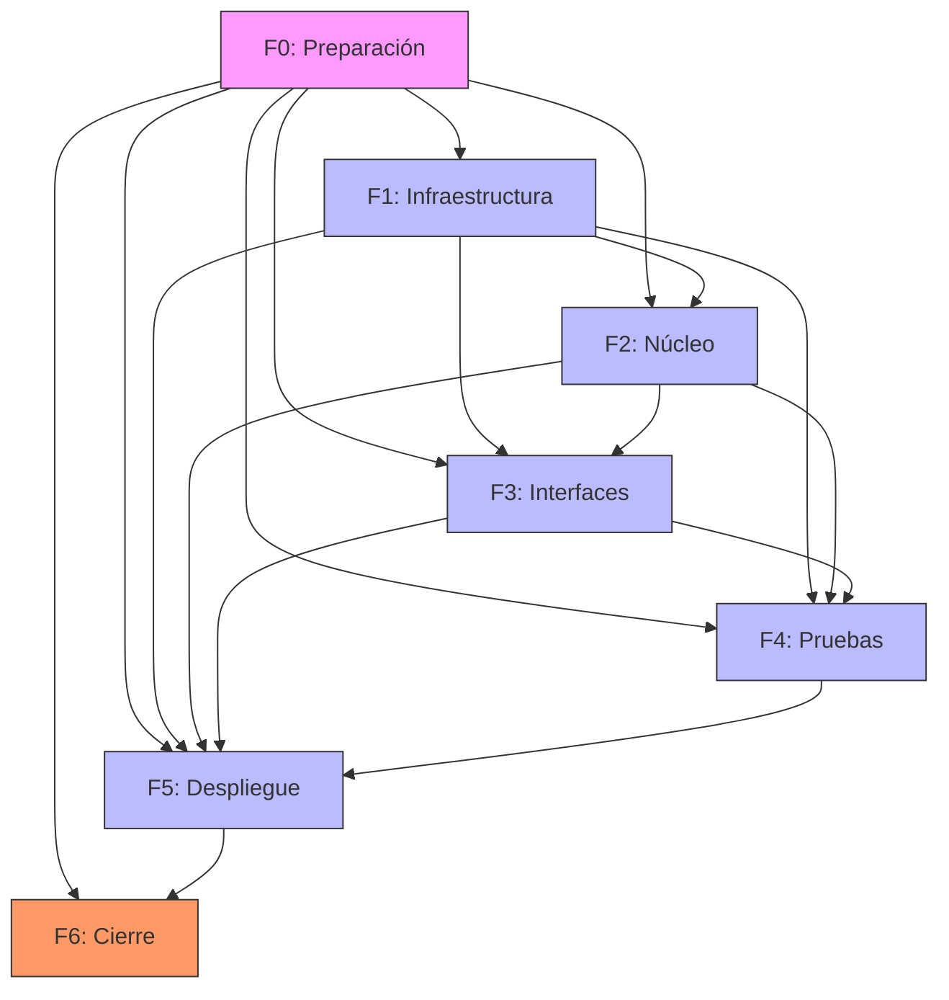

# Workflow – Dashboard Metabase + Colección Analítica para E-commerce v1.0

**Fecha:** 2026-07-03 | **Autor:** Fisherk2 | **Metodología:** Iterativo

---

## 1. Visión de Fases


| **Fase**                | **Estado**        | **Objetivo**                                                    | **Entregables**                                                                                  | **Duración**  |
| ----------------------- | ----------------- | --------------------------------------------------------------- | ------------------------------------------------------------------------------------------------ | ------------- |
| **F0: Preparación**     | ✅ COMPLETADO      | Configurar entorno base, convenciones y documentación inicial.  | Estructura de carpetas, `.gitignore`, `README.md`, `AGENTS.md`, `ARCHITECTURE.md`, `Makefile`, `tests/test_f0.py` (72 tests). | 1 día         |
| **F1: Infraestructura** | ✅ COMPLETADO      | Levantar servicios de PostgreSQL y Metabase con Docker.         | `docker-compose.yml`, credenciales seguras, conexión funcional, persistencia, tests/test_f1.py (67 tests).     | 1 día         |
| **F2: Núcleo**          | 📋 LISTO PARA PLANIFICAR | Implementar schema estrella, generar datos y optimizar queries. | Script `generate_data.py`, schema SQL, índices, vistas materializadas, particionamiento.         | 2 días        |
| **F3: Interfaces**      | ⏳ PENDIENTE       | Configurar paneles en Metabase y validar queries.               | 3+ paneles en Metabase (rotación, stock, ventas), queries optimizadas.                           | 1 día         |
| **F4: Pruebas**         | ⏳ PENDIENTE       | Validar rendimiento, exportación y flujos completos.            | Resultados de `EXPLAIN ANALYZE`, pruebas de exportación, validación de paneles.                  | 1 día         |
| **F5: Despliegue**      | ⏳ PENDIENTE       | Documentar el proyecto y preparar para portafolio.              | `README.md` final con badges, guías de usuario, capturas de pantalla.                            | 1 día         |
| **F6: Cierre**          | ⏳ PENDIENTE       | Revisión final y lecciones aprendidas.                          | Retrospectiva documentada, actualización de `AGENTS.md` y `WORKFLOW.md`.                         | 0.5 días      |


---

## 2. Desglose por Fase

### Fase 0: Preparación

**Objetivo:** Establecer la base del proyecto con estructura clara y documentación inicial.


| **ID** | **Tarea**                                                              | **Estado**    | **DoD (Definition of Done)**                                                                    |
| ------ | ---------------------------------------------------------------------- | ------------- | ----------------------------------------------------------------------------------------------- |
| F0-01  | Crear estructura de carpetas (`/docs`, `/scripts`, `/sql`, `/docker`). | ✅ Completado  | Estructura de carpetas validada y versionada en Git.                                            |
| F0-02  | Configurar `.gitignore` para Python, SQL, Docker y Metabase.           | ✅ Completado  | Archivo `.gitignore` incluye patrones para `.env`, `*.pyc`, `*.log`, `data/`, etc.              |
| F0-03  | Crear `README.md` inicial con descripción del proyecto y badges.       | ✅ Completado  | `README.md` incluye: título, descripción, stack tecnológico, badges, y enlaces a documentación. |
| F0-04  | Crear `AGENTS.md` y `ARCHITECTURE.md`.                                 | ✅ Completado  | Documentos completos y revisados.                                                               |
| F0-05  | Crear `Makefile` con targets para infraestructura, BD, datos y testing.| ✅ Completado  | `make help` lista todos los targets. `make setup` ejecuta flujo completo.                       |
| F0-06  | Crear `tests/test_f0.py` con 72 tests de validación.                  | ✅ Completado  | Tests estáticos pasan sin Docker. 72 tests verdes.                                              |


**Dependencias:**

- **Requeridas:** Ninguna.
- **Opcionales:** Herramientas de linter (ej: `sqlfluff`, `black`).

---

### Fase 1: Infraestructura

**Objetivo:** Levantar un entorno reproducible con PostgreSQL y Metabase.


| **ID** | **Tarea**                                                             | **Estado**    | **DoD (Definition of Done)**                                          |
| ------ | --------------------------------------------------------------------- | ------------- | --------------------------------------------------------------------- |
| F1-01  | Completar `docker-compose.yml` con environment, ports, volumes, healthcheck, networks, restart, mem_limit. | ✅ Completado | `make validate` exit 0; ambos servicios con healthcheck/depends_on.   |
| F1-02  | Extender `.env.example` con vars MB_DB_* y METABASE_SECRET_KEY.       | ✅ Completado | `.env.example` con 14+ vars, secciones comentadas.                    |
| F1-03  | Crear `.dockerignore` en raíz.                                        | ✅ Completado | 15+ patrones excluyendo venv, tests, .env, git.                       |
| F1-04  | Crear `docker-compose.override.yml` template.                         | ✅ Completado | Merge safe con compose. Renombrado a `.example` para evitar fugas.    |
| F1-05  | Levantar servicios y verificar healthchecks.                          | ✅ Completado | `make up` exit 0; pg_isready healthy; Metabase Initialization Complete.|
| F1-06  | Verificar API health de Metabase.                                     | ✅ Completado | `curl /api/health` retorna `{"status":"ok"}`.                         |
| F1-07  | Verificar persistencia y aislamiento de red.                          | ✅ Completado | Tabla `_f1_test` persiste tras restart; puerto 5432 NO expuesto.      |
| F1-08  | Crear `tests/test_f1.py` con suite automatizada.                      | ✅ Completado | 67 tests (61 estáticos + 6 runtime). Todos verdes.                    |
| F1-09  | Code review + simplificación de código.                               | ✅ Completado | DRY has_docker, guard clauses, dead code removido.                    |
| F1-10  | Revisión multi-eje (Tezcatlipoca) + fixes.                            | ✅ Completado | 10 observaciones corregidas en 5 commits atómicos.                    |


**Dependencias:**

- **Requeridas:** F0 (Preparación).

---

### Fase 2: Núcleo

**Objetivo:** Implementar el schema estrella, generar datos sintéticos y optimizar queries.
**Estado:** 📋 LISTO PARA PLANIFICAR (dependencias F0 + F1 cumplidas)


| **ID** | **Tarea**                                                                        | **Responsable** | **Estimación** | **DoD (Definition of Done)**                                                            |
| ------ | -------------------------------------------------------------------------------- | --------------- | -------------- | --------------------------------------------------------------------------------------- |
| F2-01  | Crear script `init.sql` con el schema estrella (tablas de hechos y dimensiones). | Fisherk2     | 2 horas        | Script ejecuta sin errores en PostgreSQL.                                               |
| F2-02  | Ejecutar `init.sql` en PostgreSQL para crear el schema.                          | Fisherk2     | 0.5 horas      | Tablas creadas y validadas con `SELECT * FROM information_schema.tables;`.              |
| F2-03  | Desarrollar script `generate_data.py` para generar datos sintéticos.             | Fisherk2     | 3 horas        | Script genera 50K–200K registros por tabla de hechos y 1K–10K por tabla de dimensiones. |
| F2-04  | Ejecutar `generate_data.py` para poblar la base de datos.                        | Fisherk2     | 1 hora         | Datos insertados y validados con `SELECT COUNT(*) FROM tabla;`.                         |
| F2-05  | Crear índices en columnas críticas (ej: `producto_id`, `fecha_id`).              | Fisherk2     | 1 hora         | Índices creados y validados con `SELECT * FROM pg_indexes;`.                            |
| F2-06  | Crear vistas materializadas para KPIs críticos (rotación, stock, ventas).        | Fisherk2     | 1 hora         | Vistas creadas y actualizadas con `REFRESH MATERIALIZED VIEW`.                          |
| F2-07  | Particionar tabla `ventas` por rango de fechas (opcional).                       | Fisherk2     | 1 hora         | Tabla `ventas` particionada y validada con `SELECT * FROM pg_partitions;`.              |


**Dependencias:**

- **Requeridas:** F1 (Infraestructura).

---

### Fase 3: Interfaces

**Objetivo:** Configurar paneles en Metabase y validar queries.


| **ID** | **Tarea**                                                           | **Responsable** | **Estimación** | **DoD (Definition of Done)**                                                      |
| ------ | ------------------------------------------------------------------- | --------------- | -------------- | --------------------------------------------------------------------------------- |
| F3-01  | Conectar Metabase a PostgreSQL y configurar permisos.               | Fisherk2     | 0.5 horas      | Metabase puede ejecutar queries en PostgreSQL.                                    |
| F3-02  | Crear panel "Rotación por Categoría" en Metabase.                   | Fisherk2     | 1 hora         | Panel muestra datos correctos y se carga en <2s.                                  |
| F3-03  | Crear panel "Stock Actual vs. Mínimo" en Metabase.                  | Fisherk2     | 1 hora         | Panel muestra alertas de stock mínimo y se carga en <2s.                          |
| F3-04  | Crear panel "Ventas por Producto (Top 10)" en Metabase.             | Fisherk2     | 1 hora         | Panel muestra los 10 productos con más ventas y se carga en <2s.                  |
| F3-05  | Validar que todas las queries usen índices y vistas materializadas. | Fisherk2     | 1 hora         | `EXPLAIN ANALYZE` muestra planes de ejecución optimizados para todas las queries. |
| F3-06  | Configurar alertas de stock mínimo en Metabase (opcional).          | Fisherk2     | 0.5 horas      | Alertas configuradas y visibles en el dashboard.                                  |


**Dependencias:**

- **Requeridas:** F2 (Núcleo).

---

### Fase 4: Pruebas

**Objetivo:** Validar rendimiento, exportación y flujos completos.


| **ID** | **Tarea**                                                                  | **Responsable** | **Estimación** | **DoD (Definition of Done)**                      |
| ------ | -------------------------------------------------------------------------- | --------------- | -------------- | ------------------------------------------------- |
| F4-01  | Ejecutar `EXPLAIN ANALYZE` en todas las queries críticas.                  | Fisherk2     | 1 hora         | Todas las queries cargan en <2s.                  |
| F4-02  | Validar exportación de paneles a PNG/CSV.                                  | Fisherk2     | 0.5 horas      | Archivos exportados son correctos y legibles.     |
| F4-03  | Probar flujos de navegación en Metabase (ej: filtrar por fecha/categoría). | Fisherk2     | 1 hora         | Todos los flujos funcionan sin errores.           |
| F4-04  | Validar persistencia de datos tras reiniciar contenedores.                 | Fisherk2     | 0.5 horas      | Datos persisten y los paneles siguen funcionando. |
| F4-05  | Probar conexión fallida a PostgreSQL y validar manejo de errores.          | Fisherk2     | 0.5 horas      | Metabase muestra mensaje de error claro.          |


**Dependencias:**

- **Requeridas:** F3 (Interfaces).

---

### Fase 5: Despliegue

**Objetivo:** Documentar el proyecto y preparar para portafolio.


| **ID** | **Tarea**                                                | **Responsable** | **Estimación** | **DoD (Definition of Done)**                                             |
| ------ | -------------------------------------------------------- | --------------- | -------------- | ------------------------------------------------------------------------ |
| F5-01  | Actualizar `README.md` (ver detalle abajo).              | Fisherk2        | 2 horas        | `README.md` completo y revisado.                                         |
| F5-02  | Crear guía de usuario en `/docs/USER_GUIDE.md`.          | Fisherk2        | 1 hora         | Guía incluye: cómo usar Metabase, interpretar paneles, y exportar datos. |
| F5-03  | Crear guía técnica en `/docs/TECHNICAL_GUIDE.md`.        | Fisherk2        | 1 hora         | Guía incluye: arquitectura, schema, queries, y optimizaciones.           |
| F5-04  | Grabar video tutorial (opcional).                        | Fisherk2        | 1 hora         | Video de 5–10 min mostrando el flujo completo.                           |
| F5-05  | Validar que el proyecto es reproducible en otro entorno. | Fisherk2        | 1 hora         | Proyecto funciona en al menos 2 entornos locales diferentes.             |

**Detalle F5-01 — Actualizar `README.md` con:**
- Pasos para levantar el proyecto.
- Capturas de pantalla de los paneles.
- Badges de tecnologías.

**Dependencias:**

- **Requeridas:** F4 (Pruebas).

---

### Fase 6: Cierre

**Objetivo:** Revisión final y documentación de lecciones aprendidas.


| **ID** | **Tarea**                                                                      | **Responsable** | **Estimación** | **DoD (Definition of Done)**                                |
| ------ | ------------------------------------------------------------------------------ | --------------- | -------------- | ----------------------------------------------------------- |
| F6-01  | Revisar todos los documentos (`PRD.md`, `TRD.md`, `AGENTS.md`, `WORKFLOW.md`). | Fisherk2        | 1 hora         | Documentos actualizados y sin inconsistencias.              |
| F6-02  | Documentar lecciones aprendidas en `/docs/LESSONS_LEARNED.md`.                 | Fisherk2        | 0.5 horas      | Documento incluye: desafíos, soluciones, y mejoras futuras. |
| F6-03  | Hacer commit final y push a repositorio Git.                                   | Fisherk2        | 0.5 horas      | Todos los cambios están versionados en Git.                 |


**Dependencias:**

- **Requeridas:** F5 (Despliegue).

---

## 3. Diagrama de Dependencia entre Specs



**Leyenda:**

- **F0 (Preparación):** Base para todas las fases.
- **F1 (Infraestructura):** Requerida para F2, F3, F4, F5.
- **F2 (Núcleo):** Requerida para F3, F4, F5.
- **F3 (Interfaces):** Requerida para F4, F5.
- **F4 (Pruebas):** Requerida para F5.
- **F5 (Despliegue):** Requerida para F6.

**Leyenda:**

- **F0 (Preparación):** Base para todas las fases.
- **F1 (Infraestructura):** Requerida para F2, F3, F4, F5.
- **F2 (Núcleo):** Requerida para F3, F4, F5.
- **F3 (Interfaces):** Requerida para F4, F5.
- **F4 (Pruebas):** Requerida para F5.
- **F5 (Despliegue):** Requerida para F6.

---

## 4. Estrategia de Pruebas por Fase


| **Fase** | **Tipo de Prueba**            | **Herramienta**                | **Criterio de Éxito**                                                  |
| -------- | ----------------------------- | ------------------------------ | ---------------------------------------------------------------------- |
| F0       | Revisión de documentación.    | Markdown + Git                 | Documentos completos y sin errores de formato.                         |
| F1       | Conexión entre servicios.     | Docker Compose + Metabase      | PostgreSQL y Metabase se comunican sin errores.                        |
| F2       | Validación de schema y datos. | PostgreSQL (`psql`)            | Schema creado, datos generados y válidos.                              |
| F2       | Rendimiento de queries.       | PostgreSQL (`EXPLAIN ANALYZE`) | Todas las queries cargan en <2s.                                       |
| F3       | Funcionalidad de paneles.     | Metabase                       | Paneles muestran datos correctos y se exportan a PNG/CSV.              |
| F4       | Pruebas de estrés.            | PostgreSQL + Metabase          | Sistema mantiene rendimiento bajo carga (ej: 10 usuarios simultáneos). |
| F4       | Pruebas de error.             | Docker + Metabase              | Mensajes de error claros y recuperables.                               |
| F5       | Reproducibilidad.             | Docker Compose                 | Proyecto funciona en al menos 2 entornos locales diferentes.           |


---

## 5. Revisiones Técnicas Formales (FTRs)


| **Gate**                | **Artefacto a Revisar**               | **Checklist**      | **Participantes** | **Resultado** |
| ----------------------- | ------------------------------------- | ------------------ | ----------------- | ------------- |
| **F0: Preparación**     | Estructura de carpetas y `AGENTS.md`. | Ver detalle abajo. | Fisherk2          | ✅ Aprobado   |
| **F1: Infraestructura** | `docker-compose.yml` y `.env`.        | Ver detalle abajo. | Fisherk2          | ✅ Aprobado   |
| **F2: Núcleo**          | Schema, datos, índices, vistas.       | Ver detalle abajo. | Fisherk2          | Pendiente     |
| **F3: Interfaces**      | Paneles en Metabase.                  | Ver detalle abajo. | Fisherk2          | Pendiente     |
| **F4: Pruebas**         | Resultados de pruebas.                | Ver detalle abajo. | Fisherk2          | Pendiente     |
| **F5: Despliegue**      | `README.md` y documentación final.    | Ver detalle abajo. | Fisherk2          | Pendiente     |

**Checklist por Gate:**

- **F0: Preparación:**
  - Estructura de carpetas valida.
  - `AGENTS.md` completo.
  - `.gitignore` configurado.
- **F1: Infraestructura:**
  - Servicios se levantan sin errores.
  - Credenciales seguras.
  - Persistencia configurada.
- **F2: Núcleo:**
  - Schema estrella implementado.
  - Datos generados y válidos.
  - Queries optimizadas.
- **F3: Interfaces:**
  - 3+ paneles funcionales.
  - Queries cargan en <2s.
  - Exportación funciona.
- **F4: Pruebas:**
  - Todas las queries <2s.
  - Exportación válida.
  - Manejo de errores validado.
- **F5: Despliegue:**
  - `README.md` completo.
  - Guías de usuario y técnica.
  - Proyecto reproducible.

---

## 6. Gestión de Riesgos


| **Riesgo**                                  | **Probabilidad** | **Impacto** | **Mitigación**                                                         | **Contingencia**                                 |
| ------------------------------------------- | ---------------- | ----------- | ---------------------------------------------------------------------- | ------------------------------------------------ |
| **Docker no funciona en el entorno local.** | Media            | Alto        | Validar requisitos (Docker 20+, espacio en disco).                     | Usar máquina virtual con Docker preinstalado.    |
| **Queries lentas (>2s).**                   | Alta             | Alto        | Usar índices, vistas materializadas y particionamiento.                | Reducir volumen de datos para pruebas iniciales. |
| **Metabase no se conecta a PostgreSQL.**    | Media            | Alto        | Verificar credenciales, red de Docker, y puertos.                      | Usar `psql` para validar conexión manualmente.   |
| **Datos generados no son realistas.**       | Media            | Medio       | Ajustar parámetros en `generate_data.py` (ej: distribución de ventas). | Usar datos reales anonimizados como alternativa. |
| **Falta de tiempo para completar el MVP.**  | Alta             | Alto        | Priorizar tareas críticas (F0, F1, F2, F3).                            | Reducir alcance (ej: 2 paneles en lugar de 3).   |
| **Problemas de permisos en Docker.**        | Baja             | Medio       | Usar `chmod` para ajustar permisos en archivos.                        | Ejecutar Docker con `--privileged`.              |
| **Inconsistencia en datos.**                | Media            | Alto        | Usar transacciones en scripts de generación.                           | Regenerar datos desde cero.                      |


---

## 7. Métricas de Progreso


| **Métrica**              | **Valor Objetivo**        | **Herramienta de Medición**           | **Frecuencia** |
| ------------------------ | ------------------------- | ------------------------------------- | -------------- |
| **Velocidad**            | 1 fase por día.           | GitHub/GitLab (commits por día).      | Diaria         |
| **Lead Time**            | <1 día por tarea crítica. | Jira/Trello (tiempo por tarea).       | Diaria         |
| **Defect Density**       | 0 defectos críticos.      | Pruebas manuales + `EXPLAIN ANALYZE`. | Por fase       |
| **Cobertura de Queries** | 100% de queries críticas. | `EXPLAIN ANALYZE` + revisión manual.  | Por fase       |
| **Tiempo de Carga**      | <2s por query.            | Cronómetro manual en Metabase.        | Por fase       |
| **Reproducibilidad**     | 100% en 2+ entornos.      | Docker Compose.                       | Final          |


**Definición de "Done" por Capa:**

- **UI (Metabase):** Paneles funcionales, exportación válida, sin errores de visualización.
- **Lógica (PostgreSQL):** Queries optimizadas, vistas materializadas actualizadas.
- **Datos:** Schema completo, datos generados y válidos.
- **Infraestructura:** Servicios levantados, conexión segura, persistencia configurada.

---

## 8. Cronograma y Hitos

### Diagrama de Gantt (Simplificado)

```mermaid
gantt
    title Cronograma del Proyecto
    dateFormat  YYYY-MM-DD
    section Fases
    F0: Preparación          :done, a1, 2026-07-02, 1d
    F1: Infraestructura     :done, a2, after a1, 1d
    F2: Núcleo              :a3, after a2, 2d
    F3: Interfaces          :a4, after a3, 1d
    F4: Pruebas             :a5, after a4, 1d
    F5: Despliegue          :a6, after a5, 1d
    F6: Cierre              :a7, after a6, 0.5d
    
    section Hitos
    MVP Listo para Pruebas  :milestone1, after a3, 0d
    MVP Validado            :milestone2, after a5, 0d
    Proyecto Completado     :milestone3, after a7, 0d
```

### Hitos Clave


| **Hito**                   | **Fecha Estimada** | **Criterio**                                                    |
| -------------------------- | ------------------ | --------------------------------------------------------------- |
| **Plan F2 listo**          | 2026-07-03         | Plan de F2 aprobado, dependencias F0+F1 verificadas.           |
| **MVP Listo para Pruebas** | 2026-07-06         | Fases F0, F1, F2, F3 completadas.                              |
| **MVP Validado**           | 2026-07-07         | Fases F4 completadas, todas las queries <2s.                   |
| **Proyecto Completado**    | 2026-07-08         | Fases F5 y F6 completadas, documentación finalizada.           |


---

## 9. Control de Cambios y Lecciones Aprendidas


| **Versión** | **Fecha**  | **Autor** | **Cambio**                         | **Lecciones Aprendidas**                                                                                                                                                                                                |
| ----------- | ---------- | --------- | ---------------------------------- | ----------------------------------------------------------------------------------------------------------------------------------------------------------------------------------------------------------------------- |
| 1.0         | 2026-07-02 | Fisherk2  | Versión inicial del `WORKFLOW.md`. | Priorizar tareas críticas (F0, F1, F2, F3) para garantizar el MVP; Usar vistas materializadas para queries frecuentes mejora el rendimiento significativamente; Docker Compose simplifica la orquestación de servicios. |
| 1.1         | 2026-07-03 | Fisherk2  | F0+F1 marcados como completados; F2 listo para planificar. | Vertical slicing reduce checkpoints con misma calidad; tests de runtime con marker permiten CI local sin Docker; named volumes eliminan problemas de permisos de bind mount. |


---

**Nota:** Este documento debe actualizarse tras cada cambio significativo en el proyecto. Usa el formato de la tabla anterior para registrar cambios y lecciones.