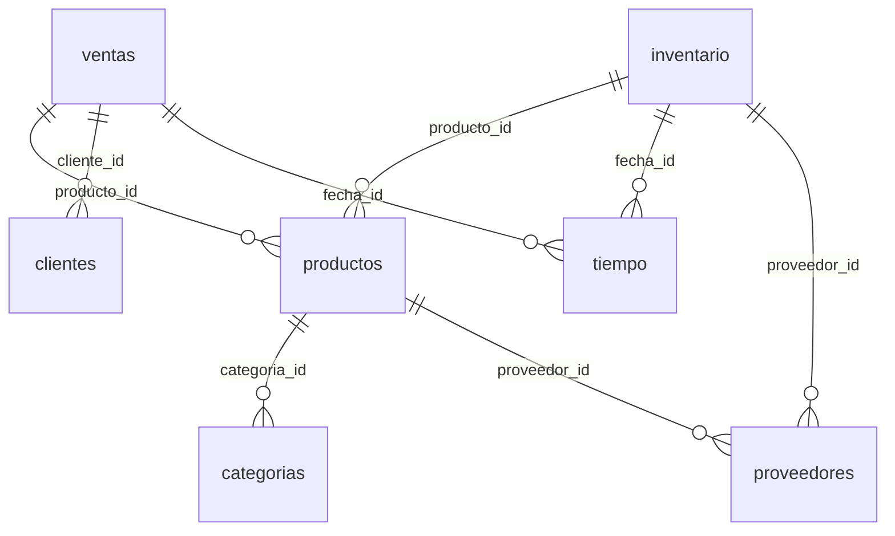

# ADR-003: Star Schema para Cargas OLAP

**Fecha:** 2026-07-02 | **Autor:** Fisherk2 | **Estado:** Aceptado

---

## Decisión

Usar un **star schema** (esquema estrella) como modelo de datos para el dashboard analítico de e-commerce.

---

## Contexto

El proyecto requiere un modelo de datos que:

- Optimice consultas analíticas complejas (OLAP)
- Separe datos transaccionales (hechos) de datos descriptivos (dimensiones)
- Permita agregaciones eficientes por categoría, tiempo, proveedor
- Soporte vistas materializadas para KPIs críticos
- Escale a 50K–200K registros en tablas de hechos

---

## Alternativas Consideradas

### Schema Normalizado (3FN)

**Ventajas:**
- Minimiza redundancia de datos
- Integridad referencial estricta
- Ideal para cargas OLTP (transaccionales)

**Desventajas:**
- Requiere múltiples JOINs para queries analíticas (rendimiento pobre)
- Difícil de optimizar con vistas materializadas
- No optimizado para agregaciones por dimensiones
- Overhead de normalización innecesario para datos sintéticos

**Ejemplo de query en 3FN:**
```sql
-- Query de rotación por categoría requeriría 5+ JOINs
SELECT c.nombre, SUM(v.cantidad)
FROM ventas v
JOIN productos p ON v.producto_id = p.id
JOIN categorias c ON p.categoria_id = c.id
JOIN proveedores pr ON p.proveedor_id = pr.id
JOIN tiempo t ON v.fecha_id = t.id
WHERE t.anio = 2026
GROUP BY c.nombre;
```

**Conclusión:** Descartado por rendimiento pobre en cargas analíticas.

---

### Schema Desnormalizado

**Ventajas:**
- Queries simples (sin JOINs)
- Rendimiento rápido en lecturas

**Desventajas:**
- Alta redundancia de datos (datos de dimensiones repetidos en cada hecho)
- Difícil mantenimiento (actualizaciones en múltiples filas)
- No escalable a volúmenes altos
- No permite demostrar habilidades de diseño de schema

**Ejemplo de tabla desnormalizada:**
```sql
CREATE TABLE ventas_desnormalizada (
    venta_id INT,
    producto_nombre VARCHAR(100),  -- Redundante
    categoria_nombre VARCHAR(100), -- Redundante
    proveedor_nombre VARCHAR(100), -- Redundante
    fecha DATE,
    cantidad INT,
    total DECIMAL
);
```

**Conclusión:** Descartado por redundancia y dificultad de mantenimiento.

---

### Snowflake Schema

**Ventajas:**
- Variantes del star schema con dimensiones normalizadas
- Menos redundancia que star schema

**Desventajas:**
- Requiere más JOINs que star schema (dimensiones subdivididas)
- Complejidad adicional innecesaria para el alcance del proyecto
- Rendimiento ligeramente inferior en queries analíticas

**Conclusión:** Descartado por complejidad innecesaria y rendimiento inferior.

---

## Razones para Elegir Star Schema

1. **Optimizado para OLAP:** Tablas de hechos (ventas, inventario, devoluciones) + tablas de dimensiones (productos, clientes, tiempo, categorias, proveedores).
2. **JOINs eficientes:** Queries analíticas requieren solo 2–3 JOINs (hecho → dimensión).
3. **Vistas materializadas:** Pre-cálculo de KPIs por dimensión (categoría, mes, año).
4. **Índices estratégicos:** Índices en columnas de JOIN (`producto_id`, `fecha_id`, `categoria_id`).
5. **Escalabilidad:** Soporta 50K–200K registros en tablas de hechos con rendimiento <2s.
6. **Separación de preocupaciones:** Hechos (transacciones) vs. dimensiones (descripciones).
7. **Flexibilidad:** Permite agregar nuevas dimensiones sin modificar tablas de hechos.
8. **Demostración de habilidades:** Star schema es estándar en la industria para BI y análisis de datos.

---

## Estructura del Star Schema

### Tablas de Hechos (3+)

| **Tabla**      | **Propósito**                    | **Granularidad**              |
| -------------- | -------------------------------- | ----------------------------- |
| `ventas`       | Transacciones de venta           | Una fila por venta            |
| `inventario`   | Movimientos de inventario        | Una fila por movimiento       |
| `devoluciones` | Devoluciones de productos        | Una fila por devolución       |

### Tablas de Dimensiones (5+)

| **Tabla**     | **Propósito**                    | **Relación**                  |
| ------------- | -------------------------------- | ----------------------------- |
| `productos`   | Catálogo de productos            | Dimensión rica (precio, stock)|
| `clientes`    | Clientes del e-commerce          | Dimensión de usuario          |
| `tiempo`      | Dimensión temporal               | Día, mes, año, trimestre      |
| `categorias`  | Clasificación de productos       | Dimensión jerárquica          |
| `proveedores` | Proveedores de productos         | Dimensión de proveedor        |

### Diagrama ER



---

## Consecuencias

### Positivas
- Queries analíticas eficientes con 2–3 JOINs.
- Vistas materializadas pre-calculan KPIs por dimensión.
- Índices en columnas de JOIN mejoran rendimiento.
- Escalable a 200K+ registros con rendimiento <2s.
- Estándar de la industria para BI y análisis de datos.

### Negativas
- Requiere diseño inicial cuidadoso de dimensiones y hechos.
- Redundancia moderada (dimensiones se repiten en JOINs).
- No es óptimo para cargas OLTP (pero el proyecto es analítico).

### Neutrales
- Star schema es ampliamente documentado y soportado.
- PostgreSQL 15+ tiene soporte nativo para este patrón.

---

## Validación

```sql
-- Verificar estructura star schema
SELECT table_name, table_type 
FROM information_schema.tables 
WHERE table_schema = 'public' 
ORDER BY table_name;

-- Verificar relaciones FK (hechos → dimensiones)
SELECT 
    tc.table_name AS hecho,
    kcu.column_name AS columna_fk,
    ccu.table_name AS dimension
FROM information_schema.table_constraints AS tc
JOIN information_schema.key_column_usage AS kcu
    ON tc.constraint_name = kcu.constraint_name
JOIN information_schema.constraint_column_usage AS ccu
    ON ccu.constraint_name = tc.constraint_name
WHERE tc.constraint_type = 'FOREIGN KEY';
```

---

## Referencias

- [Star Schema - Wikipedia](https://en.wikipedia.org/wiki/Star_schema)
- [The Data Warehouse Toolkit - Ralph Kimball](https://www.kimballgroup.com/data-warehouse-business-intelligence-resources/kimball-techniques/dimensional-modeling-techniques/star-schema/)
- [PostgreSQL Star Schema Example](https://www.postgresql.org/docs/15/tutorial-fk.html)
- [OLAP vs OLTP](https://www.ibm.com/cloud/blog/olap-vs-oltp)
