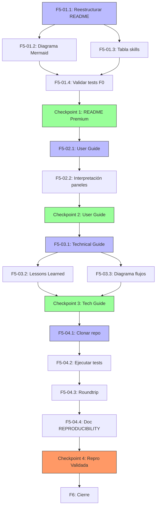

# Plan de Ejecución — F5: Despliegue

**Fecha:** 2026-07-07 | **Autor:** Fisherk2 | **Fase:** F5 (📋 LISTO PARA PLANIFICAR)
**Metodología:** Slicing vertical con checkpoints de calidad (patrón F0/F1/F2/F3/F4)
**Reemplaza:** N/A (nueva fase)
**Alcance confirmado:** Documentación de portafolio (README premium + User Guide + Technical Guide) + validación de reproducibilidad. **Sin screenshots**, **sin video tutorial** (F5-04 descartado por decisión del usuario).

---

## 1. Resumen

F5 convierte el proyecto de **producto funcional** a **proyecto de portafolio presentable**. El usuario es Fisherk2 mostrando el proyecto a employers/clientes. El éxito se mide por: (a) un README que enganche en los primeros 30 segundos, (b) una User Guide que demuestre dominio de Metabase, (c) una Technical Guide que demuestre profundidad técnica (SQL, schema, optimización), y (d) reproducibilidad verificada en entorno limpio.

**Estimación total:** 8-10 horas (~1 día)
**Vertical slices:** 4
**Checkpoints:** 4 (quality gates)
**Commits atómicos esperados:** 5-7
**Decisiones confirmadas vía question tool:**
- ✅ Alcance: 4 slices (README + User Guide + Tech Guide + Reproducibilidad)
- ✅ Screenshots: NO — solo texto + diagramas Mermaid
- ✅ Video tutorial (F5-04): NO — descartado por decisión del usuario
- ✅ Reproducibilidad (F5-05): Mismo host + mismo máquina (clonar repo en otra carpeta)

---

## 2. Estado Actual Detectado

| Elemento | Estado | Acción F5 |
|----------|--------|-----------|
| `README.md` | ⚠️ Esqueleto básico (86 líneas) con badges y Quick Start | **Expandir** a ~250 líneas: descripción impactante, features, arquitectura, instalación completa, troubleshooting, arquitectura visual |
| `docs/USER_GUIDE.md` | ❌ No existe | **Crear** desde cero: cómo usar Metabase, interpretar paneles, exportar |
| `docs/TECHNICAL_GUIDE.md` | ❌ No existe | **Crear** desde cero: arquitectura, star schema, queries, optimización, particionamiento |
| `docs/ARCHITECTURE.md` | ✅ Existe (F0) | **Consumir** como referencia para Tech Guide (no duplicar) |
| `docs/SCHEMA.md` | ✅ Existe (F2) | **Consumir** como referencia para Tech Guide |
| `docs/METABASE_SETUP.md` | ✅ Existe (F3) | **Consumir** como referencia para User Guide |
| `docs/METABASE_EXPORTS.md` | ✅ Existe (F4) | **Linkear** desde User Guide |
| Reproducibilidad (roundtrip) | ✅ `test_persistence.sh` existe (F4) | **Ejecutar** en directorio separado y documentar |
| Patrones arquitectura | ✅ ADRs en `specs/adr/` (F0-F4) | **Linkear** desde Tech Guide |

---

## 3. Slices y Tareas

### Slice 1: README Premium (F5-01)

**Objetivo:** Convertir el README de esqueleto a presentación de portafolio impactante. El README es lo primero que ve un employer — debe enganchar en los primeros 30 segundos y demostrar skills en 2 minutos.

| ID | Tarea | Estimación | DoD | Dependencias |
|----|-------|-----------|-----|--------------|
| **F5-01.1** | Reestructurar README: añadir secciones (Descripción, Features, Demo, Tech Stack, Architecture, Quick Start, Installation, Usage, Documentation, Project Structure, Development, Testing, Performance, Security, License, Contributing). Mantener badges. | 1.5 h | README tiene ~250 líneas, todas las secciones pobladas, sin placeholders | F4 ✅ |
| **F5-01.2** | Añadir diagrama Mermaid de arquitectura (services + flujo) en README. Referenciar `docs/ARCHITECTURE.md` para detalle. | 30 min | Diagrama renderiza en GitHub | F5-01.1 |
| **F5-01.3** | Añadir tabla de "What You'll Learn" (skills demostradas: Star Schema, SQL Optimization, Metabase, Docker, Python, Make). | 30 min | Tabla presente, 5-8 skills listadas | F5-01.1 |
| **F5-01.4** | Verificar con `python -m pytest tests/test_f0.py` que los tests de README siguen pasando (test_f0 valida que README tiene secciones esperadas). | 15 min | `make test` exit 0 (F0 README tests) | F5-01.1..3 |

**Subtotal Slice 1:** 2.75 horas

### Checkpoint 1: README Premium ✅
- [ ] README tiene ≥200 líneas con todas las secciones
- [ ] Diagrama Mermaid de arquitectura presente y renderizable
- [ ] Tabla de skills presente
- [ ] `make test` no rompe por cambios de README
- [ ] Tiempo de lectura estimado: 2 minutos

---

### Slice 2: User Guide (F5-02)

**Objetivo:** Crear `docs/USER_GUIDE.md` para usuarios finales (empleadores que quieren ver el dashboard funcionando, no la arquitectura). Enfoque en Metabase: login, navegación, interpretación de paneles, exportación.

| ID | Tarea | Estimación | DoD | Dependencias |
|----|-------|-----------|-----|--------------|
| **F5-02.1** | Crear `docs/USER_GUIDE.md` con secciones: Prerequisites, Setup (5 min), Acceder a Metabase, Tour del Dashboard (4 paneles explicados uno por uno: qué mide, cómo leerlo, qué significa cada estado), Exportar datos (link a METABASE_EXPORTS.md), Troubleshooting, FAQ. | 2 h | Doc existe, ≥150 líneas, cubre los 4 paneles | F4 ✅, F5-01 ✅ |
| **F5-02.2** | Para cada panel, documentar: nombre, pregunta que responde, fuente de datos (MV o tabla), interpretación de estados (ej: ALERTA = stock_actual <= stock_minimo). | Incluido en F5-02.1 | Cada panel tiene interpretación | F5-02.1 |

**Subtotal Slice 2:** 2 horas

### Checkpoint 2: User Guide ✅
- [ ] `docs/USER_GUIDE.md` existe y es ≥150 líneas
- [ ] Los 4 paneles tienen interpretación
- [ ] Sección Troubleshooting cubre top 3 issues
- [ ] Link a `docs/METABASE_EXPORTS.md` presente

---

### Slice 3: Technical Guide (F5-03)

**Objetivo:** Crear `docs/TECHNICAL_GUIDE.md` para audiencia técnica (empleadores evaluando SQL/arquitectura). Profundidad: por qué se tomó cada decisión, qué patrones se aplicaron, cómo está optimizado.

| ID | Tarea | Estimación | DoD | Dependencias |
|----|-------|-----------|-----|--------------|
| **F5-03.1** | Crear `docs/TECHNICAL_GUIDE.md` con secciones: Architecture Overview, Star Schema Design (referencia a SCHEMA.md), Materialized Views Strategy, Query Optimization (referencia a queries_performance.sql), Partitioning Strategy, Metabase Configuration (referencia a METABASE_SETUP.md), Testing Strategy, Performance Validation, Reproducibility. | 3 h | Doc existe, ≥300 líneas, cobertura completa de decisiones técnicas | F4 ✅, F5-01 ✅ |
| **F5-03.2** | Añadir sección "Lessons Learned" (top 5 decisiones y trade-offs: ej: por qué Spanish month names en MV, por qué `make test-queries` corre en container, por qué MVs vs. tablas base). | Incluido en F5-03.1 | 5+ lecciones documentadas | F5-03.1 |
| **F5-03.3** | Añadir diagrama Mermaid de flujos de datos (PostgreSQL → MVs → Metabase → Usuario). | Incluido en F5-03.1 | Diagrama presente | F5-03.1 |

**Subtotal Slice 3:** 3 horas

### Checkpoint 3: Technical Guide ✅
- [ ] `docs/TECHNICAL_GUIDE.md` existe y es ≥300 líneas
- [ ] Cubre: arquitectura, schema, MVs, queries, partitioning, Metabase, testing
- [ ] Sección Lessons Learned con 5+ entradas
- [ ] Diagramas Mermaid presentes

---

### Slice 4: Reproducibilidad (F5-05)

**Objetivo:** Verificar que el proyecto es reproducible desde cero en un entorno limpio. Decisión del usuario: **mismo host + misma máquina** (clonar repo en otra carpeta, ejecutar `make setup` y validar).

| ID | Tarea | Estimación | DoD | Dependencias |
|----|-------|-----------|-----|--------------|
| **F5-04.1** | Clonar repo en directorio separado (ej: `/tmp/f5-repro-test/`). Ejecutar `make setup` desde cero. Verificar exit 0. | 30 min | `make setup` exit 0 en directorio nuevo | F4 ✅ |
| **F5-04.2** | Ejecutar `make test` y `make test-queries` en directorio nuevo. Verificar que pasan. | 15 min | Tests pasan en directorio nuevo | F5-04.1 |
| **F5-04.3** | Ejecutar `ALLOW_DESTRUCTIVE=1 ./scripts/test_persistence.sh` en directorio nuevo. Verificar roundtrip completo. | 1 h | Roundtrip exit 0, tiempo documentado | F5-04.2 |
| **F5-04.4** | Documentar resultados de reproducibilidad en `docs/REPRODUCIBILITY.md` (incluir: entorno, comandos, tiempo, resultados, issues encontrados si los hubo). | 30 min | Doc existe, ~50 líneas | F5-04.3 |

**Subtotal Slice 4:** 2.25 horas

### Checkpoint 4: Reproducibilidad Validada ✅
- [ ] `make setup` exit 0 en directorio nuevo
- [ ] `make test` y `make test-queries` pasan
- [ ] Roundtrip completo exit 0
- [ ] `docs/REPRODUCIBILITY.md` documenta el proceso y resultados

---

## 4. Dependencias entre Slices



**Leyenda:**
- **Slice 1**: README Premium (4 tasks, S/M/M/XS)
- **Slice 2**: User Guide (2 tasks, M/S)
- **Slice 3**: Technical Guide (3 tasks, L + S + S)
- **Slice 4**: Reproducibilidad (4 tasks, S/XS/M/S)

---

## 5. Checkpoints — Quality Gates

### Checkpoint 1: README Premium
- README ≥200 líneas con todas las secciones
- Diagrama Mermaid renderiza en GitHub
- `make test` no rompe por cambios de README
- Tabla "What You'll Learn" presente

### Checkpoint 2: User Guide
- `docs/USER_GUIDE.md` ≥150 líneas
- Los 4 paneles tienen interpretación
- Sección Troubleshooting cubre top 3 issues
- Link a METABASE_EXPORTS.md presente

### Checkpoint 3: Technical Guide
- `docs/TECHNICAL_GUIDE.md` ≥300 líneas
- Cubre: arquitectura, schema, MVs, queries, partitioning, Metabase, testing
- Sección Lessons Learned con 5+ entradas
- Diagramas Mermaid presentes

### Checkpoint 4: Reproducibilidad Validada
- `make setup` exit 0 en directorio nuevo
- `make test` y `make test-queries` pasan
- Roundtrip completo exit 0
- `docs/REPRODUCIBILITY.md` documenta el proceso

---

## 6. Riesgos y Mitigaciones

| Riesgo | Impacto | Probabilidad | Mitigación | Contingencia |
|--------|---------|--------------|------------|--------------|
| **README muy largo (>400 líneas) ahuyenta lectores** | Medio | Media | Front-load lo impactante (descripción, features, demo) en primeros 30s; progressive disclosure con links a docs/ | Mover detalle a docs/ y dejar README como índice |
| **User Guide muy técnico (pierde audiencia no-técnica)** | Bajo | Baja | User Guide enfocado en "qué hacer" no "cómo funciona"; referencia a Tech Guide para detalle | Dividir en USER_GUIDE.md (operativo) y QUICKSTART.md (5 min) |
| **Tech Guide no demuestra profundidad real** | Alto | Media | Incluir EXPLAIN ANALYZE real, planes de queries, trade-offs documentados; lessons learned con decisiones reales (Spanish months, container-based testing) | Añadir sección "Benchmarks" con números reales |
| **Roundtrip falla por servicios ya corriendo** | Bajo | Alta | Usar directorio separado con Docker volumes aislados; documentar prerequisites (Docker limpio) | Documentar cleanup manual si falla |
| **Tests F0 rompen por cambios en README** | Bajo | Baja | Antes de modificar README, revisar `tests/test_f0.py` para entender qué secciones valida; mantener esas secciones | Actualizar tests F0 si las secciones cambian semánticamente |
| **Tiempo se extiende >10h** | Medio | Media | Priorizar: README > User Guide > Tech Guide > Repro. Si falta tiempo, saltarse Slice 4 y documentar como "manual no automatizado" | Mover Slice 4 a F6 backlog |

---

## 7. Patrones Aplicados

| Patrón | Tipo | Aplicación en F5 | Slice |
|--------|------|-------------------|-------|
| **Progressive Disclosure** | UX/Docs | README = resumen + links; User/Tech Guide = detalle; links bidireccionales | S1, S2, S3 |
| **Information Architecture** | UX/Docs | Jerarquía: README → USER_GUIDE → TECHNICAL_GUIDE → ARCHITECTURE/SCHEMA (F0-F2) | S1, S2, S3 |
| **Template Method** | Docs | Estructura consistente en cada doc: Overview → Setup → Usage → Troubleshooting | S2, S3 |
| **Facade** | Docs | `docs/AGENTS.md` como facade al ecosistema completo de docs | S1 |
| **Roundtrip Test** | Testing | Slice 4 es un roundtrip test manual para validar reproducibilidad | S4 |
| **Verification** | Testing | Cada checkpoint valida criterios objetivos (líneas, exit codes) | All |

**NO aplica en F5:** Patrones de código (DDD, Repository, etc.) — F5 es documentación, no código. Las decisiones arquitectónicas ya están tomadas en ADRs y referenciadas desde Tech Guide.

---

## 8. Comandos de Verificación Global (F5 Complete)

```bash
# 1. Validar estructura de docs
ls -la README.md docs/USER_GUIDE.md docs/TECHNICAL_GUIDE.md docs/REPRODUCIBILITY.md

# 2. Validar tamaño de docs
wc -l README.md docs/USER_GUIDE.md docs/TECHNICAL_GUIDE.md docs/REPRODUCIBILITY.md
# Esperado: README ≥200, USER_GUIDE ≥150, TECHNICAL_GUIDE ≥300, REPRODUCIBILITY ≥50

# 3. Validar tests no rompen
make test
# Esperado: 313+ static passing (mismo baseline que F4)

# 4. Validar reproducibilidad
cd /tmp && git clone <repo> f5-repro-test && cd f5-repro-test
make setup      # exit 0
make test       # exit 0
make test-queries  # exit 0
ALLOW_DESTRUCTIVE=1 ./scripts/test_persistence.sh  # exit 0

# 5. Validar diagramas Mermaid renderizan
# Abrir README.md y docs/TECHNICAL_GUIDE.md en GitHub — diagramas deben visualizarse
```

---

## 9. Métricas F5

| Métrica | Valor Objetivo | Medición |
|---------|---------------|----------|
| Tareas completadas | 13 | tasks/todo.md checkboxes |
| Checkpoints pasados | 4/4 | Checkpoint sections §5 |
| Tiempo total | 8-10 h | Clock |
| Archivos creados/modificados | 4 (README + 3 docs nuevos) | `git diff --name-only F4..F5` |
| Commits atómicos | 5-7 | `git log --oneline F4..F5` |
| Líneas de documentación | ≥700 (200+150+300+50) | `wc -l` |
| Tests passing | ≥313 (sin regresión) | `make test` |
| Roundtrip exit code | 0 | `test_persistence.sh` |
| Reproducibilidad en dir nuevo | exit 0 todos los comandos | Manual |

**Definición de "Done" por Capa (F5):**
- **README**: engancha en 30s, demuestra skills, linkea a docs detalladas
- **User Guide**: usuario no-técnico puede usar Metabase sin ayuda
- **Technical Guide**: reviewer técnico entiende decisiones y optimizaciones
- **Reproducibilidad**: proyecto corre desde cero en entorno limpio

---

## 10. Estado Actual y Siguiente Fase

**F4: Pruebas** — ✅ COMPLETADO (8 tasks, 4 slices, 8 commits atómicos, 38 tests, code review multi-eje 7 observaciones)

**F5: Despliegue** — 📋 PLAN APROBADO — Listo para ejecutar. Alcance:
- README premium con skills + arquitectura + diagramas
- User Guide para audiencia operativa
- Technical Guide para audiencia técnica
- Validación de reproducibilidad en directorio separado

**F6: Cierre** — Próxima fase después de F5. Alcance:
- Revisar todos los documentos
- Documentar lecciones aprendidas en `docs/LESSONS_LEARNED.md`
- Commit final y push

**Dependencias:** Requiere F4 completado ✅.
**Estimación:** 1 día (según WORKFLOW.md F5).

---

## 11. Control de Cambios

| Versión | Fecha | Autor | Cambio | Lecciones Aprendidas |
|---------|-------|-------|--------|---------------------|
| 1.0 | 2026-07-07 | Fisherk2 | Versión inicial del plan F5 | Documentación de portafolio prioriza "first 30 seconds" (engagement) sobre completeness; progressive disclosure con 3 niveles (README → User → Tech) escala mejor que un solo mega-doc; reproducibilidad debe verificarse en entorno limpio (no en el directorio de desarrollo); sin screenshots el README se apoya en diagramas Mermaid para visual impact |
