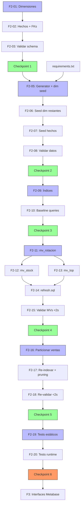

# Plan de Ejecución — F2: Núcleo

**Fecha:** 2026-07-03 | **Autor:** Fisherk2 | **Fase:** F2 (📋 LISTO PARA EJECUTAR)
**Metodología:** Slicing vertical con checkpoints de calidad (patrón F1)
**Reemplaza:** F1 plan (preservado en git history, commit `f218f99`+)
**Alcance confirmado:** Schema estrella + datos + índices + MVs + particionamiento + test suite

---

## 1. Resumen

F2 construye el **núcleo analítico** del proyecto: schema estrella de 10 tablas (6 dimensiones + 4 hechos), datos sintéticos realistas con Python + Faker (155K+ registros), 9+ índices B-tree, 3 vistas materializadas pre-calculadas, particionamiento de `ventas` por fecha, y suite de tests automatizada. Todo optimizado para queries <2s.

**Estimación total:** 12 horas (~1.5 días)
**Vertical slices:** 6
**Checkpoints:** 6 (quality gates)
**Commits atómicos esperados:** 6-8
**Decisiones confirmadas vía question tool:**
- ✅ Particionamiento: slice 5 de F2
- ✅ Logistica: schema + 20K datos
- ✅ Tests: `test_f2.py` completo (estáticos + runtime)

---

## 2. Estado Actual Detectado

| Elemento | Estado | Acción F2 |
|----------|--------|-----------|
| `scripts/` | Solo `requirements.txt` (157 bytes) y `.gitkeep` | **Crear** `init.sql` + `generate_data.py` + `refresh_materialized_views.sql` |
| `sql/indexes/` | Directorio vacío | **Crear** `create_indexes.sql` |
| `sql/views/` | Directorio vacío | **Crear** `mv_rotacion_mensual.sql`, `mv_stock_actual.sql`, `mv_top_productos.sql` |
| `sql/partitions/` | Directorio vacío | **Crear** `partition_ventas.sql` |
| `tests/` | `test_f0.py` (72 tests) + `test_f1.py` (67 tests) | **Crear** `test_f2.py` (~40 tests) |
| `Makefile` | Targets F2 ya definidos: `db-init`, `data-generate`, `data-count`, `mv-refresh`, `indexes-check`, `test-queries`, `test-integrity` | Verificar cobertura |
| `docs/SCHEMA.md` | ER diagram completo (378 líneas) | Referencia para crear `init.sql` |
| `specs/spec-star-schema.md` | Especificación detallada (124 líneas) | **Fuente de verdad** para DDL |
| `specs/spec-data-generation.md` | Volúmenes + reglas de negocio (137 líneas) | **Fuente de verdad** para script Python |
| `specs/spec-sql-optimization.md` | DDL de MVs + particionamiento (202 líneas) | **Fuente de verdad** para optimización |
| PostgreSQL 15+ | ✅ Operativo (F1) | Reutilizar |
| Metabase OSS | ✅ Operativo (F1) | Consumir datos F2 (F3) |
| `tests/conftest.py` | ✅ Existe (F1) con `root`, `run_cmd`, `PROJECT_ROOT`, `has_docker` | Reutilizar fixtures |

---

## 3. Slices y Tareas

### Slice 1: Schema Foundation (init.sql)

| ID | Tarea | Estimación | DoD | Dependencias |
|----|-------|-----------|-----|--------------|
| **F2-01** | Crear `scripts/init.sql` con **6 tablas de dimensiones** en orden: `categorias`, `proveedores`, `productos`, `clientes`, `tiempo`, `promociones`. Aplicar: `SERIAL PK`, `UNIQUE` en campos clave, `CHECK` constraints (precios >0, stock >=0), `NOT NULL` declarados. Comentarios `COMMENT ON TABLE` para cada tabla. | 1.5 h | `psql -f scripts/init.sql` exit 0; 6 tablas en `information_schema.tables`; `\d+ productos` muestra constraints esperados | F1 ✅ |
| **F2-02** | Añadir a `scripts/init.sql` las **4 tablas de hechos**: `ventas`, `inventario`, `devoluciones`, `logistica`. Cada una con: SERIAL PK, FKs explícitas a dimensiones (`REFERENCES tabla(id)`), CHECK constraints (cantidad >0, stocks >=0), índices B-tree en cada FK. Sección delimitada con comentarios: `-- ============ HECHOS ============`. | 1.5 h | 10 tablas en `information_schema.tables`; `pg_indexes` muestra índices en todas las FKs; `\d ventas` muestra FKs correctas | F2-01 |
| **F2-03** | Validar schema end-to-end: `make db-init` ejecuta sin errores; `make db-reset` roundtrip funciona (DROP+CREATE+INIT); `make db-shell -c "\dt"` lista 10 tablas. | 30 min | `make db-reset && make db-shell -c "\dt"` exit 0 y muestra 10 tablas | F2-02 |

**Subtotal Slice 1:** 3.5 horas

### Checkpoint 1: Schema Foundation ✅

- [ ] `make db-init` exit 0 (schema completo)
- [ ] `make db-reset` roundtrip funciona (DROP CASCADE + init.sql)
- [ ] 10 tablas en `information_schema.tables` (6 dim + 4 hechos)
- [ ] Todas las FKs declaradas con `REFERENCES`
- [ ] CHECK constraints en precios/stocks/cantidades
- [ ] Índices B-tree en cada FK (verificar con `pg_indexes`)

---

### Slice 2: Data Generation (Python + Faker)

| ID | Tarea | Estimación | DoD | Dependencias |
|----|-------|-----------|-----|--------------|
| **F2-04** | Crear `scripts/requirements.txt` con `faker>=18.0`, `psycopg2-binary>=2.9`, `python-dotenv>=1.0`. | 10 min | `pip install -r scripts/requirements.txt` exit 0; `import faker, psycopg2` sin errores | F0 ✅ |
| **F2-05** | Implementar `scripts/generate_data.py` con: clase `DataGenerator` (encapsula Faker + conexión psycopg2), función `connect_db()` con variables de entorno, `main()` con orden de inserción por FK, transacciones por tabla (`BEGIN`/`COMMIT`), argparse `--debug` y `--scale`, modo `--reset` (TRUNCATE CASCADE). Métodos privados: `_seed_categorias()`, `_seed_proveedores()`. | 1.5 h | `python scripts/generate_data.py --reset` exit 0; 20 categorías + 50 proveedores en BD; log muestra transacciones BEGIN/COMMIT | F2-03, F2-04 |
| **F2-06** | Implementar generadores restantes: `_seed_productos()` (5K, distribución Pareto 70/30 sobre categorías), `_seed_clientes()` (2K), `_seed_tiempo()` (365 días 2026-01-01 a 2026-12-31 con campos: fecha, dia_semana, mes, anio, trimestre), `_seed_promociones()` (30 con fecha_inicio/fin). | 1 h | `make data-count` muestra 5K productos, 2K clientes, 365 tiempo, 30 promociones | F2-05 |
| **F2-07** | Implementar generadores de hechos: `_seed_ventas()` (100K con Pareto 70/30 sobre productos, fecha_venta en 2026, precio_unitario de producto, total = cantidad * precio, promocion_id aleatorio del 30% de ventas), `_seed_inventario()` (50K, daily snapshots por producto), `_seed_devoluciones()` (5K, 5% de ventas), `_seed_logistica()` (20K, 20% de ventas). | 2 h | `make data-count` muestra 100K ventas, 50K inventario, 5K devoluciones, 20K logistica | F2-06 |
| **F2-08** | Validar volúmenes + integridad: `make data-count` exit 0 con conteos esperados; `make test-integrity` exit 0 (no FK huérfanas); `make db-shell -c "SELECT COUNT(*) FROM ventas WHERE total != cantidad * precio_unitario"` debe retornar 0. | 30 min | data-count correcto, test-integrity OK, totales válidos | F2-07 |

**Subtotal Slice 2:** 5 horas

### Checkpoint 2: Data Valid ✅

- [ ] `make deps` exit 0
- [ ] `python scripts/generate_data.py --reset` exit 0
- [ ] Volúmenes: 20+50+5000+2000+365+30+100000+50000+5000+20000 = **155,535 registros**
- [ ] `make test-integrity` exit 0 (sin huérfanos)
- [ ] `make data-count` exit 0 con todos los conteos
- [ ] Ventas: `total = cantidad * precio_unitario` en 100% de filas
- [ ] Tiempo: 365 días consecutivos (2026-01-01 a 2026-12-31)

---

### Slice 3: Indexes (Optimización 1)

| ID | Tarea | Estimación | DoD | Dependencias |
|----|-------|-----------|-----|--------------|
| **F2-09** | Crear `sql/indexes/create_indexes.sql` con **9+ índices B-tree** en columnas críticas para JOIN/WHERE/GROUP BY. Mínimo: `idx_ventas_producto_id`, `idx_ventas_cliente_id`, `idx_ventas_fecha_id`, `idx_inventario_producto_id`, `idx_inventario_fecha_id`, `idx_devoluciones_venta_id`, `idx_productos_categoria_id`, `idx_productos_proveedor_id`, `idx_ventas_fecha_venta` (para particionamiento). Usar `CREATE INDEX IF NOT EXISTS` para idempotencia. | 1 h | `make indexes-check` muestra 9+ índices; `EXPLAIN SELECT * FROM ventas WHERE producto_id = 1` usa Index Scan (no Seq Scan) | F2-08 |
| **F2-10** | Validar rendimiento de queries base (sin MVs todavía): `EXPLAIN ANALYZE` en las 4 queries críticas de `docs/SCHEMA.md` §4. Confirmar que cada una usa índices y completa en <500ms (antes de MVs). Documentar en `sql/queries_baseline.sql` para comparación posterior. | 30 min | 4 queries en `sql/queries_baseline.sql`; cada una usa Index Scan; tiempos <500ms | F2-09 |

**Subtotal Slice 3:** 1.5 horas

### Checkpoint 3: Indexes Applied ✅

- [ ] `make indexes-check` muestra 9+ índices
- [ ] Todas las queries críticas usan Index Scan (no Seq Scan)
- [ ] Tiempos baseline <500ms (medidos con `\timing`)
- [ ] `sql/queries_baseline.sql` documenta el plan de ejecución

---

### Slice 4: Materialized Views (Optimización 2)

| ID | Tarea | Estimación | DoD | Dependencias |
|----|-------|-----------|-----|--------------|
| **F2-11** | Crear `sql/views/mv_rotacion_mensual.sql` con `CREATE MATERIALIZED VIEW` (ventas + productos + categorias + tiempo agregados por categoria/mes/anio, calcula ventas_totales, ingresos_totales, productos_vendidos). Añadir `CREATE INDEX` en `categoria` y `(mes, anio)`. Usar `WITH DATA` para poblar inmediatamente. | 30 min | `make mv-refresh` funciona; `SELECT COUNT(*) FROM mv_rotacion_mensual` retorna 60 filas (12 meses × 5 categorías) | F2-10 |
| **F2-12** | Crear `sql/views/mv_stock_actual.sql` con CASE para estado (ALERTA/PRECAUCION/OK según umbrales stock_minimo). JOIN productos + categorias + proveedores. Índices en `estado` y `producto_id`. | 20 min | `SELECT estado, COUNT(*) FROM mv_stock_actual GROUP BY estado` muestra distribución coherente | F2-11 |
| **F2-13** | Crear `sql/views/mv_top_productos.sql` con `ORDER BY ingresos_totales DESC` y LIMIT implícito (top 100 productos). Índice en `ingresos_totales DESC`. | 20 min | `SELECT * FROM mv_top_productos LIMIT 10` retorna top 10 productos ordenados por ingresos | F2-11 |
| **F2-14** | Crear `scripts/refresh_materialized_views.sql` con `REFRESH MATERIALIZED VIEW` para las 3 MVs (en orden de dependencia). Añadir target `mv-refresh` (ya existe) y verificar que `make mv-refresh` ejecuta el script completo. | 15 min | `make mv-refresh` refresca las 3 MVs sin errores; log muestra "REFRESH MATERIALIZED VIEW" exitoso | F2-13 |
| **F2-15** | Validar rendimiento de queries contra MVs: `EXPLAIN ANALYZE SELECT * FROM mv_rotacion_mensual WHERE anio=2026` debe completar en <2s. Documentar tiempos en `docs/PERFORMANCE.md` (nuevo) o añadir a `WORKFLOW.md`. | 30 min | Las 4 queries críticas (rotación, stock, top, alertas) ejecutan <2s con MVs | F2-14 |

**Subtotal Slice 4:** 2 horas

### Checkpoint 4: Materialized Views Active ✅

- [ ] 3 MVs creadas: `mv_rotacion_mensual`, `mv_stock_actual`, `mv_top_productos`
- [ ] `make mv-refresh` exit 0 (refresca las 3)
- [ ] Índices en cada MV creados
- [ ] Queries contra MVs <2s (validado con EXPLAIN ANALYZE)
- [ ] MVs pobladas con datos (`WITH DATA`)

---

### Slice 5: Partitioning (Optimización 3 - Opcional confirmado)

| ID | Tarea | Estimación | DoD | Dependencias |
|----|-------|-----------|-----|--------------|
| **F2-16** | Estrategia: `DROP TABLE ventas CASCADE;` + recrear como tabla particionada + recargar datos. Crear `sql/partitions/partition_ventas.sql` con: `CREATE TABLE ventas (...) PARTITION BY RANGE (fecha_venta)`, **12 particiones mensuales** (2026_01 a 2026_12) usando `FOR VALUES FROM ('YYYY-MM-01') TO ('YYYY-MM-(next)')`. | 1 h | `SELECT * FROM pg_partition_tree('ventas')` muestra 12 particiones + tabla padre; INSERTs se enrutan a partición correcta | F2-08 (datos de ventas) |
| **F2-17** | Recrear índices en tabla particionada: `CREATE INDEX idx_ventas_fecha_venta ON ventas (fecha_venta);` (PostgreSQL propaga automáticamente a particiones). Re-ejecutar `sql/indexes/create_indexes.sql` con cláusula `IF NOT EXISTS`. Validar con `EXPLAIN SELECT * FROM ventas WHERE fecha_venta BETWEEN '2026-03-01' AND '2026-03-31'` debe mostrar **partition pruning** (solo lee partición ventas_2026_03). | 30 min | EXPLAIN muestra "Partition Pruning" + solo 1 partición escaneada; 100K datos distribuidos en 12 particiones (~8.3K/mes) | F2-16, F2-09 |
| **F2-18** | Re-validar queries post-particionamiento: las 4 queries críticas deben seguir <2s. Refrescar MVs (pueden estar stale tras DROP ventas). Actualizar `docs/PERFORMANCE.md` con tiempos pre/post particionamiento. | 30 min | Queries <2s; MVs refrescadas; comparison doc | F2-17, F2-15 |

**Subtotal Slice 5:** 2 horas

### Checkpoint 5: Partitioning Active ✅

- [ ] `ventas` es tabla particionada con 12 particiones mensuales
- [ ] `pg_partition_tree('ventas')` retorna 12 hijos + 1 padre
- [ ] EXPLAIN muestra **partition pruning** en queries con filtro fecha
- [ ] Índices recreados en tabla particionada
- [ ] MVs refrescadas tras recreación de `ventas`
- [ ] Queries siguen <2s (performance mantenida o mejorada)

---

### Slice 6: Test Suite (Automatización)

| ID | Tarea | Estimación | DoD | Dependencias |
|----|-------|-----------|-----|--------------|
| **F2-19** | Crear `tests/test_f2.py` con **tests estáticos** (sin Docker requerido): verificar existencia de `scripts/init.sql`, `scripts/generate_data.py`, `sql/indexes/create_indexes.sql`, 3 archivos en `sql/views/`, `sql/partitions/`, `scripts/requirements.txt`. Validar que `init.sql` contiene CREATE TABLE para las 10 tablas esperadas (regex). Validar que `generate_data.py` define `main()` y `DataGenerator` (AST parse). Validar que MVs están definidas en sus archivos. | 1 h | `pytest tests/test_f2.py -k "not runtime" -v` exit 0; ≥15 tests estáticos verdes | C5 |
| **F2-20** | Añadir **tests runtime** con marker `@pytest.mark.runtime` (skip si Docker no disponible). Tests: `make db-init` exitoso, `SELECT COUNT(*) FROM ventas` ≥ 100000, `make test-integrity` exit 0, `EXPLAIN ANALYZE` para cada MV muestra tiempo <2s, `pg_partition_tree` retorna 12 particiones, `REFRESH MATERIALIZED VIEW` exit 0. | 1.5 h | `pytest tests/test_f2.py -v` exit 0; ≥25 tests runtime verdes; skip automático sin Docker | F2-19, F2-18 |

**Subtotal Slice 6:** 2.5 horas

### Checkpoint 6: F2 Complete ✅ (Ready para F3)

- [ ] `make test` muestra F0 (72) + F1 (67) + F2 (≥40) = **≥179 tests passing**
- [ ] FTR de F2 pasa checklist de `docs/WORKFLOW.md` §5 (Schema + datos + queries optimizadas)
- [ ] Roundtrip `make db-reset && make data-generate && make mv-refresh` funciona
- [ ] `make validate && make up && make db-init && make data-generate && make mv-refresh` es la ruta crítica
- [ ] `git log --oneline` muestra 6-8 commits atómicos para F2
- [ ] Working tree limpio

---

## 4. Dependencias entre Slices



**Leyenda:**
- **Slice 1**: Schema estrella (10 tablas)
- **Slice 2**: ETL Python + datos (155K registros)
- **Slice 3**: Índices B-tree (optimización 1)
- **Slice 4**: Vistas materializadas (optimización 2)
- **Slice 5**: Particionamiento (optimización 3)
- **Slice 6**: Test suite automatizada

---

## 5. Checkpoints — Quality Gates

### Checkpoint 1: Schema Foundation
- `make db-init` exit 0
- `make db-reset` roundtrip funciona
- 10 tablas en `information_schema.tables`
- FKs declaradas con `REFERENCES`
- CHECK constraints válidos

### Checkpoint 2: Data Valid
- 155,535 registros totales (volúmenes esperados)
- `make test-integrity` exit 0 (sin FK huérfanas)
- `total = cantidad * precio_unitario` en 100% de ventas
- 365 días consecutivos en `tiempo`

### Checkpoint 3: Indexes Applied
- 9+ índices en `pg_indexes`
- Index Scan (no Seq Scan) en queries críticas
- Baseline <500ms con `\timing`

### Checkpoint 4: Materialized Views Active
- 3 MVs creadas y pobladas
- `make mv-refresh` exit 0
- Queries contra MVs <2s
- Índices en cada MV

### Checkpoint 5: Partitioning Active
- 12 particiones mensuales en `ventas`
- `pg_partition_tree` muestra jerarquía correcta
- Partition pruning visible en EXPLAIN
- MVs refrescadas post-DROP

### Checkpoint 6: F2 Complete
- FTR pasa WORKFLOW.md §5 checklist F2
- ≥40 tests nuevos (estáticos + runtime)
- Roundtrip completo funciona
- Working tree limpio, 6-8 commits atómicos

---

## 6. Riesgos y Mitigaciones

| Riesgo | Impacto | Probabilidad | Mitigación | Contingencia |
|--------|---------|--------------|------------|--------------|
| **Faker genera datos que violan CHECK constraints** (ej: stock negativo) | Alto | Media | Validar cada batch antes de `COMMIT` con `assert all(...)`; usar Faker `random_int(min, max)` con bounds | Wrap en try/except + rollback + log error |
| **Tiempos de inserción >30 min para 100K ventas** | Medio | Media | Usar `executemany()` con batch_size=1000; `COPY` (psycopg2 `copy_from`) para velocidad 10x | Reducir DATA_ROWS_SALES a 50K temporalmente |
| **DROP ventas particionada pierde FKs de devoluciones/logistica** | Alto | Alta | `DROP TABLE ventas CASCADE` (todas las FKs se eliminan); recrear devoluciones/logistica DESPUÉS con FKs a nueva `ventas` | Hacer backup antes con `pg_dump ventas > ventas_backup.sql` |
| **MVs quedan stale tras DROP ventas** | Medio | Alta | `make mv-refresh` después de F2-16; documentar en script | Añadir `REFRESH` automático en `init.sql` o en target `db-reset` |
| **PostgreSQL rechaza partición por solapamiento de rangos** | Bajo | Baja | Generar script con `for month in 01..12`; validar que rangos sean contiguos sin gaps | `pg_partitions` para diagnóstico; rollback con `DROP TABLE ventas` |
| **Tests runtime fallan en CI sin Docker** | Bajo | Alta | Marker `@pytest.mark.runtime` + skip automático si `not has_docker()` (patrón F1) | Tests estáticos cubren el 80% sin runtime |
| **Distribución Pareto produce concentración extrema** (1 producto = 50% ventas) | Bajo | Media | Usar `numpy.random.pareto(alpha=1.5)` con escala controlada; validar con `SELECT producto_id, COUNT(*) ... LIMIT 10` | Ajustar `alpha` parameter; alternativa: distribución zipfiana |
| **Tiempo de `make data-generate` excede 30 min** | Medio | Media | Background generation con `--scale 0.5` (50K ventas); perfilado con `cProfile` | Reducir volúmenes temporalmente; documentar tiempos esperados |

---

## 7. Patrones Aplicados

| Patrón | Tipo | Aplicación en F2 | Slice |
|--------|------|-------------------|-------|
| **Star Schema** | Data Warehouse | 6 dimensiones + 4 hechos; FKs explícitas; desnormalización estratégica | S1 |
| **ETL Pipeline** | Integración | Extract (Faker) → Transform (Python objects con reglas negocio) → Load (psycopg2 COPY/executemany) | S2 |
| **Factory** | GoF Creacional | `Faker(seed=42)` para reproducibilidad; factory functions para crear instancias de generadores | S2 |
| **Strategy** | GoF Comportamental | Distribución Pareto vs Uniforma intercambiables para generación de ventas; permite A/B de distribuciones | S2 |
| **Repository** | Enterprise | Funciones de seed encapsulan SQL + conexión; `DataGenerator._seed_xxx()` abstrae persistencia | S2 |
| **Builder** | GoF Creacional | `DataGenerator` builder pattern: configura conexión → define orden de seed → ejecuta pipeline | S2 |
| **Template Method** | GoF Comportamental | `main()` define orden fijo (categorias → proveedores → ... → logistica) que subclases pueden override | S2 |
| **Index Pattern (B-tree)** | Data Access | Índices en FK + WHERE + GROUP BY columnas para OLAP | S3 |
| **Materialized View (Cache)** | Data Access | Pre-computar KPIs (rotación, stock, top productos); refresh strategy desacoplada | S4 |
| **Partition Pattern (Range)** | Data Access | `PARTITION BY RANGE (fecha_venta)` con 12 particiones mensuales; partition pruning automático | S5 |
| **Test Suite Pattern** | Testing | Estáticos (sin Docker) + runtime (`@pytest.mark.runtime` con skip automático) | S6 |
| **Checkpoint/Quality Gate** | DevOps | 6 gates entre slices; rollback posible si falla | All |

**NO aplica en F2:** `clean-ddd-hexagonal` (F2 es data layer, no domain layer con bounded contexts). Las decisiones arquitectónicas (Star Schema, ETLs) ya están tomadas en `docs/ARCHITECTURE.md` §1.

---

## 8. Comandos de Verificación Global (F2 Complete)

```bash
# 1. Schema
make db-reset && make db-init                  # Schema limpio
make db-shell -c "\dt"                         # 10 tablas
make db-shell -c "SELECT COUNT(*) FROM pg_indexes WHERE schemaname='public'"  # ≥15 índices

# 2. Datos
make deps                                      # Instalar deps
make data-generate                             # Generar 155K registros
make data-count                                # Conteos por tabla
make test-integrity                            # Sin FK huérfanas

# 3. Índices
make indexes-check                             # 9+ índices
make db-shell -c "EXPLAIN SELECT * FROM ventas WHERE producto_id = 1"  # Index Scan

# 4. MVs
make mv-refresh                                # Refresca 3 MVs
make db-shell -c "SELECT matviewname FROM pg_matviews"  # 3 MVs
make db-shell -c "EXPLAIN ANALYZE SELECT * FROM mv_rotacion_mensual WHERE anio=2026"  # <2s

# 5. Particionamiento
make db-shell -c "SELECT * FROM pg_partition_tree('ventas')"  # 12 particiones
make db-shell -c "EXPLAIN SELECT * FROM ventas WHERE fecha_venta BETWEEN '2026-03-01' AND '2026-03-31'"  # partition pruning

# 6. Tests
make test                                      # F0 (72) + F1 (67) + F2 (≥40) = ≥179 passing
pytest tests/test_f2.py -v --tb=short          # Detalle F2

# 7. Roundtrip final
make db-reset && make data-generate && make mv-refresh && make test
```

---

## 9. Métricas F2

| Métrica | Valor Objetivo | Medición |
|---------|---------------|----------|
| Tareas completadas | 18/18 | tasks/todo.md checkboxes |
| Checkpoints pasados | 6/6 | Checkpoint sections §5 |
| Tiempo total | ≤ 12 h | Clock |
| Archivos modificados/creados | ~10 | `git diff --name-only` |
| Commits atómicos | 6-8 | `git log --oneline F1..F2` |
| Tests passing | 139 (F0+F1) + ≥40 (F2) = ≥179 | `pytest` |
| Tablas creadas | 10 (6 dim + 4 hechos) | `information_schema.tables` |
| Registros totales | 155,535 | `make data-count` |
| Índices B-tree | ≥9 | `pg_indexes` |
| Vistas materializadas | 3 | `pg_matviews` |
| Particiones | 12 mensuales | `pg_partition_tree('ventas')` |
| Queries <2s | 100% de queries críticas | `EXPLAIN ANALYZE` |
| FK huérfanas | 0 | `make test-integrity` |

**Definición de "Done" por Capa (F2):**
- **Schema**: 10 tablas con FKs + CHECK constraints + índices FK
- **Datos**: 155K registros con integridad referencial 100%
- **Performance**: Índices + MVs + Particionamiento → queries <2s
- **Optimización**: Partition pruning visible en EXPLAIN
- **Tests**: ≥40 tests nuevos (estáticos + runtime) con marker

---

## 10. Estado Actual y Siguiente Fase

**F1: Infraestructura** — ✅ COMPLETADO (10 tasks, 145 tests, 5 commits atómicos)
**F2: Núcleo** — 📋 PLAN APROBADO — Listo para ejecutar (18 tasks, 6 slices, 12h estimadas)

**F3: Interfaces** — Próxima fase después de F2. Alcance:
- Conectar Metabase a PostgreSQL (admin user, JDBC)
- 3+ paneles: Rotación por Categoría, Stock vs Mínimo, Top 10 Productos
- Validar queries con EXPLAIN ANALYZE <2s
- Configurar alertas de stock mínimo (opcional)
- Export PNG/CSV funcional

**Dependencias:** Requiere F2 completado (datos + MVs operativas).
**Estimación:** 1 día (según WORKFLOW.md F3).

---

## 11. Control de Cambios

| Versión | Fecha | Autor | Cambio | Lecciones Aprendidas |
|---------|-------|-------|--------|---------------------|
| 1.0 | 2026-07-03 | Fisherk2 | Versión inicial del plan F2 | Slicing vertical con 6 checkpoints permite fail-fast en data layer; DROP+RECREATE es viable para particionamiento porque F2 es entorno sintético; tests runtime con marker ahorran tiempo en CI local |
