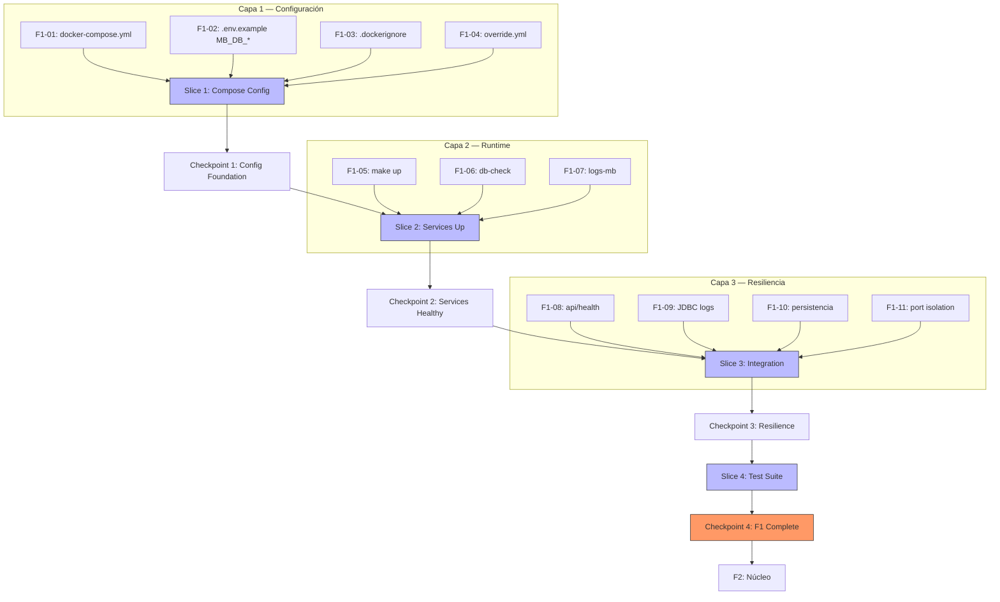

# Plan de Ejecución — F1: Infraestructura

**Fecha:** 2026-07-03 | **Autor:** Fisherk2 | **Fase:** F1
**Metodología:** Vertical slicing con checkpoints de calidad
**Reemplaza:** F0 plan (preservado en git history, commit `2b0af1e`+)

---

## 1. Resumen

F1 levanta el entorno reproducible del proyecto: **PostgreSQL 15+** y **Metabase OSS** orquestados con Docker Compose, comunicándose por red interna aislada, con healthchecks, persistencia por volúmenes named, credenciales seguras desde `.env`, y suite de tests automatizados para regression.

**Estimación total:** 4.5 horas
**Vertical slices:** 4
**Checkpoints:** 4 (quality gates)
**Commits atómicos esperados:** 6-8

---

## 2. Estado Actual Detectado

| Elemento | Estado | Acción F1 |
|----------|--------|-----------|
| `docker/docker-compose.yml` | Stub de 13 líneas (solo imágenes) | **Completar** (env, ports, volumes, healthcheck, network, mem_limit) |
| `.env.example` | 27 líneas, 8 vars (`POSTGRES_*`, `METABASE_PORT`, `COMPOSE_PROJECT_NAME`, `DATA_ROWS_*`) | **Extender** con 7 vars faltantes: `MB_DB_TYPE`, `MB_DB_DBNAME`, `MB_DB_PORT`, `MB_DB_USER`, `MB_DB_PASS`, `MB_DB_HOST`, `METABASE_SECRET_KEY` |
| `.env` (real) | Existe localmente, 879 bytes | Verificar gitignore + NO commitear |
| `Makefile` | 123 líneas, targets F1 ya definidos (`up`, `down`, `validate`, `db-check`, `logs`, `logs-mb`, etc.) | Verificar cobertura; añadir `db-wait` si es necesario |
| `tests/test_f0.py` | 72 tests passing (estáticos) | Crear `tests/test_f1.py` con suite nueva (estática + integración) |
| `.dockerignore` | **No existe** | Crear (excluir `venv/`, `tests/`, `.env`, `__pycache__`, `.git`) |
| `docker/docker-compose.override.yml` | **No existe** | Crear template vacío con `.gitkeep` o comentario guía |
| Docker Engine | v29.6.0 | OK |
| Docker Compose | v5.1.4 (v2 syntax) | OK |
| `scripts/init.sql`, `generate_data.py` | No existen (F2) | Fuera de scope F1 |

---

## 3. Slices y Tareas

### Slice 1: Compose Config Foundation

| ID | Tarea | Estimación | DoD | Dependencias |
|----|-------|-----------|-----|--------------|
| **F1-01** | Completar `docker/docker-compose.yml` con: `environment` (vars de `.env`), `ports` (solo Metabase 3000:3000), `volumes` (`pg_data`, `mb_data` named), `healthcheck` (`pg_isready -U $POSTGRES_USER` cada 10s, 5 retries), `networks` (bridge `ecommerce_net`), `mem_limit` (1g pg / 2g mb per `SECURITY.md`), `restart: unless-stopped`. Metabase: `depends_on: postgres: condition: service_healthy`. | 1.5 h | `make validate` exit 0; `docker compose config` no warnings; ambos servicios con healthcheck/depends_on | F0 ✅ |
| **F1-02** | Extender `.env.example` con 7 vars: `MB_DB_TYPE=postgres`, `MB_DB_DBNAME`, `MB_DB_PORT`, `MB_DB_USER`, `MB_DB_PASS`, `MB_DB_HOST=postgres`, `METABASE_SECRET_KEY`. Añadir bloque de comentarios por sección (PostgreSQL / Metabase / Compose / Data) ya existente. | 15 min | `wc -l .env.example` ≥ 35; `grep -c '=' .env.example` ≥ 14 | F0 ✅ |
| **F1-03** | Crear `.dockerignore` en raíz: `venv/`, `tests/`, `__pycache__/`, `*.pyc`, `.env`, `.env.*` (excepto `.env.example`), `.git/`, `.gitignore`, `*.md` (excepto `README.md` y `docs/`), `metabase-data/`, `data/`, `*.log`, `.pytest_cache/`, `node_modules/`. | 15 min | `cat .dockerignore` lista 10+ patrones; `docker build` con `docker-compose.yml` excluye correctamente | F1-01 |
| **F1-04** | Crear `docker/docker-compose.override.yml` template con `services: {}` y comentario explicativo (este archivo es para personalizaciones locales NO committeadas; el real va en `.gitignore` o se sobreescribe localmente). | 10 min | `docker compose -f docker/docker-compose.yml -f docker/docker-compose.override.yml config` exit 0; override es merge-safe | F1-01 |

**Subtotal Slice 1:** 1.9 horas

### Checkpoint 1: Config Foundation ✅

Verificación obligatoria antes de continuar:

- [ ] `make validate` exit 0 (sin warnings de interpolación de variables)
- [ ] `docker compose -f docker/docker-compose.yml config` muestra ambos servicios con `healthcheck`, `volumes`, `environment`, `networks`
- [ ] `.env.example` tiene ≥ 14 variables (4 PostgreSQL + 1 Metabase port + 6 MB_DB + 1 secret + 2 data)
- [ ] `docker compose -f docker/docker-compose.yml -f docker/docker-compose.override.yml config` exit 0 (merge funciona)
- [ ] `.dockerignore` excluye `venv/`, `.env`, `tests/`, `__pycache__/`
- [ ] `git check-ignore .env` retorna el path (secretos protegidos)

---

### Slice 2: Services Up & Healthy

| ID | Tarea | Estimación | DoD | Dependencias |
|----|-------|-----------|-----|--------------|
| **F1-05** | Levantar servicios: `make up` y validar con `make status` que ambos están "Up" o "Up (healthy)" | 15 min | `docker compose ps` muestra `metabase-postgres` y `metabase-app` con estado `Up`; `make status` exit 0 | C1 |
| **F1-06** | Verificar healthcheck PostgreSQL: `make db-check` retorna "accepting connections"; healthcheck log en `make logs-pg` | 10 min | `docker exec metabase-postgres pg_isready -U ecommerce` exit 0; log muestra "database system is ready" | F1-05 |
| **F1-07** | Verificar arranque de Metabase: `make logs-mb` muestra "Metabase Initialization Complete" sin errores de conexión | 10 min | Log contiene "Metabase Initialization" + "plugins loaded"; NO contiene "FATAL" ni "Connection refused" | F1-06 |

**Subtotal Slice 2:** 35 minutos

### Checkpoint 2: Services Healthy ✅

- [ ] `make up` exit 0, ambos contenedores `Up`
- [ ] `make db-check` retorna "accepting connections"
- [ ] `make logs-mb | tail -50` muestra "Metabase Initialization Complete" sin FATAL
- [ ] `docker inspect metabase-postgres --format='{{.State.Health.Status}}'` retorna "healthy"
- [ ] `docker inspect metabase-app --format='{{.State.Status}}'` retorna "running"

---

### Slice 3: Integration & Resilience

| ID | Tarea | Estimación | DoD | Dependencias |
|----|-------|-----------|-----|--------------|
| **F1-08** | Verificar API health de Metabase: `curl -sf http://localhost:3000/api/health` retorna 200 con `{"status":"ok"}` | 5 min | `curl -s http://localhost:3000/api/health` retorna JSON con status ok | F1-07 |
| **F1-09** | Verificar logs JDBC: `make logs-mb | grep -iE "database|postgres"` muestra inicialización del application DB y referencia al warehouse | 10 min | Log contiene referencias a "application database" (H2) y NO contiene errores de conexión al warehouse | F1-07 |
| **F1-10** | Verificar persistencia: `make down && make up` + verificar que `docker volume ls` muestra `metabase-dashboard_pg_data` y `metabase-dashboard_mb_data`. Crear tabla test: `make db-shell -c "CREATE TABLE _f1_test (id INT);"`, `make down`, `make up`, `make db-shell -c "\dt"` muestra `_f1_test`, luego `DROP TABLE _f1_test;` | 30 min | Tabla `_f1_test` persiste tras restart; ambos volumes existen en `docker volume ls` | F1-08 |
| **F1-11** | Verificar aislamiento de red: `docker port metabase-postgres` retorna vacío (5432 NO expuesto a host); `nc -zv localhost 5432 -w 2` falla con timeout/refused | 10 min | `docker port metabase-postgres` exit 0 con output vacío; `nc` falla | F1-05 |

**Subtotal Slice 3:** 55 minutos

### Checkpoint 3: Resilience Verified ✅

- [ ] `curl -s http://localhost:3000/api/health` retorna 200
- [ ] `make logs-mb` no contiene "Connection refused" ni "FATAL"
- [ ] Tabla `_f1_test` persiste tras `make down && make up`
- [ ] `docker volume ls | grep metabase-dashboard` muestra 2 volumes
- [ ] `docker port metabase-postgres` retorna vacío (BD aislada)
- [ ] `nc -zv localhost 5432` falla (puerto no expuesto a host)

---

### Slice 4: Automated Test Suite

| ID | Tarea | Estimación | DoD | Dependencias |
|----|-------|-----------|-----|--------------|
| **F1-12** | Crear `tests/test_f1.py` con pytest. Tests estáticos (config válido, vars presentes, healthcheck definido, network interno, mem_limit). Tests de runtime (skip si Docker no disponible): `make up` + `curl /api/health` + `docker port metabase-postgres` vacío. Markers: `@pytest.mark.runtime` para los que requieren Docker. | 1 h | `make test` muestra tests F1 verdes; ≥ 20 nuevos tests; tests runtime pasan con Docker disponible; tests estáticos pasan siempre | C3 |

**Subtotal Slice 4:** 1 hora

### Checkpoint 4: F1 Complete ✅ (Ready para F2)

- [ ] `make test` muestra F0 (72) + F1 (≥20) tests passing
- [ ] FTR de F1 pasa checklist de `docs/WORKFLOW.md` §5 (Servicios levantan / Credenciales seguras / Persistencia configurada)
- [ ] `make up && make down && make up` roundtrip funciona
- [ ] `make validate && make up && make status` es la ruta crítica documentada
- [ ] `git log --oneline` muestra 6-8 commits atómicos para F1

---

## 4. Dependencias entre Slices



**Leyenda:**
- **Slice 1**: Configuración estática (sin Docker engine)
- **Slice 2**: Servicios arriba + healthchecks
- **Slice 3**: Resiliencia + seguridad de red
- **Slice 4**: Regression suite automatizada

---

## 5. Checkpoints — Quality Gates

### Checkpoint 1: Config Foundation
- `make validate` exit 0 sin warnings
- `.env.example` completo (14+ vars)
- `.dockerignore` y `override.yml` creados
- Secretos NO en repo (git check-ignore)

### Checkpoint 2: Services Healthy
- `make up` levanta ambos
- `make db-check` exit 0 (PostgreSQL ready)
- Metabase Initialization Complete en logs
- healthcheck status = "healthy"

### Checkpoint 3: Resilience Verified
- API /health 200
- Volúmenes persisten tras down/up
- Puerto 5432 NO expuesto a host
- JDBC funcional (logs sin error)

### Checkpoint 4: F1 Complete
- FTR de F1 pasa WORKFLOW.md §5
- Tests F1 verdes (estáticos + runtime)
- Roundtrip `make up && down && up` funciona
- Working tree clean, 6-8 commits atómicos

---

## 6. Riesgos y Mitigaciones

| Riesgo | Impacto | Probabilidad | Mitigación | Contingencia |
|--------|---------|--------------|------------|--------------|
| Puerto 3000 ya en uso | Alto | Media | `METABASE_PORT` configurable en `.env`; documentar cambio en README | Cambiar a 3001 o liberar puerto antes de `make up` |
| Docker daemon no corriendo | Alto | Baja | Pre-flight check en `Makefile` antes de `up`; documentar en README | Iniciar Docker Desktop o `sudo systemctl start docker` |
| Permisos de volumen (Linux) | Medio | Baja | Usar **named volumes** (no bind mounts); named volumes los maneja Docker engine | `sudo chown -R 999:999 ./pg_data` si se usa bind mount |
| Metabase first-run wizard (admin user) | Bajo | Alta | **Fuera de scope F1**: F1 solo verifica que Metabase arranca; la creación de admin user es interactiva y ocurre en F3 (UI) | Documentar en README que F3 requiere crear admin user |
| Healthcheck timeout muy corto | Medio | Media | Configurar `start_period: 30s` para Metabase (descarga imágenes, inicializa plugins); `start_period: 10s` para PostgreSQL | Aumentar `retries` o `interval` |
| `nc` no instalado | Bajo | Baja | Test de port isolation usa `docker port` (built-in) como verificación principal; `nc` es secundario | Usar `python -c "import socket; socket.create_connection(('localhost', 5432), 2)"` |
| `make validate` falla por interpolación de vars no definidas | Alto | Media | `.env.example` con TODAS las vars que el compose necesita; `.env` debe existir localmente con mismas keys | Copiar `.env.example` a `.env` antes de `make validate` |

---

## 7. Patrones Aplicados

| Patrón | Tipo | Aplicación en F1 |
|--------|------|------------------|
| **Adapter** | Estructural (GoF) | JDBC adapter entre Metabase (cliente genérico) y PostgreSQL (warehouse específico) — verificado en F1-09 |
| **Health Check** | Microservicios | `pg_isready` como liveness/readiness probe; Docker `condition: service_healthy` para service discovery |
| **Service Discovery** | Microservicios | `depends_on: postgres: condition: service_healthy` — Metabase espera hasta que PG esté healthy |
| **Network Isolation** | Container | Bridge network `ecommerce_net` interna; PostgreSQL sin `ports:` → no expuesto a host |
| **Persistent Volume** | Container | Named volumes `pg_data` y `mb_data` sobreviven a `docker compose down` |
| **Facade** | Estructural (GoF) | `Makefile` como única interfaz para `docker compose`, `psql`, `curl` |
| **Composition Root** | DDD/Inversión de Dependencias | `docker-compose.yml` es el composition root: inyecta credenciales desde `.env` a los servicios |
| **Override Pattern** | Configuración | `docker-compose.override.yml` para personalizaciones locales sin tocar el archivo commiteado |

**NO aplica en F1:** `clean-ddd-hexagonal` (F1 es infraestructura, no dominio).

---

## 8. Comandos de Verificación Global (F1 Complete)

```bash
# 1. Configuración estática
make validate                                    # docker compose config exit 0
wc -l .env.example                               # ≥ 35 líneas
test -f .dockerignore && echo ".dockerignore OK" # existe
test -f docker/docker-compose.override.yml && echo "override OK"

# 2. Servicios arriba
make up                                          # levanta ambos
make status                                      # ambos "Up" o "Up (healthy)"
make db-check                                    # "accepting connections"

# 3. Resiliencia
curl -s http://localhost:3000/api/health        # {"status":"ok"}
make logs-mb | grep -i "metabase initialization" # sin FATAL
docker port metabase-postgres                    # vacío (5432 no expuesto)
nc -zv localhost 5432 -w 2 2>&1                  # connection refused

# 4. Persistencia
make db-shell -c "CREATE TABLE _f1_test (id INT);"  # crear tabla
make down                                            # detener
make up                                              # reiniciar
make db-shell -c "\dt" | grep _f1_test               # tabla persiste
make db-shell -c "DROP TABLE _f1_test;"              # cleanup

# 5. Tests automatizados
make test                                          # F0 (72) + F1 (≥20) passing
pytest tests/test_f1.py -v --tb=short              # detalle F1

# 6. Roundtrip final
make down && make up && make status                # sin errores
```

---

## 9. Métricas F1

| Métrica | Valor Objetivo | Medición |
|---------|---------------|----------|
| Tareas completadas | 12/12 | tasks/todo.md checkboxes |
| Checkpoints pasados | 4/4 | Checkpoint sections §5 |
| Tiempo total | ≤ 4.5 h | Clock |
| Archivos modificados/creados | ~5 | `git diff --name-only` |
| Commits atómicos | 6-8 | `git log --oneline F0..F1` |
| Tests passing | 72 (F0) + ≥20 (F1) = 92+ | `pytest` |
| Servicios healthy | 2/2 | `make status` |
| Volúmenes persistentes | 2/2 | `docker volume ls` |
| Puertos no expuestos | 1/1 (5432) | `docker port` |

**Definición de "Done" por Capa (F1):**
- **Config**: Compose válido, env completo, secrets fuera de repo
- **Runtime**: Servicios arrancan en orden correcto (PostgreSQL → Metabase)
- **Network**: PostgreSQL NO expuesto a host; Metabase SÍ
- **Persistence**: Volúmenes named sobreviven restart
- **Resilience**: Healthchecks, restart policy, isolation
- **Tests**: Suite automatizada valida todo lo anterior

---

## 10. Siguiente Fase

**F2: Núcleo** — Plan se generará tras completar F1. Alcance:
- `scripts/init.sql` con star schema (8+ tablas)
- `scripts/generate_data.py` con Python + Faker (100K ventas, 5K productos)
- `sql/indexes/` con índices críticos
- `sql/views/` con 3 vistas materializadas (`mv_rotacion_mensual`, etc.)
- `sql/partitions/` con particionamiento de `ventas` por fecha
- Tests: `EXPLAIN ANALYZE` <2s, integridad referencial

---

## 11. Control de Cambios

| Versión | Fecha | Autor | Cambio | Lecciones Aprendidas |
|---------|-------|-------|--------|----------------------|
| 1.0 | 2026-07-03 | Fisherk2 | Versión inicial del plan F1 | Vertical slicing reduce checkpoints de 5 (F0) a 4 con misma calidad; tests de runtime con marker `@pytest.mark.runtime` permiten CI local sin Docker; named volumes eliminan problemas de permisos de bind mount |
