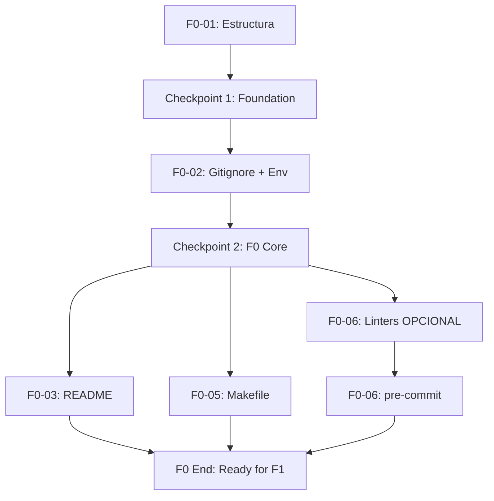

# Plan de Ejecución — F0: Preparación

**Fecha:** 2026-07-03 | **Autor:** Fisherk2 | **Fase:** F0
**Metodología:** Vertical slicing con checkpoints de calidad

---

## 1. Resumen

F0 establece la base del proyecto: estructura de carpetas, configuración de seguridad, documentación de entrada (README) e interfaz de automatización (Makefile). Sin F0 completado, ninguna fase posterior (F1+) puede ejecutarse de forma reproducible.

**Estimación total:** 6 horas (sin F0-06) | 7.5 horas (con F0-06)
**Vertical slices:** 3 + 1 opcional
**Checkpoints:** 2 (quality gates)

---

## 2. Estado Actual Detectado

| Elemento | Estado | Acción F0 |
|----------|--------|-----------|
| `README.md` | Vacío (0 bytes) | Crear desde cero (F0-03) |
| `Makefile` | Stub (35 bytes) | Implementar completo (F0-05) |
| `.env.example` | Vacío (0 bytes) | Crear template (F0-02b) |
| `.gitignore` | Existe, cubre env/IDE/AI | Extender (F0-02a) |
| `docker/` dir | No existe | Crear (F0-01a) |
| `sql/` dirs | No existen | Crear subdirectorios (F0-01a) |
| `metabase/collections/` | No existe | Crear (F0-01a) |
| `docker-compose.yml` | En raíz (31 bytes) | Mover a `docker/` (F0-01b) |
| `Dockerfile` | Stub en raíz (28 bytes) | Eliminar (F0-01b) |
| `scripts/*.sh` | 4 stubs de template anterior | Eliminar (F0-01c) |
| `requirements.txt` | Stub (23 bytes) | Llenar deps (F0-05b) |
| `AGENTS.md` | ✅ Completo (49 líneas) | Verificar (F0-04) |
| `docs/ARCHITECTURE.md` | ✅ Completo (115 líneas) | Verificar (F0-04) |

---

## 3. Slices y Tareas

### Slice 1: Foundation — Estructura + Seguridad

| ID | Tarea | Estimación | DoD | Dependencias |
|----|-------|-----------|-----|--------------|
| **F0-01a** | Crear directorios: `docker/`, `sql/views/`, `sql/indexes/`, `sql/partitions/`, `metabase/collections/` | 15 min | `ls` muestra todos los directorios | Ninguna |
| **F0-01b** | Mover `docker-compose.yml` de raíz a `docker/`, eliminar `Dockerfile` stub | 15 min | `docker/docker-compose.yml` existe, raíz no tiene docker-compose.yml | F0-01a |
| **F0-01c** | Eliminar `scripts/build.sh`, `lint.sh`, `setup.sh`, `test.sh` (reemplazados por make targets) | 10 min | `scripts/` solo tiene archivos del spec | F0-01a |
| **F0-02a** | Extender `.gitignore` con: `data/`, `*.sql.gz`, `.pytest_cache/`, `.coverage`, `metabase-data/`, `*.egg-info/` | 15 min | `git check-ignore data/test.sql` retorna el path | F0-01a |
| **F0-02b** | Crear `.env.example` con template: `POSTGRES_USER`, `POSTGRES_PASSWORD`, `POSTGRES_DB`, `POSTGRES_PORT`, `METABASE_PORT`, `METABASE_SECRET_KEY` | 15 min | `.env.example` commiteable, documenta todas las vars del proyecto | F0-01a |

**Subtotal Slice 1:** 1.5 horas

### Checkpoint 1: Foundation ✅

Verificación obligatoria antes de continuar:

- [ ] `tree -L 2 -I 'agents|skills|references|commands|.git' .` muestra estructura del SPEC.md
- [ ] `git check-ignore -v .env` confirma que `.env` está ignorado
- [ ] `git check-ignore -v .env.example` confirma que `.env.example` NO está ignorado
- [ ] `docker/docker-compose.yml` existe, raíz no tiene `docker-compose.yml`
- [ ] `scripts/` no contiene archivos `.sh`
- [ ] `.env.example` tiene al menos 6 variables documentadas

---

### Slice 2: Documentation — README + Verificación de Índice

| ID | Tarea | Estimación | DoD | Dependencias |
|----|-------|-----------|-----|--------------|
| **F0-03** | Crear `README.md` inicial con: título, descripción MVP, badges (PostgreSQL, Metabase, Docker, Python), Quick Start con `make setup`, estructura de carpetas, enlaces a `docs/`, `AGENTS.md`, `SPEC.md` | 1 hora | `README.md` tiene >50 líneas, renderiza badges, sección Quick Start funcional | Checkpoint 1 |
| **F0-04** | Verificar `AGENTS.md` (49 líneas) y `docs/ARCHITECTURE.md` (115 líneas) — ya completos por commits anteriores | 5 min | Confirmar que ambos existen y enlazan correctamente | Checkpoint 1 |

**Subtotal Slice 2:** 1 hora

### Checkpoint 2: F0 Core ✅ (Ready para F1)

- [ ] `README.md` renderiza correctamente en GitHub
- [ ] `AGENTS.md` <60 líneas, todos los enlaces funcionan
- [ ] `docs/ARCHITECTURE.md` tiene diagrama Mermaid + ADR index
- [ ] FTR (Formal Technical Review) de F0 pasa checklist de `docs/WORKFLOW.md` sección 5

---

### Slice 3: Automation Interface — Makefile + Requirements

| ID | Tarea | Estimación | DoD | Dependencias |
|----|-------|-----------|-----|--------------|
| **F0-05** | Implementar `Makefile` completo según `specs/spec-makefile.md`: 25+ targets en 6 secciones (infra, db, data, sql, testing, utilities), `.PHONY`, `.DEFAULT_GOAL := help`, `include .env`, grupos con comentarios | 1 hora | `make help` lista 25+ targets, `make validate` ejecuta `docker compose -f docker/docker-compose.yml config` | Checkpoint 2 |
| **F0-05b** | Llenar `requirements.txt` con: `faker>=18.0`, `psycopg2-binary>=2.9`, `python-dotenv>=1.0` (referencia: `specs/spec-data-generation.md` sección 4) | 10 min | `pip install -r requirements.txt --dry-run` no falla | Checkpoint 2 |

**Subtotal Slice 3:** 1.2 horas

---

### Slice 4: Quality Tooling [OPCIONAL]

| ID | Tarea | Estimación | DoD | Dependencias |
|----|-------|-----------|-----|--------------|
| **F0-06a** | Configurar `sqlfluff` (`.sqlfluff` con `dialect = postgres`, exclusions razonables) | 30 min | `sqlfluff lint scripts/init.sql` funciona | Checkpoint 2 |
| **F0-06b** | Configurar `black` + `flake8` (`pyproject.toml`, `.flake8`) | 30 min | `black --check scripts/` no falla | Checkpoint 2 |
| **F0-06c** | Configurar `pre-commit` hooks (`.pre-commit-config.yaml`) | 30 min | `pre-commit run --all-files` ejecuta | F0-06a, F0-06b |

**Subtotal Slice 4:** 1.5 horas (opcional)

---

## 4. Dependencias entre Slices



---

## 5. Checkpoints — Quality Gates

### Checkpoint 1: Foundation
- Estructura de carpetas coincide con SPEC.md
- Secretos protegidos (`.env` ignorado, `.env.example` commiteable)
- Sin archivos huérfanos del template original

### Checkpoint 2: F0 Complete
- Documentación de entrada lista (README + AGENTS + ARCHITECTURE)
- Makefile operativo (`make help` + `make validate` + `make deps`)
- Requirements completos para F2
- FTR de F0 pasa checklist de WORKFLOW.md §5

---

## 6. Riesgos y Mitigaciones

| Riesgo | Impacto | Probabilidad | Mitigación |
|--------|---------|--------------|------------|
| Eliminar archivos `.sh` que algún agente aún referencia | Medio | Baja | Confirmar con `grep -r 'build.sh\|lint.sh' .` antes de eliminar |
| Mover `docker-compose.yml` rompe paths esperados por el Makefile | Alto | Media | Actualizar `Makefile` (F0-05) para usar `docker/docker-compose.yml` |
| `.env.example` con credenciales reales por error | Alto | Baja | Usar placeholders tipo `change-me-in-production`, agregar nota |
| F0-06 (linters) agrega fricción sin valor | Bajo | Media | Marcar como opcional, diferir a F2 si bloquea |

---

## 7. Patrones Aplicados

| Patrón | Aplicación en F0 |
|--------|------------------|
| **Separation of Concerns** | `docker/`, `sql/`, `metabase/`, `scripts/` separados por dominio |
| **Single Source of Truth** | `.env.example` como única fuente de variables de entorno |
| **Facade** | `Makefile` expone una interfaz simple (`make setup`, `make help`) que oculta complejidad de Docker/psql |
| **Convention over Configuration** | Targets en `kebab-case`, scripts en `snake_case`, estructura de carpetas predefinida |

---

## 8. Comandos de Verificación Global (F0 Complete)

```bash
# 1. Estructura
tree -L 2 -I 'agents|skills|references|commands|.git|.opencode' .

# 2. Seguridad
git check-ignore -v .env
git check-ignore -v .env.example
git status  # No debe mostrar archivos .sh eliminados

# 3. Makefile
make help                    # Lista 25+ targets
make validate                # Valida docker/docker-compose.yml
make deps                    # Instala requirements

# 4. Documentación
test -s README.md && echo "README OK"
test -s AGENTS.md && echo "AGENTS OK"
test -s docs/ARCHITECTURE.md && echo "ARCHITECTURE OK"
```

---

## 9. Métricas F0

| Métrica | Valor Objetivo |
|---------|---------------|
| Tareas completadas | 7/7 (sin F0-06) o 10/10 (con F0-06) |
| Checkpoints pasados | 2/2 |
| Tiempo total | ≤6h (sin linters) o ≤7.5h (con linters) |
| Archivos modificados | ~10 |
| Commits atómicos | 5-7 (uno por tarea o grupo) |

---

## 10. Siguiente Fase

**F1: Infraestructura** — Levantar PostgreSQL 15+ y Metabase con Docker Compose. Plan se generará después de completar F0.

---

## 11. Control de Cambios

| Versión | Fecha | Autor | Cambio |
|---------|-------|-------|--------|
| 1.0 | 2026-07-03 | Fisherk2 | Versión inicial del plan F0 |
