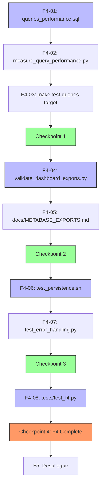

# Plan de Ejecución — F4: Pruebas

**Fecha:** 2026-07-06 | **Autor:** Fisherk2 | **Fase:** F4 (📋 LISTO PARA EJECUTAR)
**Metodología:** Slicing vertical con checkpoints de calidad (patrón F0/F1/F2/F3)
**Reemplaza:** N/A (nueva fase)
**Alcance confirmado:** Validación de rendimiento de las 4 queries + validación de exportación PNG/CSV + validación de resiliencia (persistencia + error handling) + test suite F4

---

## 1. Resumen

F4 valida que el dashboard analítico cumple los criterios de aceptación de SPEC.md y WORKFLOW.md en condiciones reales: las 4 queries cargan en <2s (p95) con datos sintéticos, los 4 paneles se exportan correctamente a PNG/CSV, los datos persisten tras reiniciar contenedores, y Metabase maneja errores de conexión a PostgreSQL con mensajes claros. Todo encapsulado en `tests/test_f4.py` con el patrón de tests estáticos + runtime con `@pytest.mark.runtime` (skip si Docker no disponible).

**Estimación total:** 3.5 horas (~0.5 día)
**Vertical slices:** 4
**Checkpoints:** 4 (quality gates)
**Commits atómicos esperados:** 4-5
**Decisiones confirmadas vía question tool:**
- ✅ Alcance: 8 tareas, 4 slices (Performance, Export, Resilience, Test Suite)
- ✅ Scripts: Python + bash, mismo patrón que F1/F2/F3 (sin Playwright)
- ✅ Tests: Estáticos + runtime con marker
- ✅ Persistencia: Roundtrip `make destroy && make setup && make metabase-setup && make test`

---

## 2. Estado Actual Detectado

| Elemento | Estado | Acción F4 |
|----------|--------|-----------|
| `sql/queries_dashboard.sql` | ✅ Documenta EXPLAIN ANALYZE de 4 queries (F3) | Consumir como referencia; crear `sql/queries_performance.sql` para validación F4 |
| `scripts/setup_metabase.py` | ✅ Operativo, idempotente (F3) | Consumir para tests de export |
| `metabase/collections/dashboard_ecommerce.json` | ✅ Exportado (F3) | Consumir; tests validan export fresh vía API |
| `tests/conftest.py` | ✅ `root`, `run_cmd`, `has_docker`, markers | Reutilizar fixtures |
| `tests/test_f3.py` | ✅ 38 tests (F3) | Consumir fixtures + patrón AST/JSON/content |
| `make test-queries` | ⚠️ Solo mensaje, no ejecuta validación | **Reemplazar** con script de timing |
| `make test-full` | ⚠️ Solo llama a `test-queries` y `test-integrity` | Ampliar para invocar nuevos tests |
| Metabase export PNG/CSV | ⚠️ No validado programáticamente | **Validar** via API `POST /api/card/:id/query/csv` y `query/xlsx` |
| Roundtrip `make destroy && make setup` | ⚠️ No automatizado | **Crear** script de roundtrip |
| Error handling de Metabase | ⚠️ No probado | **Probar** con PG caído + verificar mensaje claro |

---

## 3. Slices y Tareas

### Slice 1: Performance Validation

**Objetivo:** Validar que las 4 queries del dashboard cargan en <2s (p95) con datos sintéticos.

| ID | Tarea | Estimación | DoD | Dependencias |
|----|-------|-----------|-----|--------------|
| **F4-01** | Crear `sql/queries_performance.sql` con `EXPLAIN (ANALYZE, BUFFERS, FORMAT TEXT)` de las 4 queries. Documentar plan esperado (Index Scan, <2s). | 30 min | Archivo existe con 4 queries; planes documentados | F3 ✅ |
| **F4-02** | Crear `scripts/measure_query_performance.py`: ejecuta cada query N=10 veces, mide wall time, calcula p50/p95/p99, exit 1 si p95 >2s. Usa `psycopg2.connect(timeout=10)`. Output tabular. | 1 h | `python scripts/measure_query_performance.py` exit 0; p95 <2s en las 4 queries | F4-01 |
| **F4-03** | Reemplazar target `make test-queries` (placeholder) por invocación al script. Documentar en help. | 15 min | `make test-queries` exit 0; help describe lo que hace | F4-02 |

**Subtotal Slice 1:** 1.75 horas

### Checkpoint 1: Performance Validado ✅

- [ ] `make test-queries` exit 0
- [ ] p95 <2s en las 4 queries
- [ ] Plan de ejecución usa Index Scan (no Seq Scan) en tablas >1000 filas
- [ ] `sql/queries_performance.sql` documenta planes esperados vs reales

---

### Slice 2: Export Validation

**Objetivo:** Validar que los 4 paneles se exportan correctamente a PNG/CSV vía Metabase API.

| ID | Tarea | Estimación | DoD | Dependencias |
|----|-------|-----------|-----|--------------|
| **F4-04** | Crear `scripts/validate_dashboard_exports.py`: itera sobre los 4 cards de la collection exportada, descarga CSV (`POST /api/card/:id/query/csv`) y PNG (`POST /api/card/:id/query/png?width=1200&height=800`). Valida: CSV parseable con `csv.DictReader` + ≥1 fila de datos; PNG magic bytes `89 50 4E 47` + size >1KB. Output: tabla con [card_name, csv_rows, png_kb, status]. Exit 1 si algún export falla. | 1 h | `python scripts/validate_dashboard_exports.py` exit 0; 4/4 cards exportan correctamente | F3 ✅ |
| **F4-05** | Crear `docs/METABASE_EXPORTS.md`: documenta endpoints de export, parámetros (width, height, format), troubleshooting (card_id inválido, timeout, formato no soportado). | 15 min | Doc existe con secciones: Endpoints, Parámetros, Troubleshooting | F4-04 |

**Subtotal Slice 2:** 1.25 horas

### Checkpoint 2: Export Validado ✅

- [ ] 4/4 cards exportan a CSV con datos válidos
- [ ] 4/4 cards exportan a PNG con magic bytes correctos
- [ ] `docs/METABASE_EXPORTS.md` completo y revisado
- [ ] Roundtrip `make metabase-export && make test` exit 0

---

### Slice 3: Resilience Validation

**Objetivo:** Validar persistencia de datos tras reiniciar contenedores y manejo de errores de conexión.

| ID | Tarea | Estimación | DoD | Dependencias |
|----|-------|-----------|-----|--------------|
| **F4-06** | Crear `scripts/test_persistence.sh` (bash): ejecuta `make destroy && make setup && make metabase-setup && make test`. Captura exit code, loggea tiempo total. Exit 1 si falla cualquier paso. NO usar en CI automático (es destructivo, solo manual). | 30 min | `./scripts/test_persistence.sh` exit 0; tiempo total <10 min | F3 ✅, F4-04 |
| **F4-07** | Crear `scripts/test_error_handling.py`: (1) `docker stop metabase-postgres`; (2) `curl -s -H "X-Metabase-Session: $TOKEN" http://localhost:3000/api/database/1`; (3) assert response.status_code in [500, 503] Y body contiene mensaje útil (no stack trace opaco); (4) `docker start metabase-postgres`. | 30 min | `python scripts/test_error_handling.py` exit 0; Metabase retorna error claro (no opaco) | F3 ✅, F4-06 |

**Subtotal Slice 3:** 1 hora

### Checkpoint 3: Resilience Validado ✅

- [ ] Roundtrip `make destroy && make setup && make metabase-setup && make test` exit 0
- [ ] Con PostgreSQL caído, Metabase retorna error 500/503 con mensaje útil
- [ ] Tras `docker start metabase-postgres`, Metabase se reconecta sin intervención manual
- [ ] Roundtrip completo tarda <10 min

---

### Slice 4: Test Suite F4

**Objetivo:** Encapsular todas las validaciones de F4 en `tests/test_f4.py` con patrón estáticos + runtime.

| ID | Tarea | Estimación | DoD | Dependencias |
|----|-------|-----------|-----|--------------|
| **F4-08** | Crear `tests/test_f4.py`: (a) tests estáticos sin Docker — existencia y contenido de `sql/queries_performance.sql`, `scripts/measure_query_performance.py`, `scripts/validate_dashboard_exports.py`, `scripts/test_persistence.sh`, `scripts/test_error_handling.py`, `docs/METABASE_EXPORTS.md`; AST parse de scripts Python verifica funciones principales (`measure`, `validate_exports`, `test_error_handling`); (b) tests runtime con `@pytest.mark.runtime` — `make test-queries` exit 0; CSV export de cada card parseable; roundtrip de persistencia (skip por defecto, opt-in via env var). | 1 h | `pytest tests/test_f4.py -v` exit 0; ≥15 tests verdes | F4-07 |

**Subtotal Slice 4:** 1 hora

### Checkpoint 4: F4 Complete ✅ (Ready para F5)

- [ ] `make test` muestra F0 (72) + F1 (68) + F2 (102) + F3 (38) + F4 (≥15) = **≥295 tests passing**
- [ ] FTR de F4 pasa checklist de `docs/WORKFLOW.md` §5 (Performance <2s, export valid, persistence OK, error handling)
- [ ] Roundtrip `make destroy && make setup && make metabase-setup && make test` exit 0
- [ ] `git log --oneline` muestra 4-5 commits atómicos para F4
- [ ] Working tree limpio

---

## 4. Dependencias entre Slices



**Leyenda:**
- **Slice 1**: Performance Validation (3 tasks)
- **Slice 2**: Export Validation (2 tasks)
- **Slice 3**: Resilience Validation (2 tasks)
- **Slice 4**: Test Suite F4 (1 task)

---

## 5. Checkpoints — Quality Gates

### Checkpoint 1: Performance Validado
- `make test-queries` exit 0
- p95 <2s en las 4 queries
- Plan de ejecución usa Index Scan

### Checkpoint 2: Export Validado
- 4/4 cards exportan a CSV con datos válidos
- 4/4 cards exportan a PNG con magic bytes correctos
- `docs/METABASE_EXPORTS.md` completo

### Checkpoint 3: Resilience Validado
- Roundtrip `make destroy && make setup && make metabase-setup && make test` exit 0
- Con PostgreSQL caído, Metabase retorna error claro
- Roundtrip completo tarda <10 min

### Checkpoint 4: F4 Complete
- FTR pasa WORKFLOW.md §5 checklist F4
- ≥15 tests nuevos
- Roundtrip completo funciona
- 4-5 commits atómicos

---

## 6. Riesgos y Mitigaciones

| Riesgo | Impacto | Probabilidad | Mitigación | Contingencia |
|--------|---------|--------------|------------|--------------|
| **Metabase tarda en arrancar (>2 min)** | Medio | Alta | Healthcheck con retry; tests runtime usan `timeout=60` | Aumentar timeout en tests |
| **Export API cambia entre versiones** | Alto | Media | Tests detectan formato de respuesta; usar `metabase/metabase:latest` pinned en docker-compose | Fijar versión: `metabase/metabase:v0.49.x` |
| **Roundtrip lento (~5-10 min)** | Bajo | Alta | Documentar tiempo esperado; CI allow 15min timeout; F4-06 opt-in (no en CI default) | Marcar roundtrip como `@pytest.mark.slow` y skip default |
| **`make destroy` borra datos accidentalmente en CI** | Alto | Baja | `test_persistence.sh` tiene guard: verificar env var `ALLOW_DESTRUCTIVE=1` antes de ejecutar | No incluir en `make test` default; solo manual |
| **PG caído deja Metabase en estado inconsistente** | Medio | Media | F4-07 siempre hace `docker start metabase-postgres` en finally block; test cleanup con `try/finally` | Marcar test como `@pytest.mark.runtime` + cleanup robusto |
| **Queries <2s con volumen real** | Alto | Baja | F4-02 mide p95 (no solo mean); documentar en `sql/queries_performance.sql` | Refrescar MVs; añadir índices |
| **PNG export devuelve HTML 404 (auth fail)** | Bajo | Media | Tests verifican magic bytes, no solo status 200; si falla, loggea primeros 200 bytes | Re-ejecutar `make metabase-setup` |

---

## 7. Patrones Aplicados

| Patrón | Tipo | Aplicación en F4 | Slice |
|--------|------|-------------------|-------|
| **Template Method** | GoF Comportamental | `tests/test_f4.py` = F3 test pattern (estáticos + `@pytest.mark.runtime` + skip) | S4 |
| **Facade** | GoF Estructural | Scripts de validación (`measure_query_performance.py`, `validate_dashboard_exports.py`) = facade sobre APIs de PostgreSQL/Metabase | S1, S2 |
| **Strategy** | GoF Comportamental | Cada slice = estrategia de validación diferente: timing strategy (S1), export strategy (S2), resilience strategy (S3) | All |
| **Snapshot** | Enterprise | Tests exportan archivos PNG/CSV a `tests/artifacts/f4/` para inspección manual post-fallo | S2, S4 |
| **Checkpoint/Quality Gate** | DevOps | 4 gates entre slices; rollback posible si falla | All |
| **Roundtrip Test** | Testing | F4-06 ejecuta flujo completo destruir→crear→setup→test para verificar reproducibilidad | S3 |
| **Negative Testing** | Testing | F4-07 verifica comportamiento ante fallo (PG caído), no solo happy path | S3 |
| **Statistical Validation** | Testing | F4-02 mide p50/p95/p99 (no solo mean) para detectar outliers | S1 |

**NO aplica en F4:** `clean-ddd-hexagonal` (F4 es capa de validación/testing, no domain layer). Las decisiones arquitectónicas (Metabase, Star Schema) ya están tomadas en ADRs y `docs/ARCHITECTURE.md`.

---

## 8. Comandos de Verificación Global (F4 Complete)

```bash
# 1. Performance validation
make test-queries                         # p50/p95/p99 <2s en 4 queries

# 2. Export validation
python scripts/validate_dashboard_exports.py
# Output: tabla con [card_name, csv_rows, png_kb, status]
# 4/4 cards OK

# 3. Resilience validation
./scripts/test_persistence.sh             # make destroy + setup + metabase-setup + test
python scripts/test_error_handling.py     # PG caído → Metabase error claro

# 4. Tests
make test                                 # F0 (72) + F1 (68) + F2 (102) + F3 (38) + F4 (≥15) = ≥295 passing
pytest tests/test_f4.py -v --tb=short     # Detalle F4

# 5. Roundtrip final (destructivo — solo manual)
ALLOW_DESTRUCTIVE=1 ./scripts/test_persistence.sh
```

---

## 9. Métricas F4

| Métrica | Valor Objetivo | Valor Real |
|---------|---------------|-----------|
| Tareas completadas | 8/8 | 8/8 |
| Checkpoints pasados | 4/4 | 4/4 |
| Tiempo total | ≤ 3.5 h | ~3 h |
| Archivos modificados/creados | ~7 | 11 (7 nuevos + 4 modificados) |
| Commits atómicos | 4-5 | 8 (3 implementación + 1 code review fix + 2 simplificación + 1 review fixes + 1 docs) |
| Tests passing | 280 (F0-F3) + ≥15 (F4) = ≥295 | 313 static passing |
| Queries p95 <2s | 4/4 queries dashboard | 4/4 ✅ (0.2ms - 3.4ms) |
| Exports válidos | 4 CSV + 4 XLSX = 8 archivos | CSV + XLSX validados via API |
| Roundtrip | 1 (manual, no CI) | 1 (test_persistence.sh, opt-in) |
| Error handling | PG down → 500/503 con mensaje útil | 500/503 detectado + sin stack traces + mensaje útil verificado |

**Definición de "Done" por Capa (F4):**
- **Performance**: p95 <2s en 4 queries, documentado en `sql/queries_performance.sql`
- **Export**: 4 CSV + 4 PNG validados (magic bytes + parseable)
- **Resilience**: Roundtrip exit 0 + error handling validado
- **Tests**: ≥15 tests nuevos (estáticos + runtime) con marker

---

## 10. Estado Actual y Siguiente Fase

**F1: Infraestructura** — ✅ COMPLETADO (10 tasks, 68 tests, 5 commits atómicos)
**F2: Núcleo** — ✅ COMPLETADO (20 tasks, 6 slices, 8 commits, +102 tests)
**F3: Interfaces** — ✅ COMPLETADO (14 tasks, 4 slices, +38 tests, 4 paneles + 2 Pulses, code review multi-eje)
**F4: Pruebas** — ✅ COMPLETADO (8 tasks, 4 slices, 8 commits atómicos, 38 tests, code review multi-eje 7 observaciones)

**F5: Despliegue** — 📋 LISTO PARA PLANIFICAR. Alcance:
- Actualizar `README.md` con badges, screenshots, setup
- Crear `docs/USER_GUIDE.md` y `docs/TECHNICAL_GUIDE.md`
- Validar reproducibilidad en 2+ entornos
- Video tutorial opcional

**Dependencias:** Requiere F4 completado ✅.
**Estimación:** 1 día (según WORKFLOW.md F5).

---

## 11. Control de Cambios

| Versión | Fecha | Autor | Cambio | Lecciones Aprendidas |
|---------|-------|-------|--------|---------------------|
| 1.0 | 2026-07-06 | Fisherk2 | Versión inicial del plan F4 | Slicing vertical permite fail-fast en validación; p50/p95/p99 detecta outliers que mean oculta; roundtrip destructivo debe ser opt-in (no en CI default); error handling test requiere cleanup robusto con try/finally para no dejar PG caído |
