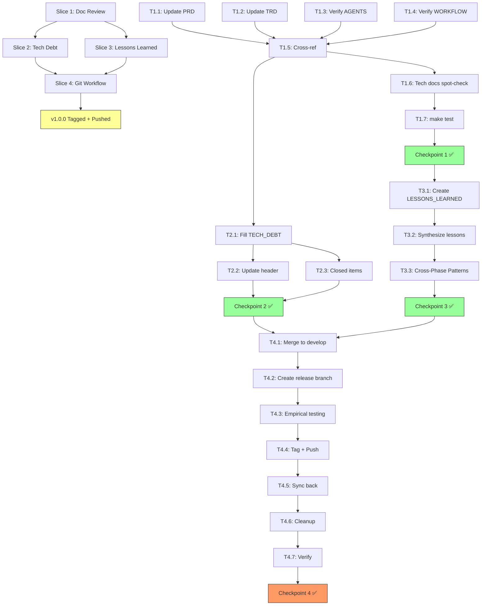

# Plan de Ejecución — F6: Cierre

**Fecha:** 2026-07-07 | **Autor:** Fisherk2 | **Fase:** F6 (📋 LISTO PARA PLANIFICAR)
**Metodología:** Slicing vertical con checkpoints de calidad (patrón F0/F1/F2/F3/F4/F5) + Git Workflow release
**Reemplaza:** N/A (nueva fase)
**Alcance confirmado:** Revisión exhaustiva de todos los docs + llenar Tech Debt + documentar lecciones aprendidas + release v1.0.0 vía Git Workflow con empirical testing.

---

## 1. Resumen

F6 es la **fase final** del proyecto. Convierte el trabajo acumulado (16 commits en `feat/mvp-dashboard`) en un release versionado y publicado. El éxito se mide por: (a) documentación consistente y sin contradicciones, (b) registro explícito de deuda técnica, (c) lecciones aprendidas documentadas para futuro, y (d) un tag v1.0.0 publicado en el remote con todas las garantías de calidad.

**Estimación total:** 4-6 horas (~0.5 días, según WORKFLOW.md F6)
**Vertical slices:** 4
**Checkpoints:** 4 (quality gates)
**Commits atómicos esperados:** 4 (uno por slice, o más si fixes durante testing)
**Decisiones confirmadas vía question tool:**
- ✅ F6-01 review: TODOS los docs (4 explícitos + 4 de F5 + tech docs)
- ✅ TECH_DEBT.md: LLENAR con datos reales del proyecto
- ✅ F6-03 Git Workflow: merge a develop → release branch → empirical testing → merge a main + tag v1.0.0 + push → sync back a develop
- ✅ Remote: `https://github.com/Fisherk2/dashboard-metabase-analiticas` (ya configurado)
- ✅ Branches remotos existentes: `main`, `develop`

---

## 2. Estado Actual Detectado

| Elemento | Estado | Acción F6 |
|----------|--------|-----------|
| `docs/PRD.md` | ⚠️ Borrador sin actualizar (fecha 2026-07-02, estado "Borrador") | **Actualizar** fecha, estado, record counts, version |
| `docs/TRD.md` | ⚠️ Borrador sin actualizar (fecha 2026-07-02, estado "Borrador") | **Actualizar** fecha, estado, record counts, version |
| `docs/AGENTS.md` | ✅ Actualizado a v2.4 (F5) | **Verificar** links y consistencia |
| `docs/WORKFLOW.md` | ✅ Actualizado a v1.5 (F5 marcado) | **Verificar** + actualizar a v1.6 al cerrar F6 |
| `docs/USER_GUIDE.md` | ✅ Creado en F5 (298 líneas) | **Cross-ref check** con PRD/TRD |
| `docs/TECHNICAL_GUIDE.md` | ✅ Creado en F5 (445 líneas) | **Cross-ref check** con PRD/TRD |
| `docs/REPRODUCIBILITY.md` | ✅ Creado en F5 (93 líneas) | **Cross-ref check** + fuente para TECH_DEBT |
| `docs/TECH_DEBT.md` | ❌ Plantilla con placeholders (`[YYYY-MM-DD]`, `[Nombre]`, etc.) | **Llenar** con 4 items reales |
| `docs/LESSONS_LEARNED.md` | ❌ No existe | **Crear** con 6+ secciones |
| Git state | ✅ 16 commits en `feat/mvp-dashboard`, branches `main`/`develop` existen | **Workflow** release v1.0.0 |
| Remote | ✅ `origin` configurado a `Fisherk2/dashboard-metabase-analiticas` | **Push** v1.0.0 |

---

## 3. Slices y Tareas

### Slice 1: Document Review (F6-01)

**Objetivo:** Garantizar que todos los docs del proyecto estén consistentes, sin placeholders, y reflejen el estado final. El proyecto pasa de "producto funcional" a "proyecto versionado presentable".

| ID | Tarea | Estimación | DoD | Dependencias |
|----|-------|-----------|-----|--------------|
| **F6-01.1** | Actualizar `docs/PRD.md`: fecha 2026-07-07, estado "Borrador" → "✅ Aprobado v1.0.0", record counts (50K-200K → ~182K), version 1.0.0 | 15 min | PRD.md sin placeholders, status Aprobado, version 1.0.0 | F5 ✅ |
| **F6-01.2** | Actualizar `docs/TRD.md`: fecha 2026-07-07, estado "Borrador" → "✅ Aprobado v1.0.0", record counts, version 1.0.0 | 15 min | TRD.md sin placeholders, status Aprobado, version 1.0.0 | F5 ✅ |
| **F6-01.3** | Verificar `docs/AGENTS.md`: confirmar v2.4, todos los links relativos existen, sin contradicciones con otros docs | 10 min | `grep -r 'docs/' AGENTS.md` todos los targets existen | F5 ✅ |
| **F6-01.4** | Verificar `docs/WORKFLOW.md`: F0-F5 marcado correcto, F6 marcado al cerrar, Gantt actualizado, hitos fechados | 10 min | Visual review, no contradicciones | F5 ✅ |
| **F6-01.5** | Cross-ref check: USER_GUIDE/TECHNICAL_GUIDE/REPRODUCIBILITY vs PRD/TRD. Buscar contradicciones en: record counts, comandos, nombres de paneles, versiones | 20 min | Matriz de verificación completa, sin contradicciones | F5 ✅, T1.1-T1.4 |
| **F6-01.6** | Spot-check: ARCHITECTURE.md, SCHEMA.md, TESTING.md, SECURITY.md, CODE_STYLE.md, METABASE_SETUP.md, METABASE_EXPORTS.md, APPFLOW.md — verificar que links no estén rotos y secciones referenciadas existen | 20 min | Todos los links `[texto](path)` apuntan a archivos existentes | T1.5 |
| **F6-01.7** | Validar con `make test` que no hay regresión (F0 valida secciones de README) | 5 min | `make test` exit 0 | T1.1-T1.6 |

**Subtotal Slice 1:** 1.5 horas (90 min)

### Checkpoint 1: Document Review ✅
- [ ] PRD.md y TRD.md actualizados con status Aprobado v1.0.0
- [ ] AGENTS.md y WORKFLOW.md verificados
- [ ] Cross-ref check sin contradicciones
- [ ] Tech docs spot-checked
- [ ] `make test` exit 0
- [ ] `wc -l docs/*.md` documentado

---

### Slice 2: Technical Debt Register (F6-01.b)

**Objetivo:** Llenar `docs/TECH_DEBT.md` con items reales del proyecto, basado en REPRODUCIBILITY.md, code review findings, y issues conocidos. Esto da visibilidad al lector del portafolio sobre lo que está resuelto y lo que queda pendiente.

| ID | Tarea | Estimación | DoD | Dependencias |
|----|-------|-----------|-----|--------------|
| **F6-02.1** | Llenar `docs/TECH_DEBT.md` con 4 items reales: <br>• **TD-001 (Resuelto F5)**: `make setup` no incluía `create-views` — corregido con commit `7330565` <br>• **TD-002 (Abierto)**: Particionamiento de `ventas` requiere migración manual (REPRODUCIBILITY Issue 2) <br>• **TD-003 (Abierto)**: Tests runtime usan credenciales hardcodeadas que no coinciden con `.env.example` (REPRODUCIBILITY Issue 3) <br>• **TD-004 (Abierto)**: 9 fallas pre-existentes en test suite runtime (port conflicts, Metabase setup no ejecutado) | 20 min | TECH_DEBT.md con 4+ items, formato completo (ID, descripción, riesgo, recomendación, estado) | F5 ✅, T1.5 (cross-ref con REPRODUCIBILITY) |
| **F6-02.2** | Actualizar header de TECH_DEBT.md: fecha 2026-07-07, autor Fisherk2, estado "Activo", coverage conocido | 5 min | Header completo, no placeholders | T2.1 |
| **F6-02.3** | Añadir sección "Ítems Cerrados" con TD-001 marcado como cerrado en v1.0.0 | 5 min | Histórico de cierres | T2.1 |

**Subtotal Slice 2:** 30 minutos

### Checkpoint 2: Technical Debt ✅
- [ ] TECH_DEBT.md tiene 3+ items abiertos documentados
- [ ] 1+ item cerrado en v1.0.0 (TD-001)
- [ ] Formato consistente con plantilla (sin placeholders)
- [ ] Header completo con fecha/autor/estado

---

### Slice 3: Lessons Learned (F6-02)

**Objetivo:** Crear `docs/LESSONS_LEARNED.md` como síntesis ejecutiva de todo el proyecto. Este doc es el "regalo" al lector: las decisiones de diseño y lecciones que el autor aprendió en cada fase, presentadas para que otros puedan evitar los mismos tropiezos.

| ID | Tarea | Estimación | DoD | Dependencias |
|----|-------|-----------|-----|--------------|
| **F6-03.1** | Crear `docs/LESSONS_LEARNED.md` con estructura: Introducción + 6 secciones (una por fase F0-F5) + 1 sección "Cross-Phase Patterns" | 10 min | Doc existe, ≥200 líneas, 7 secciones | F5 ✅ |
| **F6-03.2** | Sintetizar lecciones de cada fase, extrayendo de: WORKFLOW.md v1.0-v1.5 (cambios + lecciones), TECHNICAL_GUIDE.md §10 (7 lessons learned), REPRODUCIBILITY.md (issues), code review findings | 40 min | 3-5 lecciones por fase, cada una con formato: **Problema** → **Solución** → **Lección** | T3.1 |
| **F6-03.3** | Añadir sección "Cross-Phase Patterns": TDD, slicing vertical, code review multi-eje, source-driven development, documentar para portafolio | 10 min | 5+ patterns cross-phase documentados | T3.2 |

**Subtotal Slice 3:** 60 minutos

### Checkpoint 3: Lessons Learned ✅
- [ ] `docs/LESSONS_LEARNED.md` existe, ≥200 líneas
- [ ] 6 fases cubiertas con 3-5 lecciones cada una
- [ ] Formato consistente: Problema → Solución → Lección
- [ ] Sección Cross-Phase con 5+ patterns

---

### Slice 4: Git Workflow Release v1.0.0 (F6-03)

**Objetivo:** Versionar y publicar v1.0.0 mediante un Git Workflow profesional: merge de trabajo → release branch → empirical testing con el usuario → merge a main + tag → push → sync back a develop. Esto garantiza que el release está validado antes de ser público.

| ID | Tarea | Estimación | DoD | Dependencias |
|----|-------|-----------|-----|--------------|
| **F6-04.1** | `git checkout develop && git merge --no-ff feat/mvp-dashboard -m 'Merge F5: Despliegue'` — Consolidar trabajo en develop | 5 min | `git log develop --oneline -5` muestra commits de F5 | T1, T2, T3 ✅ |
| **F6-04.2** | `git checkout -b release/v1.0.0 develop` — Crear rama de release | 2 min | `git branch` muestra `release/v1.0.0` | T4.1 |
| **F6-04.3** | **Empirical testing con asistencia del agente**, ejecutando comando por comando: <br>• `make down` (limpiar servicios) <br>• `make destroy` (⚠️ borrar volúmenes) <br>• `cp .env.example .env` <br>• `make setup` (deps + up + db-init + data-generate + create-views + mv-refresh) <br>• `make test` (tests estáticos) <br>• `make test-queries` (rendimiento p95 <2s) <br>• `make metabase-setup` (paneles) <br>• `make metabase-pulse-test` (pulses) <br>• Verificar en Metabase UI: 4 dashboards + 2 pulses | 30 min | Todos los comandos exit 0, dashboards visibles en `http://localhost:3000` | T4.2 |
| **F6-04.4** | Si empirical test pasa: <br>• `git checkout main && git merge --no-ff release/v1.0.0 -m 'Release v1.0.0'` <br>• `git tag -a v1.0.0 -m 'Release v1.0.0: Dashboard Metabase + Colección Analítica'` <br>• `git push origin main develop --tags` | 5 min | `git log main --oneline -3` muestra merge, `git tag -l` muestra v1.0.0, remote actualizado | T4.3 |
| **F6-04.5** | Sync back: <br>• `git checkout develop && git merge --no-ff main -m 'Sync main → develop post-release v1.0.0'` <br>• `git push origin develop` | 3 min | `git log main..develop --oneline` está VACÍO | T4.4 |
| **F6-04.6** | Cleanup: <br>• `git branch -d release/v1.0.0` <br>• Verificar `git status` limpio en develop | 2 min | `git branch` no muestra release/v1.0.0, `git status` clean | T4.5 |
| **F6-04.7** | Verificación final: <br>• `git log --oneline --all -20` <br>• `git tag -l` muestra v1.0.0 <br>• `curl -s https://api.github.com/repos/Fisherk2/dashboard-metabase-analiticas/releases/latest` confirma v1.0.0 publicado | 3 min | Tag visible en GitHub, release publicado | T4.6 |

**Subtotal Slice 4:** 50 minutos (más 30 min de empirical testing con el usuario)

### Checkpoint 4: Release v1.0.0 ✅
- [ ] Merge a develop exitoso
- [ ] Release branch `release/v1.0.0` creada
- [ ] Empirical testing: todos los comandos exit 0
- [ ] Dashboards visibles en Metabase (4 paneles + 2 pulses)
- [ ] Merge a main exitoso
- [ ] Tag v1.0.0 creado y pusheado
- [ ] Sync back a develop exitoso
- [ ] `git log main..develop` vacío (sync confirmado)
- [ ] Release visible en GitHub

---

## 4. Dependencias entre Slices



**Leyenda:**
- **Slice 1**: Document Review (7 tasks, S/S/S/S/M/M/XS)
- **Slice 2**: Technical Debt (3 tasks, S/XS/XS)
- **Slice 3**: Lessons Learned (3 tasks, S/M/S)
- **Slice 4**: Git Workflow (7 tasks, XS/XS/L/XS/XS/XS/XS)

---

## 5. Checkpoints — Quality Gates

### Checkpoint 1: Document Review
- PRD.md y TRD.md con status Aprobado v1.0.0, sin placeholders
- AGENTS.md v2.4 verificado, WORKFLOW.md F5 ✅
- Cross-ref check sin contradicciones (USER_GUIDE ↔ PRD, etc.)
- `make test` exit 0

### Checkpoint 2: Technical Debt
- TECH_DEBT.md con 4+ items reales (1 cerrado, 3 abiertos)
- Header completo, formato consistente
- Plan de reducción para próximo ciclo

### Checkpoint 3: Lessons Learned
- `docs/LESSONS_LEARNED.md` existe, ≥200 líneas
- 6 fases cubiertas con lecciones en formato Problema → Solución → Lección
- Sección Cross-Phase con 5+ patterns

### Checkpoint 4: Release v1.0.0
- Empirical testing exit 0 en todos los comandos
- Tag v1.0.0 visible en `git tag -l`
- `git log main..develop` VACÍO (sync confirmado)
- Release visible en GitHub

---

## 6. Riesgos y Mitigaciones

| Riesgo | Impacto | Probabilidad | Mitigación | Contingencia |
|--------|---------|--------------|------------|--------------|
| **Empirical test encuentra bug bloqueante** | Alto | Media | El release branch es aislado: hotfix en release, retest, merge | Si hotfix no funciona, abortar release, volver a develop |
| **Push a remote falla (permisos, network)** | Alto | Baja | `git push --dry-run` antes de push real; verificar `git remote -v` | Documentar push manual en LESSONS_LEARNED.md |
| **Tag v1.0.0 ya existe** | Medio | Baja | `git tag -d v1.0.0 && git push origin :refs/tags/v1.0.0` antes de re-tag | Usar v1.0.1 si conflicto |
| **Conflict en merge develop → main** | Medio | Media | Resolver con `-X theirs` (release gana) o `-X ours` (develop gana) según contexto | Manual merge si automático falla |
| **PRD/TRD actualizaciones introducen contradicciones** | Bajo | Baja | Cross-ref check (T1.5) detecta antes de merge | Commit fix antes de T4.1 |
| **Empirical testing toma >30min (servicios lentos)** | Bajo | Baja | Paciencia; los servicios pueden tardar en cold start | Continuar en sesión siguiente si excede tiempo |

---

## 7. Patrones Aplicados

| Patrón | Tipo | Aplicación en F6 | Slice |
|--------|------|-------------------|-------|
| **Repository Pattern (docs)** | Docs | TECH_DEBT.md como registro centralizado de deuda | S2 |
| **Template Method (LESSONS_LEARNED)** | Docs | Estructura consistente Problema→Solución→Lección para cada fase | S3 |
| **GitFlow (release branches)** | Git | Ramas `main`/`develop`/`feature/*`/`release/*` para versionado | S4 |
| **Semantic Versioning** | Git | Tag v1.0.0 (MAJOR.MINOR.PATCH) | S4 |
| **Empirical Testing** | QA | Ejecutar el sistema real con el usuario antes de release | S4 |
| **Verification** | QA | Cada checkpoint valida criterios objetivos (exit codes, líneas, tags) | All |
| **Synced Branches** | Git | Sync back de main → develop post-release | S4 |

**NO aplica en F6:** Patrones de código (DDD, Repository, etc.) — F6 es cierre de proyecto (docs + git), no código. Las decisiones arquitectónicas ya están tomadas y documentadas en ADRs.

---

## 8. Comandos de Verificación Global (F6 Complete)

```bash
# 1. Validar estructura de docs
ls -la docs/PRD.md docs/TRD.md docs/AGENTS.md docs/WORKFLOW.md
ls -la docs/TECH_DEBT.md docs/LESSONS_LEARNED.md

# 2. Validar estado de docs
grep -E "Aprobado|✅" docs/PRD.md docs/TRD.md | head -3
grep -c "^- \[ \]" docs/TECH_DEBT.md  # Items en TECH_DEBT

# 3. Validar tests no rompen
make test
# Esperado: 73+ static passing (sin regresión)

# 4. Validar reproducibilidad (en release branch)
make down && make destroy && make setup
make test
make test-queries
make metabase-setup

# 5. Validar Git state
git log --oneline main -5          # Ver commits mergeados
git tag -l                         # Ver v1.0.0
git log main..develop --oneline    # Debe ser vacío
git status                         # Limpio

# 6. Validar remote
curl -s https://api.github.com/repos/Fisherk2/dashboard-metabase-analiticas/releases/latest
# Debe mostrar tag_name: v1.0.0
```

---

## 9. Métricas F6

| Métrica | Valor Objetivo | Medición |
|---------|---------------|----------|
| Tareas completadas | 17 | tasks/todo.md checkboxes |
| Checkpoints pasados | 4/4 | Checkpoint sections §5 |
| Tiempo total | 4-6 h | Clock |
| Archivos modificados | 4 (PRD, TRD, AGENTS, WORKFLOW) | git diff |
| Archivos creados | 2 (TECH_DEBT, LESSONS_LEARNED) | git status |
| Commits atómicos | 4 (uno por slice) | git log --oneline |
| Empirical tests exit 0 | 8+ comandos | Manual con usuario |
| Tag v1.0.0 | Publicado en remote | `git ls-remote --tags origin` |
| Branches sincronizados | `main..develop` vacío | `git log main..develop --oneline` |

**Definición de "Done" por Capa (F6):**
- **Documentación**: PRD, TRD, AGENTS, WORKFLOW, TECH_DEBT, LESSONS_LEARNED — todos consistentes, sin placeholders, con fechas y versiones correctas
- **Git State**: v1.0.0 tagged, pusheado, main y develop sincronizados
- **Validation**: Empirical testing confirma que el release funciona en entorno limpio
- **Handoff**: Proyecto versionado y público, listo para portafolio

---

## 10. Estado Actual y Siguiente Fase

**F5: Despliegue** — ✅ COMPLETADO (5 tasks, 4 slices, 9 commits atómicos, docs premium + reproducibilidad + code review multi-eje)

**F6: Cierre** — 📋 PLAN APROBADO — Listo para ejecutar. Alcance:
- Revisión exhaustiva de todos los docs (F6-01)
- Llenar TECH_DEBT.md con datos reales (F6-01.b)
- Documentar lecciones aprendidas (F6-02)
- Git Workflow: develop ← release branch → main + tag v1.0.0 + push + sync back (F6-03)

**Proyecto Completado** — Después de F6, el proyecto está en v1.0.0 publicada, listo para presentación a employers/clientes.

**Dependencias:** Requiere F5 completado ✅.
**Estimación:** 0.5 días (según WORKFLOW.md F6).
**Remote:** `https://github.com/Fisherk2/dashboard-metabase-analiticas` (ya configurado).

---

## 11. Control de Cambios

| Versión | Fecha | Autor | Cambio | Lecciones Aprendidas |
|---------|-------|-------|--------|---------------------|
| 1.0 | 2026-07-07 | Fisherk2 | Versión inicial del plan F6 | Release v1.0.0 via Git Workflow (develop → release branch → empirical testing → main + tag → sync back) garantiza que el release está validado antes de publicar; documentar lecciones en formato Problema→Solución→Lección escala mejor que prosa libre; TECH_DEBT.md con items reales (no plantilla) da visibilidad sobre lo resuelto y lo pendiente a employers; cross-ref check entre docs (T1.5) detecta contradicciones antes de que sean públicas |
