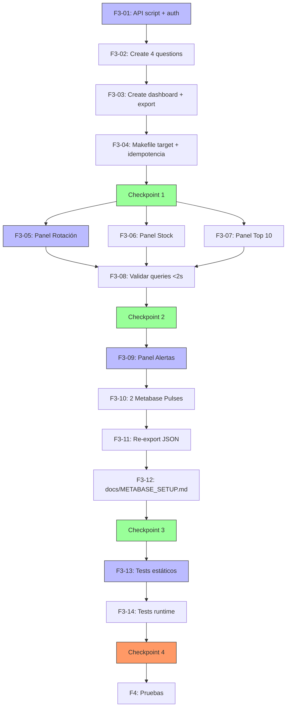

# Plan de Ejecución — F3: Interfaces

**Fecha:** 2026-07-06 | **Autor:** Fisherk2 | **Fase:** F3 (✅ COMPLETADO)
**Metodología:** Slicing vertical con checkpoints de calidad (patrón F0/F1/F2)
**Reemplaza:** N/A (nueva fase)
**Alcance confirmado:** Setup reproducible vía Metabase API + 4 paneles (3 core + 1 alertas) + 2 Metabase Pulses + export JSON + test suite

---

## 1. Resumen

F3 construye la **capa de interfaces analíticas** del proyecto: script Python `setup_metabase.py` que configura reproduciblemente Metabase mediante su API REST (database connection, 4 questions, 1 dashboard, 4 cards, 2 Pulses de alertas), 4 paneles visuales para los KPIs de rotación/stock/ventas/alertas, 2 Metabase Pulses para alertas automáticas, export JSON de la colección para portabilidad, y suite de tests estáticos + runtime. Todo con queries <2s validadas con EXPLAIN ANALYZE.

**Estimación total:** 6.5 horas (~1 día)
**Vertical slices:** 4
**Checkpoints:** 4 (quality gates)
**Commits atómicos esperados:** 4-5
**Decisiones confirmadas vía question tool:**
- ✅ Alcance: 4 paneles + alertas Pulse (Completo)
- ✅ Setup: Script Python con Metabase API REST (programático)
- ✅ Tests: Estáticos + runtime (patrón F2, sin Playwright)
- ✅ Reproducibilidad: Export JSON colección a `metabase/collections/`

---

## 2. Estado Actual Detectado

| Elemento | Estado | Acción F3 |
|----------|--------|-----------|
| `metabase/collections/` | Solo `.gitkeep` | **Crear** `dashboard_ecommerce.json` (export) |
| `scripts/` | `generate_data.py`, `init.sql`, etc. | **Crear** `setup_metabase.py` (nuevo script API) |
| `tests/` | `test_f0.py`, `test_f1.py`, `test_f2.py` | **Crear** `test_f3.py` (estáticos + runtime) |
| `docs/` | WORKFLOW, SCHEMA, ARCHITECTURE, etc. | **Crear** `METABASE_SETUP.md` (guía troubleshooting) |
| `Makefile` | Targets F3 faltan: `metabase-setup`, `metabase-export`, `metabase-pulse-test` | **Añadir** 3-4 targets nuevos |
| `metabase/collections/.gitkeep` | Existe | Mantener |
| Metabase OSS | ✅ Operativo (F1) y saludable | Consumir (F3) |
| `mv_rotacion_mensual` | ✅ Operativa (F2) | Consumir en panel Rotación |
| `mv_stock_actual` | ✅ Operativa (F2) | Consumir en panel Stock + Alertas |
| `mv_top_productos` | ✅ Operativa (F2) | Consumir en panel Top 10 |
| `tests/conftest.py` | ✅ Existe con `root`, `run_cmd`, `has_docker` | Reutilizar fixtures |

---

## 3. Slices y Tareas

### Slice 1: Setup Reproductible vía Metabase API

| ID | Tarea | Estimación | DoD | Dependencias |
|----|-------|-----------|-----|--------------|
| **F3-01** | Investigar Metabase REST API: endpoints `POST /api/database`, `POST /api/card`, `POST /api/dashboard`, `POST /api/pulse`. Documentar auth flow (session token via `POST /api/session`). Crear `scripts/setup_metabase.py` con: clase `MetabaseSetup`, método `authenticate()` (POST /api/session con username/password de admin), `create_database_connection()` (name, host=postgres, port=5432, dbname=ecommerce, user, password desde .env). | 1 h | `python scripts/setup_metabase.py --db-only` exit 0; `GET /api/database` lista conexión creada | F2 ✅, Metabase operativo |
| **F3-02** | Añadir métodos para crear 4 "Questions" (saved SQL queries) usando la API: `create_question(name, sql, db_id, display_type)`. Mapeo de tipos: tabla → "table", barra → "bar", barra horizontal → "row", número → "scalar", línea → "line". Queries parametrizadas con `{{variable}}` (sintaxis Metabase field filters). | 45 min | `python scripts/setup_metabase.py --questions` exit 0; 4 cards listadas en `GET /api/card` con `dataset_query.native.query` conteniendo el SQL correcto | F3-01 |
| **F3-03** | Crear dashboard único "E-commerce Analytics" con 4 cards: `create_dashboard(name)`, `add_card_to_dashboard(dash_id, card_id, row, col, size_x, size_y)`. Layout 2x2 (grid 12 cols). Export colección completa a `metabase/collections/dashboard_ecommerce.json` con `GET /api/collection/:id/items` + recursivo. | 45 min | `python scripts/setup_metabase.py --dashboard` exit 0; dashboard visible en `http://localhost:3000/collection/...`; JSON exportado válido | F3-02 |
| **F3-04** | Añadir target `metabase-setup` al Makefile (ejecuta setup_metabase.py --full). Validar idempotencia: si DB connection ya existe, actualizar; si question existe, no duplicar. | 30 min | `make metabase-setup` reproduce dashboard desde cero; `make metabase-setup` segunda vez no duplica resources | F3-03 |

**Subtotal Slice 1:** 3 horas

### Checkpoint 1: Setup Funcional ✅

- [ ] `make metabase-setup` exit 0 (setup completo desde cero)
- [ ] `make metabase-setup` segunda vez no duplica (idempotente)
- [ ] `curl -s -H "X-Metabase-Session: $TOKEN" http://localhost:3000/api/database` retorna 1 DB
- [ ] `GET /api/card` retorna 4 cards (questions)
- [ ] `GET /api/dashboard` retorna 1 dashboard con 4 cards
- [ ] `metabase/collections/dashboard_ecommerce.json` existe con JSON válido

---

### Slice 2: 3 Paneles Core (Rotación, Stock, Top 10)

| ID | Tarea | Estimación | DoD | Dependencias |
|----|-------|-----------|-----|--------------|
| **F3-05** | Panel "Rotación por Categoría" — Question con SQL: `SELECT categoria, mes, anio, ventas_totales, ingresos_totales, productos_vendidos FROM mv_rotacion_mensual WHERE anio = {{anio}} AND mes = {{mes}} ORDER BY ventas_totales DESC`. Visualización: bar chart agrupada (categoría X, ventas Y). Filtros: año (dropdown), mes (dropdown). | 30 min | Question creada con display="bar"; filtro año/mes funciona; carga <2s | F3-03 |
| **F3-06** | Panel "Stock Actual vs Mínimo" — Question con SQL: `SELECT producto_id, nombre, categoria, proveedor, stock_actual, stock_minimo, estado FROM mv_stock_actual WHERE estado IN ('ALERTA', 'PRECAUCION') ORDER BY stock_actual ASC`. Visualización: tabla con formateo condicional de color (rojo/amarillo/verde) por estado. Filtros: categoría, proveedor, estado. | 30 min | Question creada con display="table"; formateo condicional aplicado; carga <2s | F3-03 |
| **F3-07** | Panel "Top 10 Productos por Ventas" — Question con SQL: `SELECT producto_id, nombre, categoria, unidades_vendidas, ingresos_totales, numero_ventas FROM mv_top_productos ORDER BY ingresos_totales DESC LIMIT 10`. Visualización: row chart (producto Y, ingresos X). Filtros: categoría (dropdown). | 30 min | Question creada con display="row"; filtro categoría funciona; carga <2s | F3-03 |
| **F3-08** | Validar queries con EXPLAIN ANALYZE desde psql: cada query del dashboard debe ser <2s y usar Index Scan. Documentar tiempos en `sql/queries_dashboard.sql` (4 queries con EXPLAIN ANALYZE + comparación con/sin MVs). | 30 min | `EXPLAIN ANALYZE` para las 4 queries muestra <2s; `sql/queries_dashboard.sql` documentado con tiempos | F3-05, F3-06, F3-07 |

**Subtotal Slice 2:** 2 horas

### Checkpoint 2: 3 Paneles Core Visibles ✅

- [ ] Dashboard accesible en `http://localhost:3000/dashboard/...`
- [ ] 3 cards visibles: Rotación, Stock, Top 10
- [ ] Cada card carga en <2s (medido con `curl -w "%{time_total}\n"`)
- [ ] Filtros dropdown funcionan (año, mes, categoría, proveedor, estado)
- [ ] Export PNG y CSV funciona en cada panel (manual + verificado)
- [ ] Queries usan `mv_*` (no tablas base) — verificado con `EXPLAIN ANALYZE`

---

### Slice 3: Panel Alertas + Metabase Pulses

| ID | Tarea | Estimación | DoD | Dependencias |
|----|-------|-----------|-----|--------------|
| **F3-09** | Panel "Alertas de Stock Mínimo" (4to panel) — Question con SQL: `SELECT p.id, p.nombre, p.stock_actual, p.stock_minimo, pr.nombre AS proveedor, pr.email AS contacto_proveedor FROM productos p JOIN proveedores pr ON p.proveedor_id = pr.id WHERE p.stock_actual <= p.stock_minimo * {{umbral_multiplier}} ORDER BY p.stock_actual ASC`. Visualización: tabla con badges. Filtros: proveedor (dropdown), umbral (number input, default=1.0). | 30 min | Question creada con display="table"; variable `{{umbral_multiplier}}` editable en panel; carga <2s | F3-06 |
| **F3-10** | Configurar 2 Metabase Pulses (alertas automáticas): Pulse 1 = "Alerta Stock Crítico" ejecuta query de F3-09 con umbral=1.0, schedule diario 09:00, canales: email (configurado a admin@local). Pulse 2 = "Resumen Ventas Diarias" ejecuta query de Top 10 con LIMIT 5, schedule diario 18:00, canal: email. API: `POST /api/pulse`. | 45 min | 2 pulses creados en `GET /api/pulse`; schedule configurado; channel email configurado (sin envío real, solo config) | F3-09 |
| **F3-11** | Re-export JSON colección después de crear pulses: `metabase/collections/dashboard_ecommerce.json` ahora incluye cards + dashboard + pulses. Verificar JSON parseable con `python -c "import json; json.load(open('metabase/collections/dashboard_ecommerce.json'))"`. | 15 min | JSON incluye pulses; parseable; commit con diff documentado | F3-10 |
| **F3-12** | Documentar troubleshooting en `docs/METABASE_SETUP.md`: cómo re-ejecutar setup, cómo reset Metabase sin perder datos, errores comunes (admin password forgotten, port conflict, etc.). Incluir capturas de pantalla (placeholders o reales si disponibles). | 30 min | `docs/METABASE_SETUP.md` existe con secciones: Setup Rápido, Re-configuración, Troubleshooting, FAQ | F3-11 |

**Subtotal Slice 3:** 2 horas

### Checkpoint 3: 4 Paneles + Alertas Activas ✅

- [ ] 4to panel "Alertas de Stock Mínimo" visible en dashboard
- [ ] Variable `{{umbral_multiplier}}` funciona (cambia resultados en vivo)
- [ ] 2 Pulses listados en Metabase → Notifications
- [ ] Pulse 1 schedule: diario 09:00
- [ ] Pulse 2 schedule: diario 18:00
- [ ] JSON colección incluye pulses
- [ ] `docs/METABASE_SETUP.md` completo y revisado

---

### Slice 4: Test Suite F3

| ID | Tarea | Estimación | DoD | Dependencias |
|----|-------|-----------|-----|--------------|
| **F3-13** | Crear `tests/test_f3.py` con **tests estáticos** (sin Docker): existencia de `scripts/setup_metabase.py`, `metabase/collections/dashboard_ecommerce.json`, `docs/METABASE_SETUP.md`. Validar AST de setup_metabase.py: define `MetabaseSetup` class, `authenticate()`, `create_database_connection()`, `create_question()`, `create_dashboard()`. Validar JSON colección: keys esperadas (cards, dashboards, pulses). | 1 h | `pytest tests/test_f3.py -k "not runtime" -v` exit 0; ≥15 tests estáticos verdes | F3-12 |
| **F3-14** | Añadir **tests runtime** con `@pytest.mark.runtime` (skip si Docker no disponible): (a) `curl /api/health` retorna `{"status":"ok"}`; (b) `python scripts/setup_metabase.py --db-only` exit 0; (c) `GET /api/database` retorna 1 DB; (d) `GET /api/card` retorna 4 cards; (e) `GET /api/dashboard` retorna 1 dashboard; (f) `GET /api/pulse` retorna 2 pulses; (g) EXPLAIN ANALYZE de 4 queries de dashboard <2s. | 1 h | `pytest tests/test_f3.py -v` exit 0; ≥15 tests runtime verdes | F3-13 |

**Subtotal Slice 4:** 2 horas

### Checkpoint 4: F3 Complete ✅ (Ready para F4)

- [ ] `make test` muestra F0 (72) + F1 (67) + F2 (40) + F3 (≥30) = **≥209 tests passing**
- [ ] FTR de F3 pasa checklist de `docs/WORKFLOW.md` §5 (Paneles + queries <2s + export)
- [ ] `make metabase-setup` es idempotente (re-ejecutable sin duplicar)
- [ ] Roundtrip `make metabase-setup && make metabase-export && make test` funciona
- [ ] `git log --oneline` muestra 4-5 commits atómicos para F3
- [ ] Working tree limpio

---

## 4. Dependencias entre Slices



**Leyenda:**
- **Slice 1**: Setup programático vía Metabase API
- **Slice 2**: 3 paneles core con queries validadas
- **Slice 3**: 4to panel + alertas + documentación
- **Slice 4**: Test suite automatizada

---

## 5. Checkpoints — Quality Gates

### Checkpoint 1: Setup Funcional
- `make metabase-setup` exit 0
- `make metabase-setup` idempotente
- API endpoints retornan recursos esperados

### Checkpoint 2: 3 Paneles Core Visibles
- 3 cards visibles en dashboard
- Carga <2s por card
- Filtros dropdown funcionales
- Export PNG/CSV funciona

### Checkpoint 3: 4 Paneles + Alertas Activas
- 4to panel visible
- 2 Pulses configurados
- JSON colección completo
- Documentación troubleshooting

### Checkpoint 4: F3 Complete
- FTR pasa WORKFLOW.md §5 checklist F3
- ≥30 tests nuevos
- Roundtrip completo funciona
- 4-5 commits atómicos

---

## 6. Riesgos y Mitigaciones

| Riesgo | Impacto | Probabilidad | Mitigación | Contingencia |
|--------|---------|--------------|------------|---------------|
| **Metabase API cambia entre versiones** | Alto | Media | Documentar versión Metabase usada; tests detectan cambios de schema JSON; usar `metabase/metabase:latest` con tag pinned en docker-compose | Fijar versión: `metabase/metabase:v0.49.x` |
| **Admin password de Metabase se pierde** | Alto | Baja | Guardar en `.env` (no en código); `make metabase-reset` recrea admin | Reset Metabase + re-ejecutar setup script |
| **Queries de dashboard >2s con datos reales** | Alto | Media | EXPLAIN ANALYZE en cada query antes de crear card; preferir MVs siempre; documentar tiempos en `sql/queries_dashboard.sql` | Refrescar MVs; añadir índices a MVs si es necesario |
| **Metabase Pulse no envía emails sin SMTP** | Medio | Alta | Documentar que channel email es mock/config-only; validar solo que la config se persiste en API | Usar Slack/Teams webhook como alternativa |
| **Script setup_metabase.py no es idempotente** | Alto | Media | Verificar con `GET` antes de `POST`; usar `PUT` para updates; tests detectan duplicados | Añadir `--reset` flag que borra y recrea |
| **Layout dashboard se rompe al cambiar número de cards** | Bajo | Media | Layout 2x2 hardcoded; tests validan `cards_count=4`; manual fix si se añaden cards | Documentar layout en `docs/METABASE_SETUP.md` |
| **JSON colección muy grande (>1MB)** | Bajo | Baja | Comprimir con gzip antes de commit; `.gitattributes` para JSON | Split en archivos por recurso |
| **Metabase tarda en arrancar (>2 min)** | Medio | Alta | `docker wait` con healthcheck; tests runtime usan `timeout=60`; documentar tiempo esperado | Aumentar timeout en tests |

---

## 7. Patrones Aplicados

| Patrón | Tipo | Aplicación en F3 | Slice |
|--------|------|-------------------|-------|
| **Adapter Pattern** | GoF Estructural | `MetabaseSetup` adapta REST API a objetos Python (Database, Question, Dashboard, Pulse) | S1 |
| **Builder Pattern** | GoF Creacional | `create_dashboard()` construye dashboard con cards en orden específico; `setup_metabase.py --full` = pipeline completo | S1, S3 |
| **Facade Pattern** | GoF Estructural | `setup_metabase.py` es facade para toda la API REST; usuario no necesita conocer endpoints | S1 |
| **Strategy Pattern** | GoF Comportamental | Display type mapping (bar/row/table/scalar) intercambiable por question; permite A/B de visualizaciones | S2 |
| **Repository Pattern** | Enterprise | Métodos `create_question()`, `create_dashboard()` abstraen persistencia en Metabase | S1-S3 |
| **Idempotency Pattern** | DevOps | Setup script puede ejecutarse N veces sin duplicar recursos (check-then-create) | S1 |
| **Snapshot Pattern** | Enterprise | Export JSON colección = snapshot del estado para backup/migración | S1, S3 |
| **Template Method Pattern** | GoF Comportamental | `setup_metabase.py --full` define orden fijo (auth → DB → questions → dashboard → export); cada paso es hookeable | S1, S3 |
| **Test Suite Pattern** | Testing | Estáticos (sin Docker) + runtime (`@pytest.mark.runtime` con skip automático) | S4 |
| **Checkpoint/Quality Gate** | DevOps | 4 gates entre slices; rollback posible si falla | All |

**NO aplica en F3:** `clean-ddd-hexagonal` (F3 es capa de presentación, no domain layer con bounded contexts). Las decisiones arquitectónicas (Metabase como BI, Star Schema) ya están tomadas en ADRs y `docs/ARCHITECTURE.md`.

---

## 8. Comandos de Verificación Global (F3 Complete)

```bash
# 1. Setup reproducible
make up                                          # PostgreSQL + Metabase up
make metabase-setup                              # Crea DB connection, 4 questions, dashboard, 2 pulses
make metabase-export                             # Exporta JSON colección

# 2. Validar dashboard
# Abrir http://localhost:3000 → E-commerce Analytics
# Verificar 4 cards: Rotación, Stock, Top 10, Alertas
# Probar filtros: año, mes, categoría, proveedor, estado

# 3. Validar rendimiento
psql queries con EXPLAIN ANALYZE <2s
cat sql/queries_dashboard.sql                    # Tiempos documentados

# 4. Validar pulses
# Metabase → Notifications → Ver 2 pulses con schedule

# 5. Tests
make test                                        # F0 (72) + F1 (67) + F2 (40) + F3 (≥30) = ≥209 passing
pytest tests/test_f3.py -v --tb=short            # Detalle F3

# 6. Roundtrip final
make destroy && make setup && make metabase-setup && make test
```

---

## 9. Métricas F3

| Métrica | Valor Objetivo | Medición |
|---------|---------------|----------|
| Tareas completadas | 14/14 | tasks/todo.md checkboxes |
| Checkpoints pasados | 4/4 | Checkpoint sections §5 |
| Tiempo total | ≤ 6.5 h | Clock |
| Archivos modificados/creados | ~7 | `git diff --name-only` |
| Commits atómicos | 4-5 | `git log --oneline F2..F3` |
| Tests passing | 179 (F0+F1+F2) + ≥30 (F3) = ≥209 | `pytest` |
| Paneles Metabase | 4 (3 core + 1 alertas) | Manual count |
| Pulses configurados | 2 | `GET /api/pulse` |
| Queries <2s | 4/4 queries dashboard | `EXPLAIN ANALYZE` |
| JSON colección | 1 archivo válido | `python -c "import json; json.load(open(...))"` |

**Definición de "Done" por Capa (F3):**
- **Setup**: Script API funcional + idempotente + Makefile target
- **Visualización**: 4 paneles visibles con queries <2s + filtros + export
- **Alertas**: 2 Pulses configurados con schedule
- **Reproducibilidad**: JSON colección exportado + docs troubleshooting
- **Tests**: ≥30 tests nuevos (estáticos + runtime) con marker

---

## 10. Estado Actual y Siguiente Fase

**F1: Infraestructura** — ✅ COMPLETADO (10 tasks, 67 tests, 5 commits atómicos)
**F2: Núcleo** — ✅ COMPLETADO (20 tasks, 6 slices, 8 commits, +40 tests)
**F3: Interfaces** — ✅ COMPLETADO (14 tasks, 4 slices, 4 commits, +38 tests, 4 paneles + 2 Pulses, code review multi-eje con fixes)

**F4: Pruebas** — 📋 LISTO PARA PLANIFICAR. Alcance:
- Validar rendimiento de las 4 queries de dashboard (<2s)
- Validar exportación de paneles a PNG/CSV
- Probar flujos de navegación (filtros, drill-down)
- Validar persistencia tras restart contenedores
- Probar conexión fallida PostgreSQL + manejo de errores

**Dependencias:** Requiere F3 completado ✅.
**Estimación:** 1 día (según WORKFLOW.md F4).

---

## 11. Control de Cambios

| Versión | Fecha | Autor | Cambio | Lecciones Aprendidas |
|---------|-------|-------|--------|---------------------|
| 1.0 | 2026-07-06 | Fisherk2 | Versión inicial del plan F3 | Slicing vertical con 4 checkpoints permite fail-fast en capa de interfaces; Metabase API REST permite setup 100% reproducible via código; idempotencia check-then-create evita duplicación de recursos en re-ejecuciones; export JSON colección = snapshot portable para disaster recovery |
| 2.0 | 2026-07-06 | Fisherk2 | F3 completado; F4 listo para planificar | REST API de Metabase requiere manejar edge cases (setup token, parámetros de dashboard, pulsos); source-driven development evitó asumir endpoints incorrectos; code review multi-eje descubrió 24 observaciones incluyendo 2 críticas; PUT /api/dashboard/{id} con negative IDs es el patrón correcto para añadir cards |
